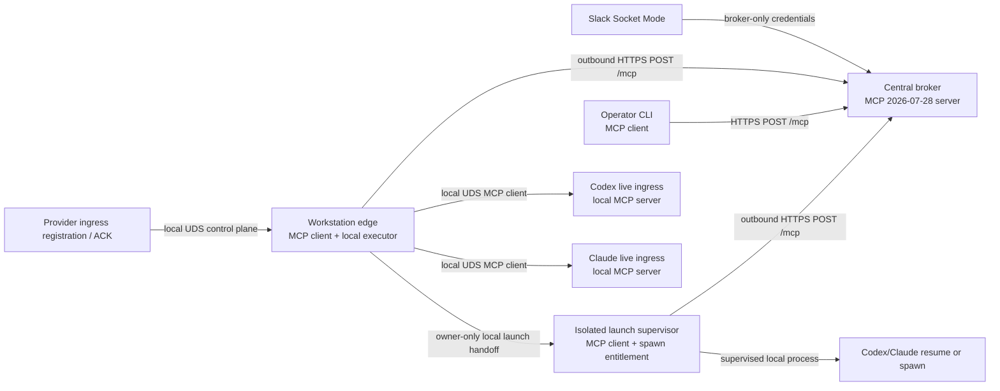

# ADR-0002: Stateless MCP capability plane for Hive v0.4

- Status: Accepted
- Decision: D-HIVE-MCP v1
- Ratified: 2026-08-01 under [KRA-897](https://linear.app/krates-ehf/issue/KRA-897)
- Parent overhaul: [KRA-896](https://linear.app/krates-ehf/issue/KRA-896)
- Supersedes: the v0.3 broker/edge wire contract; the live-provider adapter/local-ingress details
  that mandate loopback callbacks or `claude/channel`; and the narrowly defined no-effect requeue
  rules in ADR-0001. All other ADR-0001 invariants remain authoritative
- Does not authorize: production cutover or removal of `/v1`; that remains an explicit KRA-912 gate
- v0.5 note: largely superseded by [ADR-0003](./0003-sender-attributed-trust.md). The
  delivery-authority capability (`authorize_live_injection` and the launch-grant/key-rotation/
  clock-skew stratum), no-effect proofs, supervisor phase ledgers, `ambiguous` reconciliation
  obligations, `legacyDraining` fences, operator scope partition, and pagination-snapshot ceremony
  are removed. Retained: D1–D8, the sender-visible Slack outbox, the operator CLI skeleton, and
  D15 observability. This document remains as the historical record of the superseded contract

## Context and authority

ADR-0001 remains authoritative for Hive's home, broker-only Slack custody, outward-only workstation
edges, delivery state machine, wake policies, crash honesty, and untrusted-input boundary. Hive v0.4
replaces the bespoke broker/edge API with the stable MCP `2026-07-28` protocol and makes all durable
application state explicit rather than transport-session state.

The normative protocol references are the final
[MCP 2026-07-28 specification](https://modelcontextprotocol.io/specification/2026-07-28), its
[Streamable HTTP binding](https://modelcontextprotocol.io/specification/2026-07-28/basic/transports/streamable-http),
and [server discovery](https://modelcontextprotocol.io/specification/2026-07-28/server/discover).
The [Tasks extension](https://modelcontextprotocol.io/extensions/tasks/overview) is separately
opt-in and experimental. Hive's exact source pin is the project-hosted
`modelcontextprotocol/ext-tasks` proposal, whose pinned revision explicitly disclaims being an
official extension. Hive therefore treats core conformance and this experimental Tasks profile as
two independently pinned and tested claims.

This ADR records all D1-D20 rulings from KRA-896. Its use of MUST, MUST NOT, SHOULD, and MAY is
normative for Hive. Protocol conformance does not weaken an application invariant.

## Preserved invariants

1. Slack Socket Mode and Slack credentials exist only at the broker.
2. Workstation edges make outbound off-box connections and expose no inbound network port.
3. Delivery is at-least-once with one fenced owner; Hive never claims exactly-once processing.
4. A crash after a provider side effect becomes possible is `ambiguous` unless evidence or proven
   provider idempotency establishes a stronger result.
5. `resume` never escalates to `spawn`.
6. Slack bodies and replays are untrusted data. `WAKE` permits routing and dispatch only; it cannot
   grant repository, shell, provider, or operator authority.
7. The broker may assemble an exact Slack thread replay but may not summarize, interpret, redact,
   or prioritize it.
8. Handles identify state. Capabilities authorize operations. A handle is never authority.

## Final topology



The broker is the only off-box MCP server. The edge is the client that claims work. MCP
`subscriptions/listen` MAY wake an edge with a change notification, but it is only a doorbell: the
edge still invokes the mutating claim tool. The protocol has no reverse-invocation channel and Hive
does not invent one. The isolated supervisor is an edge-local component, but its independently
authenticated phase checks travel directly to the broker rather than through the general edge
executor. Headless provider execution otherwise remains edge application logic. A live provider
ingress is a separate, machine-local MCP server reached by the edge over a Unix-domain socket.

### Dispatch sequence

```mermaid
sequenceDiagram
  participant S as Slack
  participant B as Broker MCP server
  participant E as Edge MCP client
  participant P as Local provider

  S->>B: durable event envelope
  B-->>S: ACK only after transaction commit
  E->>B: hive.delivery.claim(commandId)
  B-->>E: delivery + generation + providerAttempt + scoped capability
  E->>B: resources/read fresh replay (private, ttlMs=0)
  E->>B: hive.delivery.begin_dispatch(commandId)
  B-->>E: durable MCP Task + sealed capability response headers
  E->>E: hive.binding.prepare_ack; commit verifier before exposing secret
  E->>B: hive.delivery.authorize_live_injection(current fence, local command digest)
  B-->>E: provider-start intent + sealed live-injection grant
  E->>P: local dispatch after Task + ACK-verifier + launch-grant durability
  P-->>E: durable local acceptance / provider-start evidence
  opt provider ACK races ahead of broker transition
    P->>E: hive.binding.ack
    E-->>P: ACK evidence durably quarantined
  end
  E->>B: hive.delivery.mark_dispatched(commandId, evidenceRef)
  B-->>E: dispatched + Task working + adapter-specific deadline
  E->>E: activate lifecycle consumption of any quarantined ACK
  E->>B: phase/evidence append commands
  alt explicit provider acknowledgement
    E->>B: hive.delivery.finish(processed, receiptRef)
    B-->>E: terminal delivery + Task + Slack-outbox intent atomically
  else deterministic pre-provider failure
    E->>B: hive.delivery.finish(undeliverable, typedReason)
  else provider effect possible but unproved
    E->>B: hive.delivery.finish(ambiguous, side_effect_uncertain)
  end
```

The durable command record is created before each mutating response. A lost response is retried
with the same command identity and returns the same stored result or Task handle.

Slack ACK requires the normalized event and delivery transaction to commit; an ingest-time full
thread snapshot is not required. The edge MUST obtain a just-in-time full replay immediately before
provider action. Any earlier snapshot is optional audit evidence and never substitutes for that
fresh replay.

## Transport matrix

| Hop | Client -> server | Binding | Authentication | Inbound exposure |
| --- | --- | --- | --- | --- |
| Slack ingress | Slack -> broker | Socket Mode | Slack app credentials | Broker only |
| Delivery/control | Edge -> broker | MCP 2026-07-28 Streamable HTTP at `/mcp` | Edge machine bearer; dispatch capability on scoped calls | Broker only |
| Headless phase authority | Isolated launch supervisor -> broker | MCP 2026-07-28 Streamable HTTP at the same `/mcp` endpoint | Enrolled current or exact held historical supervisor identity + broker launch capability; independently rooted signed phase receipt | Broker only |
| Operator | CLI -> broker | MCP 2026-07-28 Streamable HTTP at `/mcp` | Independent operator/admin bearer scopes | Broker only |
| Local provider diagnostics | Operator CLI -> edge control | MCP 2026-07-28 Streamable HTTP over owner-only UDS | Independent local `provider:probe` operator credential | Local filesystem socket only |
| Live dispatch | Edge -> provider ingress | MCP 2026-07-28 Streamable HTTP over owner-only UDS | Edge-held dispatch credential + dispatch-binding capability + broker-fenced live-injection capability; per-attempt ACK capability when delivery can ACK | Local filesystem socket only |
| Bootstrap registration | Provider bridge -> edge control | MCP 2026-07-28 Streamable HTTP over owner-only UDS | Verified local peer identity + single-use audience-bound registration nonce | Local filesystem socket only |
| Binding renewal | Provider bridge -> edge control | MCP 2026-07-28 Streamable HTTP over owner-only UDS | Provider-held control credential + control-binding capability | Local filesystem socket only |
| Binding confirmation | Provider bridge -> edge control | MCP 2026-07-28 Streamable HTTP over owner-only UDS | Pending-initial or pending-next control credential + capability and exact expected-absent/pending-initial or current/pending-next revision fence | Local filesystem socket only |
| Live ACK | Provider bridge -> edge control | MCP 2026-07-28 Streamable HTTP over owner-only UDS | Provider-held control credential + control-binding capability + distinct per-attempt ACK capability | Local filesystem socket only |
| Headless provider | Edge -> isolated launch supervisor -> provider process | Local supervised process adapter after broker phase authorization; not an MCP hop | Separately rooted supervisor identity + broker-signed bounded headless-launch capability + permission profile/environment allowlist | None |

The broker endpoint accepts one JSON-RPC message per POST and returns JSON or request-scoped SSE.
It validates `Origin`, `Accept`, `MCP-Protocol-Version`, `Mcp-Method`, `Mcp-Name`, and all mirrored
header/body values. It rejects GET and DELETE and rejects missing required modern metadata. It never
mints or echoes `Mcp-Session-Id`; incoming `Mcp-Session-Id` and `Last-Event-ID` are removed final-core
mechanisms and are ignored and stripped before authentication/dispatch, never interpreted as a
session or resume request. Every modern POST carries protocol version and client capabilities in
`_meta`. `clientInfo` is optional, display-only implementation metadata and never authority;
`server/discover` is implemented. Closing a request stream is transport cancellation, not proof that
application work stopped.

Local MCP uses HTTP/1.1 Streamable HTTP request/response framing over a Unix-domain socket, including
real request and response headers; it is not newline-delimited stdio or a custom JSON framing. The
listener never binds TCP. UDS endpoints live in an owner-only runtime directory, are created mode
`0600`, reject symlinks and unexpected owners, verify local peer identity, and use explicit binding
revisions. They preserve the same one-request-per-POST MCP JSON-RPC, modern metadata, header/body
equality, cancellation, and no-session model as the broker endpoint. This gives capability headers a
real authentication-metadata channel without storing any callback URL or network endpoint as
execution authority.

## Identity and authority model

### Machine and operator identities

- An edge credential is a random 256-bit bearer secret minted by the broker credential-admin plane
  through the scoped, recoverable tools below. The root credential-admin identity is enrolled out
  of band. The broker stores only its SHA-256 digest, edge ID, key ID, validity interval, status,
  and rotation lineage; fixed-length digests are compared in constant time.
- Edge credentials authenticate claim, discovery, health, and explicitly allowed administrative
  calls. They do not authorize a specific delivery.
- Operator read, planning, mutation, reconciliation, and credential-management scopes are distinct.
- Local provider registration and dispatch credentials are independent of broker, edge, Slack, and
  operator credentials. Child processes receive none of those secrets.
- Authentication failures are constant-shape and secret-free. Rotation overlaps are bounded and a
  revoked credential is never restored by an older process.
- Rotation stages active and confirm-only next keys from one credential lineage for at most ten
  minutes. Explicit confirmation within that window promotes next and revokes old atomically; if
  next expires unconfirmed, current remains active through its own independently fixed validity
  interval. A still-live delivery capability binds
  that stable lineage, not one key version, so the confirmed next key can continue authorized work;
  crossing an edge or credential lineage revokes the capability. Recovery uses a local, single-use,
  short-lived enrollment secret.
- The edge authenticates the broker through HTTPS certificate validation against one canonical URI;
  the deployment MAY additionally pin the broker certificate's SPKI.
- Hive uses this deliberately narrow machine-to-machine authorization profile. It does not claim
  adoption of the MCP OAuth authorization chapter.

### Delivery-scoped capability

Claim mints an opaque random capability whose broker-side digest is bound to:

```text
edgeId, machineCredentialLineageId, issuedMachineKeyId (audit only), deliveryId,
leaseGeneration, providerAttempt, actor, provider, workspaceHandle,
permissionProfileId/version/digest, allowedOperations, audience, issuedAt, expiresAt
```

The currently active machine bearer authenticates the edge and MUST belong to the bound credential
lineage; `issuedMachineKeyId` never participates in authorization. The delivery capability
authorizes only the bound delivery operations. Both are required. The latter travels in a redacted
`Hive-Dispatch-Capability` header. Capabilities travel only in authentication metadata, never
in a URI, query string, resource body, Task result, diagnostic, trace, error, or provider prompt.
Expiry cannot extend the lease. A stale generation, attempt, edge, audience, or operation fails
closed even if the secret itself is valid. A successful serialized actor-lease renewal atomically
extends every still-active **delivery-lifecycle** capability under that actor/generation, never
beyond the renewed lease; it does not expose a new secret. This rule excludes the evidence-upload
and local ACK-evidence capabilities, which authorize no lifecycle mutation and use their separate
bounded evidence-window expiries. Exact command replay observes the same renewal result. Loss or
unresolved renewal never extends lifecycle capability life.

### Attempt evidence-upload capability

`hive.delivery.begin_dispatch` also mints a separate opaque evidence-upload capability in the same
transaction as the Task. Its digest record binds the original edge and machine-credential lineage,
delivery, lease generation, provider attempt, evidence-stream ID, append-only operation, sequence
floor, audience, size/count limits, and an initial expiry at the validated absolute
attempt-retention ceiling. Measured from Task creation, that ceiling covers the selected adapter's
provider accept/start budget followed by its maximum live-ACK window or supervised-process hard
deadline, plus reconciliation retention. For a live plan it also covers the provider-local effective
grant-expiry boundary plus the complete `postExpiryEvidenceRetentionMs` needed to create, seal,
upload, and reconcile a nonacceptance attestation. The immutable upload path therefore remains usable
when a provider durably accepts work but actor authority is lost before `mark_dispatched` can run;
no lifecycle command or post-lease extension is needed to keep evidence drain alive.
For a headless plan it likewise covers the latest broker-clock instant at which the isolated
supervisor may create the signed no-process terminal under the immutable launch-policy snapshot,
obtain and persist its mutually exclusive root anchor, and complete the post-expiry seal, upload,
replay, and reconciliation budget.

`mark_dispatched` atomically records the actual adapter-specific attempt deadline and evidence
retention horizon but never has to lengthen the already sufficient upload authority. The narrower
recorded horizon is only the earliest garbage-collection eligibility time. Evidence and evidence-head
state may be collected only when every required source is sealed or every authority capable of a
fresh accepted append has expired or been revoked; every registered local evidence outbox/drain hold
is resolved; no unresolved or retention-protected obligation, outbox item, integrity alert, Task, command
replay, lane dependency, or audit reference remains; and every applicable retention window has
elapsed. Garbage collection compare-and-sets the source-set digest, evidence head, seal state, and
capability expiry/revocation epoch in one transaction. Any concurrent append, seal, integrity-alert
insertion, or reference creation wins or makes collection abort. A still-valid append capability for
an unsealed stream prevents collection even when current reconciliation/outbox obligations are
discharged.

Before creating the Task, `begin_dispatch` validates that the configured absolute ceiling covers
the selected adapter's provider accept/start budget, maximum live-ACK or supervised-process budget,
and reconciliation retention from Task creation. For live dispatch it MUST additionally satisfy
`absoluteAttemptRetentionMs >= maxAcceptStartMs + (2 * maxGrantClockSkewMs) +
postExpiryEvidenceRetentionMs`. For headless dispatch it MUST additionally satisfy
`absoluteAttemptRetentionMs >= maxAcceptStartMs + (2 * maxHeadlessLaunchClockSkewMs) +
postExpiryEvidenceRetentionMs`. In both inequalities the post-expiry term includes local
attestation/signature, any required root no-process anchor round trip, stream seal, evidence upload,
exact replay, and broker reconciliation. A headless configuration additionally proves
`postExpiryEvidenceRetentionMs > maxHeadlessStatusRpcMs +
(2 * maxHeadlessStatusClockSkewMs) + maxLocalTerminalSignSealUploadReplayReconcileMs`; every term is
finite and comes from the same immutable policy snapshot. An invalid configuration fails
deterministically before Task creation or provider effect; the ceiling
can never truncate the promised evidence window. The accept/start deadline is only an operation
budget and never the expiry boundary for immutable evidence upload.

This capability deliberately survives actor-lease loss and revocation of lifecycle authority so a
restarted original edge can drain provider acknowledgement or crash evidence already committed to
its local outbox. It requires a current machine bearer from the original edge/credential lineage and
authorizes only idempotent immutable append for the bound attempt. It cannot claim, renew, dispatch,
cancel, terminalize a Task/delivery, enqueue Slack output, create a new attempt, change an existing
evidence byte, or extend any authority. Sequence/digest conflicts and limit violations fail closed.
Evidence arrival alone never changes delivery truth; an authorized lifecycle command or explicit
reconciliation must consume it. Revoking the edge credential lineage revokes this capability.

### Live-injection capability

Immediately before a live provider call, the edge invokes
`hive.delivery.authorize_live_injection` with its current machine bearer and delivery capability.
The broker validates the exact delivery, lease generation, provider attempt, current actor lease,
local-deliver command ID and canonical request digest, and accept/start budget. From authoritative
delivery, owner, plan, and Task state it derives `edgeId`, actor, provider, required live
surface/version, and permission-profile ID/version/digest; none is caller-selectable. It also binds
the caller-declared local binding ID/revision, edge boot epoch, and provider-ingress nonacceptance
attestation key ID/public-key digest as non-authoritative coordinates; only provider ingress can
validate them against its confirmed local binding. One compare-and-set transaction commits the
unique `(deliveryId, leaseGeneration, providerAttempt, provider-start intent)` row and returns a
broker-signed, key-ID-versioned `Hive-Live-Injection-Capability` header bound to all authoritative
and declared values, the provider-ingress audience, issuance time, and expiry. Expiry is no later
than both the current lease and the immutable accept/start deadline. The signed grant is independent
of the longer-lived ACK-evidence capability:
neither reusable local binding authority nor ACK authority can substitute for it.

Exactly one launch authorization can exist for an attempt. Reissuing the same command ID and
secret-negative request digest returns the stored byte-identical grant; every other command ID or
digest for that attempt conflicts and mints nothing. The canonical local-deliver digest covers the
MCP method and params, exact replay digest, and non-secret attempt/binding fences. It explicitly
excludes every authentication and capability header, including the live-injection and ACK headers,
which are verified as separate authentication metadata and cannot make the digest circular.
Grant commit is the conservative point at which that provider effect becomes `possible`: a later
broker hold can block further authority and request cancellation, but cannot revoke this already
issued off-box capability or prove it was never consumed.

Provider ingress verifies the broker issuer and a launch-signing key chained to a broker trust root
provisioned independently of the reusable edge-dispatch channel; the confirmed binding pins the
allowed key ID but cannot replace that root. It then verifies audience, exact attempt and binding
fence, edge boot epoch, and provider-attestation key digest, broker-derived edge/actor/provider and required surface/version against the confirmed binding,
the permission-profile coordinate against the provider's local allowlist, local command ID and
digest, and expiry before first acceptance.

The root-authorized launch policy has exact finite `maxAuthorizeRpcMs`, `maxGrantTtlMs`,
`maxGrantClockSkewMs`, and `postExpiryEvidenceRetentionMs` values and a version bound into every
grant. `maxGrantClockSkewMs` bounds the absolute **pairwise signed offset** between the broker's grant
timestamp clock and provider ingress's verification clock; it is not an independent ± error budget
for each clock. Missing or unbounded values fail startup. The broker enforces
`expiresAt - issuedAt <= maxGrantTtlMs`; provider ingress verifies that signed interval and defines
effective grant expiry on its injected clock as `expiresAt + maxGrantClockSkewMs`. It accepts only
through that instant. No component orders broker `issuedAt` against a provider-local confirmation
time.

Normal signing-key rotation retains every launch key verify-only until every grant it signed has
expired and every associated non-acceptance, evidence, and local-command replay hold is discharged
or reaches its configured absolute retention ceiling, whichever is later. The root-authorized key
set and binding state record that reference-counted retention; rotation cannot shorten it. Explicit
emergency root revocation fails closed, leaves side effect possible, and creates a reconciliation
obligation rather than manufacturing no-effect proof. An unknown, revoked, or out-of-window key
otherwise fails closed. A second consecutive `unknown_key` result for the same
`(provider, bindingId, bindingRevision, brokerIssuer, launchKeyId)`, with no intervening successful
verification under that coordinate, upserts one bounded operator alarm and degrades provider/edge
health. Its counter saturates rather than creating one row per retry, and only a successful matching
verification resolves it. The alarm neither authorizes fallback nor changes delivery truth; KRA-906
owns the safe aggregate/alarm and KRA-908 emits the typed reason. One local fsync-backed transaction
consumes the grant and stores durable acceptance plus the exact command result before injection.
When the signer and held binding snapshot remain verifiable, fresh use after effective expiry is rejected only
through the atomic tombstone path below; emergency root/lineage revocation instead fails closed to
reconciliation and cannot manufacture proof. Exact `hive.live.deliver` replay may return the stored acceptance
after effective expiry but cannot consume the grant or inject again.

Binding promotion cannot strand a grant already minted against the prior confirmed revision. Before
sending `authorize_live_injection`, the edge fsyncs an `authorization-in-flight` row containing its
command identity/digest, binding revision, and broker-authenticated `authorizeNotAfter` derived from
the immutable `begin_dispatch` accept/start deadline. The broker enforces both that deadline and its
current confirmed-binding registry before the provider-start-intent CAS. Binding confirmation
serializes with the local journal and cannot erase the row.

After local promotion, the edge invokes `hive.edge.confirm_binding` before any fresh launch on the
new revision. The command has exactly two canonical **broker-slot** precondition forms, selected from
durable broker state independently of whether the provider-authenticated local receipt came from
`register` or `renew`. Slot seeding carries the receipt for the local pending candidate's promotion
to current, the exact current binding and boot fence, `previousBinding: { state: "absent" }`,
`expectedBindingRegistry: { state: "absent" }`, a sealed digest of the canonical empty
prior-authorization list, and a new command ID. Slot replacement carries the local confirmation
receipt, exact broker-previous and local-current binding/boot fences, the expected broker
binding-registry revision, a sealed digest and complete list of journaled prior-binding authorization
command identities/digests/deadlines, and a new command ID. The current binding may be the next
revision of the same binding or a newly registered binding ID/boot replacing a durable broker slot
that survived provider expiry or restart.

One broker transaction locks the broker-derived `(edgeId, actor, provider)` registry slot and the same unique
attempt/command/start-intent keys used by authorization. In the initial branch it verifies that the
registry slot is absent, the receipt proves the exact staged local candidate and promotion, the
supplied sealed set is canonically empty, and no grant, provider-start intent, or
no-grant tombstone exists for that never-confirmed binding. It then inserts the current registry row
and stores the canonical empty result set plus `resultingBindingRegistryRevision` and the exact
current binding/boot fence. It creates no no-grant tombstone and no promoted-away
sender/verifier hold. Because live authorization requires that current registry
row, a binding in the expected-absent state could never legally have minted a grant. A competing
initial confirmation serializes on the same slot; exact command replay returns the stored insert,
while any changed receipt, binding, or request bytes conflict. This branch seeds authority only and
never treats database absence as no-effect proof for a previously launchable revision.

In the slot-replacement branch, under the same locks, the broker enumerates every stored grant and
provider-start intent for the exact broker-previous edge, binding, boot epoch, and covered attempts, and compares
that authoritative set with the supplied sealed list. It rejects omissions, duplicates, entries with
the wrong edge/binding/boot/attempt/deadline coordinates, and any digest or receipt mismatch. Extra
listed entries are accepted only when they are valid rows from the sealed prior-binding edge journal
and their exact broker keys are genuinely absent. For each validated listed command the transaction
returns an existing-grant reference or writes a permanent `no_grant_committed` tombstone, then
promotes the registry and stores the canonical complete result set,
`resultingBindingRegistryRevision`, and exact current binding/boot fence. A racing authorization therefore
either commits first and is enumerated/returned as existing, or observes the tombstone/new binding
and can never mint. Lookup absence alone is never authoritative no-record proof for a launchable
revision: only the committed tombstone under this complete-set CAS is. Existing-grant results expose
the safe signed expiry so sender/verifier holds extend through effective expiry plus post-expiry
evidence/replay retention; secret recovery still uses the original exact command replay. The
tombstone permanently excludes provider-start intent for that command and, when joined to the sealed
edge authorization row and promotion fence, is ADR-0001 case-1 no-effect evidence. It is not
provider-ingress `expired_unaccepted` evidence because no grant existed.

If a slot-present replacement came from a fresh local registration and the exact old sender/verifier
snapshot is unavailable, an existing-grant result remains an explicit ambiguity obligation; it can
never be rewritten as no-grant merely because the replacement process lacks old local state. The
replacement may serve unrelated future deliveries after the broker CAS, but every affected delivery
remains fenced from another attempt until its obligation is reconciled. The edge persists the
replayed resulting registry revision/current fence before it can form any later slot replacement.

A pre-send stall, delayed network request, or process restart cannot bypass this gate: after broker
promotion every prior-binding request is stale, and after an `unresolved_at_ceiling` outcome the edge
must complete this broker fencing transaction before any replacement-binding provider work. If the broker
is unreachable, the binding remains non-launchable and the local ambiguity obligation stays open.
A lost committed grant response is resolved by exact broker stored-result replay. Every
slot-present replacement for which that exact old local state remains available also conservatively
retains the promoted-away dispatch verifier, binding revision,
boot epoch, and immutable semantic snapshot (edge/actor/provider/surface/version/profile coordinate
and digest plus provider-attestation key ID/digest) in a bounded `launch-acceptance-only` hold. Measured only on the provider's injected
local clock, the hold ends no earlier than confirmation plus `maxAuthorizeRpcMs + maxGrantTtlMs +
(2 * maxGrantClockSkewMs) + postExpiryEvidenceRetentionMs`, and never before each registered prior-binding
authorization is resolved to a stored grant, authoritative no-record result, or an explicit
`unresolved_at_ceiling` ambiguity obligation. At that ceiling the latter resolution atomically
forbids later acceptance and permits bounded verifier retirement only after its audit/replay hold;
it is not a provider non-acceptance tombstone. Clock rollback likewise fails closed to an explicit
reconciliation obligation. Neither `unresolved_at_ceiling` nor clock rollback becomes no-effect
proof. This calculation never compares clocks across hosts.
That hold
accepts only an exact broker-signed grant whose binding fence and immutable semantic coordinates
match the held snapshot and whose expiry fits the validated grant lifetime. It may atomically accept
that still-valid grant, reject/tombstone the full expired grant, and replay those exact stored
results. Current explicit profile/key/root denial or lineage revocation always wins; the snapshot
does not freeze an allowlist. The hold cannot describe a new session, cancel before acceptance or
cancel unrelated work, renew, confirm, bind another attempt, or authorize any other operation. The
edge may request fresh launch authorization only with the latest confirmed binding revision in its
durable journal. Promotion and nominal bundle expiry cannot remove the hold until its bounded grant,
non-acceptance-evidence, and local replay obligations are discharged. Explicit root or binding-lineage
revocation still wins and therefore fails closed to reconciliation.

Consuming a held or current grant atomically creates an `attempt-cancel-only` verifier hold for the
same dispatch lineage, binding revision, boot epoch, delivery/generation/attempt, and local command.
It permits only `hive.live.cancel` for that accepted attempt plus exact replay through the attempt
deadline/reconciliation horizon; it cannot deliver, attest another grant, or authorize new work.
Binding promotion therefore cannot make cleanup unreachable.

Committing launch authorization makes provider effect possible. While its grant is outstanding, no
new attempt may become eligible. Expiry plus durable, exact local evidence
that provider ingress never accepted the grant restores side effect `impossible` and permits the
same atomic authority-loss requeue used before launch intent. Missing, conflicting, or uncertain
evidence produces `ambiguous`; expiry alone is never proof. A crash after `prepare_ack` alone remains
safely pre-effect because the ACK capability cannot cross this launch gate.

Provider ingress exposes `hive.live.attest_nonacceptance` so that proof is constructible rather than
inferred from absence. A crash before ingress may mean the provider has never seen the grant, so
after effective grant expiry the edge presents the **full expired signed** `Hive-Live-Injection-Capability` as
non-authorizing evidence metadata in the dedicated stripped
`Hive-Expired-Live-Injection-Capability` header, plus its digest,
delivery/generation/attempt and binding fence, local-deliver command digest, and a new command ID.
Provider ingress first verifies the broker issuer/signature, launch-key hold, exact semantic tuple,
binding snapshot, digest, and expiry; possession of an expired grant grants no operation by itself.
One fsync-backed transaction serializes against `hive.live.deliver`: if durable acceptance exists it
returns that acceptance reference and MUST NOT emit no-effect proof; otherwise it inserts an
irrevocable expired-grant tombstone and one attempt-bound provider-ingress-signed attestation before
returning its evidence handle. Every later or concurrent deliver observes either acceptance or the
tombstone and cannot inject. A first post-effective-expiry `hive.live.deliver` rejection runs the same atomic
tombstone-and-attestation path, so a delayed call cannot race an earlier negative observation.
Exact attestation replay returns the stored result. Before effective grant expiry the operation
returns typed `hive_nonacceptance_not_final`, creates no tombstone **and no command/dedup row**, and
therefore permits the same command ID and byte-identical request to be issued after effective expiry.

The unique local launch-state key is `(brokerIssuer, grantDigest, deliveryId, leaseGeneration,
providerAttempt, edgeBootEpoch, bindingId, bindingRevision, localDeliverCommandId,
canonicalLocalDeliverDigest)` and has exactly two terminal states: `accepted` or
`expired_unaccepted`. Its tombstone, held verifier/snapshot, and exact stored result outlive the
evidence-upload, reconciliation, and local-command replay windows. If attestation wins a race, any
ACK-capability header material held by the losing deliver request is discarded from transient
memory and never persisted or forwarded. Premature garbage collection is a conformance failure.

Each provider ingress owns an Ed25519 nonacceptance-attestation keypair in its isolated owner-only
store; its private key is never returned to the edge, provider child, model, or broker. Registration
binds the key ID/public key and a proof-of-possession signature into the pending/current binding.
The broker-signed launch grant binds that declared key digest, and provider ingress accepts the grant
only when it matches the confirmed binding. Thus a substituted edge-owned key can never accompany a
grant that the real provider ingress accepts.

The signed journal attestation binds domain `hive-provider-nonacceptance/v1`, its public key/key ID,
boot epoch, confirmed or held binding revision/semantic snapshot, full broker grant digest and
issuer/key, exact delivery/generation/attempt/local-command tuple, terminal launch-state sequence and
digest, `expired_unaccepted`, and rejection instant. The signing transaction serializes with grant
acceptance and stores the signature with the tombstone before returning. The original edge only
transports that immutable signed record through the attempt-evidence capability. The broker checks
the Ed25519 signature under the public key whose digest is authorized by the broker-signed grant,
then validates schema/digests, original edge lineage, equality to the grant's declared binding
coordinates, and the immutable evidence chain. It does not independently claim to know which local
binding was confirmed; provider ingress owned that check before signing. Only validation of this
exact signed tombstone/attestation permits no-effect requeue. Missing/rotated-away private-key or
signature state remains `ambiguous`; an edge assertion alone is never sufficient.
KRA-908 owns the atomic local tool and held-verifier race; KRA-905 owns its immutable evidence schema/store;
KRA-904 consumes the validated proof in the broker lifecycle transaction. A crash, rotation, or
missing journal/verifier/snapshot state that prevents validation remains `ambiguous`.

KRA-904 owns broker issuance and the provider-start-intent transaction; KRA-900 owns the broker
signing root, root-authorized launch-key set, binding registry, and `hive.edge.confirm_binding` CAS;
KRA-908 owns the local confirmation receipt/journal, broker-call integration, independent trust-root
provisioning, key pinning, confirmed-binding comparison, and provider-ingress verification.

### Recoverable capability response envelopes

Every remotely minted bearer that must survive a lost response has two broker records: a fixed-length
digest used only for verification and a replay envelope used only to reproduce the original response.
For claim, `begin_dispatch`, `authorize_live_injection`, a successful `reserve_spawn`, and an allowed
`authorize_headless_phase`, the broker generates the random 256-bit secret or signed grant/receipt,
then seals it with AES-256-GCM under a broker-local capability-wrapping key.
A random 96-bit IV is stored; AAD binds the capability kind, machine-credential lineage,
delivery/generation/attempt coordinates, command ID, canonical request digest, binding fence where
applicable, and wrapping-key ID. The command transaction stores only ciphertext/IV/tag, verifier
digest, and key ID—never plaintext.

The `reserve_spawn` authority-envelope AAD additionally binds the immutable headless effect-slot
key and retry ordinal, pre-reservation digest, `spawnReservationId`, supervisor identity/key,
headless launch-policy digest and exact policy values, authority-status revision, signed effective
launch boundary, `latestAnchorIssueAt`, attempt-evidence authority boundary, broker signing-key ID,
and wrapping-key ID. Its alternative
`Hive-Headless-No-Reservation` result is a signed, secret-negative authentication record rather than
a bearer: the command row stores and exactly replays its signed bytes, but the transport still strips
the header below the DTO boundary. Neither branch may be reconstructed from safe result fields.

The `authorize_headless_phase` envelope AAD binds the supervisor identity revision, effect slot,
reservation/capability digests, exact phase (`bind`, `process_created`, or
`anchor_no_process_terminal`), status nonce, immutable launch/status-policy digests and values,
denial revisions, signed status/effective boundaries, command/request digests, receipt signer key,
terminal-anchor retention horizon where applicable, and wrapping-key ID. An allowed phase receipt is a single-phase bearer and is recoverable only through
that exact command. A deny or committed no-process anchor is secret-negative signed authentication
metadata stored and replayed under the same family; neither is phase authority.

Credential mint and rotation use their own domain-separated envelope AAD:
`edge_machine_credential`, stable credential-admin principal ID, edge ID, lineage ID, key ID,
expected and resulting lineage revisions, operation/phase, command ID, canonical request digest,
and wrapping-key ID. One transaction generates the bearer, stores its fixed-length verifier digest,
seals the plaintext and safe result/envelope reference, and commits the full command tuple before a
response may emit `Hive-Edge-Credential`. No delivery-shaped coordinate is invented for initial mint.

Broker responses carry dispatch authority only in `Hive-Dispatch-Capability`, evidence authority
only in `Hive-Evidence-Upload-Capability`, a live single-attempt launch grant only in
`Hive-Live-Injection-Capability`, and a headless single-slot launch grant only in
`Hive-Headless-Launch-Capability`. The signed secret-negative headless result travels only in
`Hive-Headless-No-Reservation`; every signed headless phase allow/deny/no-process-anchor response
travels only in `Hive-Headless-Authority-Status`. Broker machine-credential mint and rotation carry
the new bearer only in `Hive-Edge-Credential`. The edge-control `hive.binding.prepare_ack` response
carries its per-attempt evidence bearer only in `Hive-Live-Ack-Capability`, sealed and replayed under
the edge-local wrapping-key contract below. These eight names form the complete direction-aware
authentication response-header manifest; an unlisted name or a listed header emitted on an
unregistered response path fails conformance.

| Response header | Sole server / method / result variant allowed to emit it |
| --- | --- |
| `Hive-Dispatch-Capability` | broker / `hive.delivery.claim` / claimed delivery |
| `Hive-Evidence-Upload-Capability` | broker / `hive.delivery.begin_dispatch` / Task created |
| `Hive-Live-Injection-Capability` | broker / `hive.delivery.authorize_live_injection` / launch authorized |
| `Hive-Headless-Launch-Capability` | broker / `hive.delivery.reserve_spawn` / reservation committed |
| `Hive-Headless-No-Reservation` | broker / `hive.delivery.reserve_spawn` / permanent no-reservation result |
| `Hive-Headless-Authority-Status` | broker / `hive.supervisor.authorize_headless_phase` / signed allow, deny, or committed no-process-anchor result |
| `Hive-Edge-Credential` | broker / `hive.edge_credential.mint` or `hive.edge_credential.rotate` / new bearer committed |
| `Hive-Live-Ack-Capability` | edge control / `hive.binding.prepare_ack` / verifier and sealed replay committed |

Each row is singleton and request-scoped; duplicate or comma-joined values fail closed. A method or
result variant may not emit another row's header. Registered request-side authentication uses are
separate manifest entries and never authorize response emission. In particular,
`Hive-Expired-Live-Injection-Capability` is request-only, non-authorizing evidence metadata and can
never appear in a response.

For a call that can emit one of these headers, the client binding consumes the source `tools/call`
into a one-MiB, one-second, fatal-UTF-8 snapshot and returns the exact captured `Request` that must be
transported beside a one-shot interceptor. The server seam likewise passes its captured request to
the handler. Method, ID, headers, protected request values, body classification, transport, and later
response validation therefore derive from one snapshot; callers cannot supply a method label, result
label, or response variant. The interceptor then requires an unambiguous HTTP
`200 application/json` response, rejects non-identity content encodings, validates a complete non-error
`CallToolResult` with the same ID, and derives the actual result variant from that result before
consulting the closed manifest. HTTP `202` is notification-only in the Hive profile and can never
authorize a secret-bearing response.

Authority-managed JSON responses reject duplicate object member names, including escape-equivalent
names, at every nesting depth before parsed route/result validation or release of the captured bytes.
The registered secret-free `no_claimable_delivery` path additionally requires the complete canonical
JSON-RPC envelope, result, and response-header map; no unknown envelope member, result member, or
response header is released.

These closed-set response headers are persisted to the registered direction- and consumer-specific
owner-only sink before they are stripped and before any MCP result,
Task, model-visible `_meta`, log, trace, diagnostic, or provider prompt is constructed. The edge
transport, isolated supervisor client, or credential-admin adapter persists them directly into the
registered owner-only sink for that transport/consumer before
committing its local command receipt. An exact authorized command replay decrypts the stored envelope
and reproduces the byte-identical header; it does not mint or extend authority. Replaying an expired
or revoked credential may reproduce the same bytes, but never restores its validity. Wrapping-key rotation transactionally
rewraps live envelopes and retains the prior key decrypt-only until every command tombstone it
protects expires. Missing keys or failed authentication fail closed. Ciphertext is not a bearer and
never participates in capability verification.

The adapter firewall rejects a response if any protected request or response secret occurs in raw
response bytes, any decoded JSON string token, response headers, status metadata, or an SSE event's
decoded JSON payload. Protected request values include the complete Authorization value, its bearer,
and every `Hive-*` value and comma-canonicalized component; ambiguous comma-joined credentials fail
before authentication or dispatch. Encoded response bodies fail closed before media-specific
scanning. JSON and `application/*+json` responses are completely preflighted before release with a
one-MiB and one-second bound, fatal UTF-8 decoding, every string token scanned before duplicate-member
collapse, and a constant valid JSON-RPC replacement on failure. SSE alone remains streaming: one
fixed one-MiB event accumulator validates fatal-UTF-8 event text and every decoded JSON string in
linear time before releasing each event. Its pull-driven parser releases at most one event or CRLF
continuation per downstream pull, so one large source chunk cannot amplify into an unbounded output
queue. A body-bearing response with any other or ambiguous media type fails closed.
Candidate text that is itself a substring of the immutable JSON-RPC rejection scaffold (for example
`id`, `jsonrpc`, or `2.0`) is a protocol-grammar collision, not evidence that application output
reflected the credential. Such a credential is rejected before authentication or dispatch, its
original response is discarded, and only the fixed valid JSON-RPC rejection scaffold is emitted;
no application-controlled response byte or metadata survives that path. These paths preserve SSE
backpressure and never buffer an unbounded response. KRA-898 proves this
request-bound interception and an injected owner-only sink seam, including idempotent duplicate
interception. The durable encrypted replay envelopes and crash-boundary persistence for each
consumer remain the explicitly
assigned work of KRA-900, KRA-904, and KRA-908.

### Durable command identity

Every mutating call carries a client-generated `commandId` and selects exactly one canonical
idempotency family:

```text
delivery attempt:
  (deliveryId, leaseGeneration, providerAttempt, operation, ordinal,
   commandId, canonicalRequestDigest, resultOrTaskRef)
actor lease:
  (actor, leaseGeneration, operation, ordinal,
   commandId, canonicalRequestDigest, result)
claim:
  (edgeId, claimCommandId, canonicalRequestDigest, storedClaimResult)
administrative target:
  (stableCallingPrincipalId, targetKind, canonicalTargetHandle,
   expectedTargetRevisionOrAbsent, operationOrPhase, commandId,
   canonicalRequestDigest, storedResultOrEnvelopeRef)
machine credential confirmation:
  (credentialLineageId, currentKeyId, nextKeyId, expectedStagedRevision,
   originatingRotateCommandId, operationOrPhase, commandId,
   canonicalRequestDigest, storedResult)
supervisor identity control:
  (stableRootCredentialAdminPrincipalId, edgeId, machineCredentialLineageId,
   expectedSupervisorRegistryRevisionOrAbsent, operation, commandId)
  request/result: (singleUseNonceDigest, previousKeyDigestOrNone,
   nextKeyIdAndDigestOrNone, proofOfPossessionDigest, typedReasonOrNone,
   preparedSlotManifestSequenceDigestAndEntriesOrNone,
   canonicalRequestDigest, storedResult)
headless authority status:
  (edgeId, machineCredentialLineageId, supervisorIdentityRevision,
   effectSlotDigest, spawnReservationId, phase, statusNonce, commandId)
  request/result: (capabilityDigest, policyAndProfileDigests, expectedDenialRevisions,
   terminalRecordDigestOrNone, canonicalRequestDigest, signedStoredResult)
broker binding confirmation identity:
  (stableEdgeId, machineCredentialLineageId, operation, commandId)
  request/result: (edgeBootEpoch, previousBindingHandleOrAbsent, currentBindingHandle,
   expectedBindingRegistryRevisionOrAbsent, localConfirmationReceiptDigest,
   priorAuthorizationSetDigest, canonicalRequestDigest, storedResult)
delivery reconciliation identity:
  (stableReconcilerPrincipalId, canonicalObligationHandle, operation, commandId)
  request/result: (expectedOutcomeRevision, evidenceSetDigest, verdict,
   evidenceRefs, auditDetailDigest, canonicalRequestDigest, storedResult)
outbox reconciliation identity:
  (stableReconcilerPrincipalId, canonicalOutboxHandle, operation, commandId)
  request/result: (expectedStateVersion, evidenceSetDigest, verdict,
   evidenceRefs, auditDetailDigest, canonicalRequestDigest, storedResult)
integrity action identity:
  (stableReconcilerPrincipalId, canonicalIntegrityAlertHandle, operation, commandId)
  request/result: (expectedAlertRevision, evidenceSetDigestOrNone,
   proofKindOrNone, evidenceRefs, auditDetailDigest,
   canonicalRequestDigest, storedResult)
local live operation:
  (edgeBootEpoch, bindingId, bindingRevision, deliveryId, leaseGeneration,
   providerAttempt, operation, commandId, canonicalRequestDigest, storedResult)
local binding operation:
  (providerPrincipalId, edgeBootEpoch, registrationNonceOrBindingId, operation, commandId)
  request/result: (expectedBindingRevisionOrAbsent, canonicalRequestDigest, storedResult)
local diagnostic operation:
  (operatorPrincipalId, edgeBootEpoch, provider, probeKind,
   commandId, canonicalRequestDigest, storedResult)
```

`operation` includes the logical phase; repeatable actions such as actor-lease renewal also include
a monotonic ordinal. `hive.edge.report` and subscription mutations use the administrative-target
family; `hive.edge.confirm_binding` uses the broker-binding-confirmation family; edge-credential
mint/rotate/revoke use the administrative-target family with an expected credential-lineage revision or the
canonical `absent` state; edge-credential confirm uses the machine-credential-confirmation family;
the non-discoverable root-admin supervisor enrollment/rotation/revoke transactions use the
supervisor-identity-control family; the supervisor's direct root-authority phase checks use the
headless-authority-status family;
delivery and Slack-outbox reconciliation use their distinct reconciliation families above;
`hive.delivery.authorize_live_injection` uses the delivery-attempt family. Replaying the
exact tuple and
request returns the stored response. Reusing a command identity with different bytes is
`command_conflict`. The MCP request ID and Task ID are not idempotency keys. Before claiming, the
edge durably persists `claimCommandId` because claim mutates ownership before a delivery capability
exists. Local `prepare_ack`/deliver/cancel/`attest_nonacceptance` use the local-live family. For `prepare_ack`, the tuple
selects the exact boot epoch, binding revision, delivery/generation/attempt,
`prepare_ack` operation, command ID, request digest, and stored sealed-header result.
Provider-bridge register/renew/confirm/ACK use the local-binding family; provider probes use the
local-diagnostic family. Registration's single-use nonce is consumed
in the same transaction that stores the exact minted response, so a lost reply can recover the same
binding and secret rather than register twice.

For every reconciliation/integrity-action family, the identity tuple ending in `commandId` is unique
independently of request preconditions. Byte-identical replay returns the stored response. Changing
revision, evidence digest, verdict, evidence reference, audit detail, or any other command byte under
that identity is `hive_command_conflict`, never a new command. Replay requires the same stable
reconciler principal and current method scope and never reattributes a verdict, acknowledgement, or
resolution.
The broker-binding-confirmation identity is likewise unique independently of boot/binding fences,
expected registry revision, receipt/list digest, or other request bytes. Exact replay requires the same stable edge and
current machine-credential lineage/method scope, looks up the stored result before fresh registry
validation, and returns it after promotion—including an initial expected-absent result after its row
is now present; changed bytes conflict.

Fresh mutation and exact committed-command replay have distinct authorization decisions. For a
credential-secret response, ordering is principal authentication, current method-scope
authorization, exact command lookup, then current object-state validation. The same stable admin
principal without the original mint/rotate verb scope receives the ordinary method-scope 403 before
envelope lookup or decryption. Rotating that administrator's authentication key without changing
stable principal or scopes preserves replay; revoking the principal or verb scope does not. After
those checks, exact replay lookup occurs before current object-existence, pending-next-existence, or
expected-revision validation. A currently authenticated principal may
present the complete immutable tuple and byte-identical request digest to retrieve only its already
committed stored response after the operation changed or expired object state. Credential
administration requires the same stable admin principal. Before either confirmation branch commits,
the command row retains a fixed-length verifier for the exact pending-next bearer that authenticated
the request and creates an outcome-neutral `confirm-result-replay-only` authorization bound to the
same credential lineage, original command identity/digest, stored result, and replay window. After
promotion or expiry, that same bearer may retrieve only that byte-identical result; the authorization
is not discovered, cannot invoke a fresh confirmation, and grants no current-key authority. Broker delivery commands require the original edge and
machine-credential lineage even after object capability or lease expiry. Local registration replay
is the bootstrap exception: the same
verified OS peer identity, nonce, command tuple/digest, and original bootstrap-credential digest may
retrieve the stored registration response even though that credential is consumed for every fresh
mutation. Other local replay requires the original peer identity and local credential lineage. The
replay path cannot execute application logic, extend authority, or mint a new secret; any returned
expired capability remains expired. A missing/incomplete record, principal
or lineage mismatch, changed digest, or request for fresh execution fails with the ordinary hidden,
conflict, or stale-authority shape. Command tombstones outlive the maximum retry and Task-retention
window. This ordering makes a dropped mint, rotate, confirm, or revoke response recoverable after
the command changed the very state that would reject fresh execution; it never bypasses
authentication or tuple/digest equality.

## Handle grammar and capability catalog

All Hive handles are canonical ASCII URIs. Path segments are percent-encoded once; encoded `/`,
dot-segments, empty identifiers, fragments, user-info, query-carried credentials, and non-canonical
round trips are rejected.

```text
hive://{brokerUuid}/v1/events/{eventId}
hive://{brokerUuid}/v1/deliveries{?cursor}
hive://{brokerUuid}/v1/deliveries/{deliveryId}
hive://{brokerUuid}/v1/deliveries/{deliveryId}/transitions
hive://{brokerUuid}/v1/deliveries/{deliveryId}/replay
hive://{brokerUuid}/v1/deliveries/{deliveryId}/evidence{?cursor}
hive://{brokerUuid}/v1/deliveries/{deliveryId}/evidence/{evidenceId}
hive://{brokerUuid}/v1/dispatches/{deliveryId}/{generation}/{providerAttempt}
hive://{brokerUuid}/v1/dispatches/{deliveryId}/{generation}/{providerAttempt}/evidence{?cursor}
hive://{brokerUuid}/v1/reconciliation/pending{?cursor}
hive://{brokerUuid}/v1/reconciliation/obligations/{obligationId}
hive://{brokerUuid}/v1/reconciliation/integrity-alerts{?cursor}
hive://{brokerUuid}/v1/reconciliation/integrity-alerts/{alertId}
hive://{brokerUuid}/v1/outbox{?cursor}
hive://{brokerUuid}/v1/outbox/{outboxId}
hive://{brokerUuid}/v1/subscriptions{?cursor}
hive://{brokerUuid}/v1/subscriptions/{actor}
hive://{brokerUuid}/v1/edges{?cursor}
hive://{brokerUuid}/v1/edges/{edgeId}
hive://{brokerUuid}/v1/edges/{edgeId}/credential-lineages/{lineageId}
hive://{brokerUuid}/v1/edges/{edgeId}/credential-lineages/{lineageId}/keys/{keyId}
hive://{brokerUuid}/v1/edges/{edgeId}/pending
hive://{brokerUuid}/v1/providers/{edgeId}/{provider}
hive://{brokerUuid}/v1/workspaces/{workspaceId}
hive://{brokerUuid}/v1/reason-codes
hive://edge/v1/bindings/{bindingId}?epoch={edgeBootEpoch}&revision={bindingRevision}
hive://edge/v1/providers/{provider}/{providerSessionRef}
```

The broker authority is a stable lowercase UUID from broker metadata. Positive integers use
canonical decimal without leading zeroes. The binding epoch and revision are non-secret ABA fences,
not authority. Collection `cursor` values, `outboxId`, `obligationId`, `alertId`, credential-lineage
IDs, and key IDs are opaque non-authority values. Credential-lineage and key handles are tool
references/results, not standalone readable resources, and never bearer authority; their bounded
safe fences may appear only inside the separately authorized exact-edge projection below. A
collection permits only the optional exact
`cursor` query key; clients cannot choose a limit or filter. A page returns an optional canonical
`next` resource URI. Unknown, duplicate, or out-of-order query keys are non-canonical.
`providerSessionRef` is an edge-minted opaque reference and never the provider's raw session ID.
Task IDs and evidence IDs are opaque. Their results include related Hive handles as data.

### Resource and template catalog

Every row is a resource template advertised only when implemented and authorized. All private reads
repeat authentication and object authorization. `Owner` is the single serving-contract acceptance
owner; a prerequisite supplies a store, probe, or transport seam but does not co-own that surface.

| Template | MCP method(s) | Authorized caller | Content | Cache | Owner | Prerequisite |
| --- | --- | --- | --- | --- | --- | --- |
| `events/{eventId}` | `resources/read` | caller holding `event:read` and subject visibility | Allowlisted normalized event metadata; no raw Slack body | private, 0 | KRA-903 | KRA-898 adapter |
| `deliveries{?cursor}` | `resources/read` | caller holding `delivery:read`; every candidate independently passes subject visibility | Bounded cursor page of authorized delivery handles, actor-safe label/handle, current state/revision, provider-effect phase, typed reason summary, updated time, optional visible owner-edge handle, and optional `next` | private, 0 | KRA-903 | KRA-898 handle/schema adapter |
| `deliveries/{deliveryId}` | `resources/read` | current owning edge with matching delivery capability, or caller holding `delivery:read` and subject visibility | Current domain state, typed reasons, and related handles | private, 0 | KRA-903 | KRA-898 adapter |
| `deliveries/{deliveryId}/transitions` | `resources/read` | current owning edge with matching delivery capability, or caller holding `delivery:read` and subject visibility | Ordered safe transition projection and evidence handles | private, 0 | KRA-903 | KRA-905 evidence |
| `deliveries/{deliveryId}/replay` | `resources/read` | current owning edge with `replay:read`, or caller holding `slack-replay:read` and subject visibility | Fresh exact thread replay for that delivery only | private, 0 | KRA-903 | KRA-898 adapter |
| `deliveries/{deliveryId}/evidence{?cursor}` | `resources/read` | current owning edge with `evidence:read`, or caller holding `evidence:read` and subject visibility | Delivery-wide audit snapshot page ordered by attempt/ledger/sequence/evidence ID with safe metadata/item handles, `snapshotObservedAt`, audit-only `deliveryEvidenceSnapshotDigest`, and optional `next`; never a reconciliation CAS precondition | private, 0 | KRA-903 | KRA-905 evidence |
| `deliveries/{deliveryId}/evidence/{evidenceId}` | `resources/read` | current owning edge with `evidence:read`, or caller holding `evidence:read` and subject visibility | One immutable versioned evidence item or authorized chunk with phase/effect/digest/redaction metadata; raw bytes require a separate payload scope | private, 0 | KRA-903 | KRA-905 evidence |
| `dispatches/{deliveryId}/{generation}/{providerAttempt}` | `resources/read` | matching owning edge with delivery capability, or caller holding `delivery:read` and subject visibility | Attempt phase, immutable Task reference, and safe result projection | private, 0 | KRA-903 | KRA-905 Task/evidence store |
| `dispatches/{deliveryId}/{generation}/{providerAttempt}/evidence{?cursor}` | `resources/read` | matching owning edge with `evidence:read`, or caller holding `evidence:read` and exact attempt visibility | Digest-bound attempt snapshot page ordered by ledger/sequence/evidence ID with `snapshotObservedAt`, full authoritative `evidenceSetDigest`, safe item handles, and optional `next`; raw payload scope remains separate | private, 0 | KRA-903 | KRA-905 evidence |
| `reconciliation/pending{?cursor}` | `resources/read` | caller holding `reconciliation:read`; every candidate independently passes subject visibility | Snapshot page of authorized open-obligation handles, immutable `openedAt`, snapshot `observedAt`, delivery/generation/attempt handles, safe reason/effect summary, `expectedOutcomeRevision`, `evidenceSetDigest`, evidence completeness/ingress state, allowed verdicts, and optional `next`; no raw bodies | private, 0 | KRA-911 | KRA-905 obligation store; KRA-903 common resource adapter |
| `reconciliation/obligations/{obligationId}` | `resources/read` | caller holding `reconciliation:read` and subject visibility | Exact `open` or `closed` obligation keyed by delivery/generation/attempt/ambiguous-outcome revision. Open state exposes the canonical attempt-evidence collection handle, CAS/evidence preconditions, and allowed verdicts; closed state exposes immutable verdict, actor/time, cited evidence, decision-time digest, resulting outcome revision, and related outbox handle | private, 0 | KRA-911 | KRA-905 obligation store; KRA-903 common resource adapter |
| `reconciliation/integrity-alerts{?cursor}` | `resources/read` | caller holding `integrity:read`; every candidate independently passes the decision subject's original visibility domain | Snapshot page of unresolved (`open` or `acknowledged`) alert handles, decision kind/subject/revision/effect-attempt fence, conflicting evidence handle, safe conflict summary, alert revision/opened time, and optional `next` | private, 0 | KRA-911 | KRA-905 evidence/alert store; KRA-903 common resource adapter |
| `reconciliation/integrity-alerts/{alertId}` | `resources/read` | caller holding `integrity:read` and the decision subject's original visibility | Exact `open`, `acknowledged`, or `resolved_nonconflict` alert with decision kind/subject/revision/effect-attempt fence, decision-time and `currentAuthoritativeEvidenceDigest`, canonical attempt- or outbox-evidence collection handle, conflicting evidence handles/digests/classes/result identities, closed `allowedProofKinds`, optional related obligation/outbox handles, expected alert revision, acknowledgement and resolution actor/time/detail/evidence; no raw payload | private, 0 | KRA-911 | KRA-905 evidence/alert store; KRA-903 common resource adapter |
| `outbox{?cursor}` | `resources/read` | caller holding `outbox:read`; every candidate independently passes subject visibility | Bounded cursor page of authorized outbox handles, event/delivery handles, lane/outcome sequence, outcome kind, state/version, attempt count/times, evidence completeness, and remediation; optional `next` URI; no message body | private, 0 | KRA-911 | KRA-905 outbox store; KRA-903 common resource adapter |
| `outbox/{outboxId}` | `resources/read` | caller holding `outbox:read` and subject visibility | Exact safe subject, open/closed state and `expectedStateVersion`, lane position, send-attempt verdict/times, authoritative `evidenceSetDigest`, authorized evidence handles, uncertainty, and allowed `confirmed_delivered`/`proved_not_sent`/`permanently_failed` verdicts; no message body, token, credential, or raw Slack response | private, 0 | KRA-911 | KRA-905 outbox store; KRA-903 common resource adapter |
| `subscriptions{?cursor}` | `resources/read` | caller holding `subscription:read`; every candidate independently passes subject visibility, and mutation scope alone does not enumerate | Bounded page of authorized actor/subscription handles, binding revision, provider/surface/version, safe home-edge/workspace handles, policy version, expiry/health, and optional `next` | private, 0 | KRA-903 | KRA-898 handle/schema adapter |
| `subscriptions/{actor}` | `resources/read` | caller holding `subscription:read` and subject visibility, or edge currently leasing that actor | Versioned subscription projection with no credential | private, 0 | KRA-903 | KRA-898 adapter |
| `edges{?cursor}` | `resources/read` | caller holding `edge:read`; credential mutation scopes do not enumerate | Bounded page of authorized edge handles, enabled/compatibility/health summary, and safe last observation; with separate `edge-credential:read`, safe lineage handle/revision/state only; optional `next` | private, 0 | KRA-903 | KRA-898/KRA-900 handle/schema prerequisites |
| `edges/{edgeId}` | `resources/read` | that edge; caller holding `edge:read` and subject visibility; or caller holding `edge-credential:read` for the exact target | Scope-filtered safe identity/compatibility/health projection and/or the safe credential-control projection defined below | private, 0 | KRA-903 | KRA-898/KRA-900 |
| `edges/{edgeId}/pending` | `resources/read`; optional `subscriptions/listen` resource-update doorbell | that edge only | Queue revision and `hasWork`; never delivery content | private, 0 | KRA-903 | KRA-899 doorbell/claim transport |
| `providers/{edgeId}/{provider}` | `resources/read` | that edge, or caller holding `provider:read` and subject visibility | Safe capability/version/availability observations; no raw session ID | private, 0 | KRA-903 | KRA-910 probe projection |
| `workspaces/{workspaceId}` | `resources/read` | mapped edge, or caller holding `workspace:read` and subject visibility | Safe mapping/readiness projection | private, 0 | KRA-903 | KRA-898 adapter |
| `reason-codes` | `resources/read` | any authenticated Hive client | Caller-independent typed reason documentation | public, 3600000 | KRA-903 | KRA-901 typed outcomes |
| `bindings/{bindingId}` (edge-local) | `resources/read` | edge executor or matching local binding principal | Actor/provider/surface/epoch/revision/expiry; endpoint and secrets excluded | private, 0 | KRA-908 | KRA-898/KRA-900 schemas and local authority |
| `providers/{provider}/{providerSessionRef}` (provider-local) | `resources/read` | edge with matching binding capability | Supported live surface and opaque session reference | private, 0 | KRA-908 | KRA-898/KRA-900 schemas and local authority |

KRA-903 alone owns and accepts the broker replay resource, including fresh assembly, authorization,
and zero-TTL serving. KRA-904 is its consumer: it owns the requirement to perform that read
immediately before provider action and pass the exact returned bytes onward. Consumption timing does
not make KRA-904 a co-owner or prerequisite of the resource surface.

`edge-credential:read` is a separate non-mutating exact-target scope. It grants no collection
enumeration, mint, rotate, confirm, revoke, claim, delivery, or evidence authority. For one known
`edges/{edgeId}` handle it exposes exactly one `credentialControl` discriminated union:

```text
{ state: "absent" }
or
{ state: "present",
  credentialLineageHandle,
  lineageRevision,
  lineageState: "active" | "expired" | "revoked",
  currentKey: { keyHandle, keyState: "active" | "expired" | "revoked",
                validUntil: timestamp },
  pendingNext: null | { keyHandle, keyState: "pending" | "expired",
                        confirmBy: timestamp, validUntil: timestamp } }
```

Here `timestamp` is a canonical UTC RFC 3339 string with millisecond precision. No lineage or key
field is present in the `absent` variant. The projection derives temporal states from the broker's
authoritative credential-registry clock even when physical expiry cleanup has not run: at or after
`currentKey.validUntil`, lineage/current state is `expired`, never `active`; at or after
`pendingNext.confirmBy`, pending state is `expired`, never `pending`. `lineageState="active"`
requires an active current key and permits a null, pending, or expired pending-next projection;
`lineageState="expired"` requires an expired current key and permits only null or expired pending
next; `lineageState="revoked"` requires a revoked current key and `pendingNext=null`. The retained
confirmation-result verifier is command/tombstone state, not a pending key, and is never projected
here. These are fences and references, never authority. Credential/verifier
digests, bearer bytes, replay-envelope ciphertext or references, secret-store paths, and audit-private
material are excluded. An `edge:read` caller sees safe lineage handle/revision/state in the edge
collection only when it also holds `edge-credential:read`; key-level fences require the exact item
read. Mutation scopes never imply either read scope. `edge-credential:read` never satisfies
mint/rotate secret-envelope replay, which still requires the original stable administrator and
current verb scope. Revoking this read scope or exact-target subject visibility increments the
affected authorization revision and invalidates frozen pages.

Collection pages use a fixed server-bounded page size of 100 and one stable keyset ordering. The
first request has no query and carries a client-generated `_meta["hive.snapshotRequestId"]` that the
client durably persists before send. `(stablePrincipalId, collectionKind, snapshotRequestId)` is a
read-deduplication identity unique independently of request preconditions. Its stored request/result
binds effective scope and authorization revision, visibility-filter digest, canonical request
digest, snapshot reference, and exact first-page bytes/`next`. The JSON-RPC request ID is not this
identity. After authentication and current collection-read scope, exact reuse under the unchanged
stored authorization/filter/request bytes returns the byte-identical first page even after broker
restart and while at snapshot quota; it allocates no second row. Reuse with changed bytes is
`-32602 / hive_snapshot_request_conflict`. A changed authorization or visibility revision invalidates
the stored read with the ordinary hidden shape and cannot allocate a new snapshot under that ID.
After snapshot expiry, the request identity remains as a non-authoritative tombstone through the
finite configured `paginationSnapshotRequestReplayMs` (strictly longer than the five-minute
snapshot lifetime by the bounded client retry window) and returns the
expired hidden shape; clients MUST persist a new ID for a fresh snapshot.
This identity is not a command, capability, cursor, mutation family, or authority. Its canonical
request digest excludes authentication/capability secrets and volatile trace, transport, and
JSON-RPC request metadata; those are independently authenticated or diagnostic.

For a fresh identity, after authorizing every candidate and before computing page boundaries, the
server durably records a bounded authorized-ID snapshot under a random unguessable snapshot
reference. The snapshot binds broker UUID, collection kind, stable principal ID, effective-scope and
authorization revision, visibility-filter digest, snapshot/order fence, ordered authorized IDs and
their exact safe projections, last key, and expiry. Required finite configuration
`paginationMaxSnapshotItems`, `paginationMaxSnapshotBytes`, and `paginationMaxTotalBytes` bounds
each snapshot and aggregate store; `paginationSnapshotRequestReplayMs` bounds request tombstones.
The aggregate byte bound includes live snapshots, stored first-page results, and request tombstones.
Missing, zero, or unbounded values fail startup. All limits are
checked before commit and no failure leaves a partial snapshot. A subsequent opaque cursor resolves
only that server-side snapshot; it is not an offset or authority and contains no readable
cardinality. This application state survives broker restart and is not an MCP session.

Canonical ascending order is numeric `deliveryId` for deliveries, canonical UTF-8 byte order of
`edgeId` for edges, canonical UTF-8 byte order of actor for subscriptions, and immutable store
ordinal for reconciliation, integrity-alert, and outbox rows. Evidence pages order by canonical
ledger kind, numeric sequence, then evidence ID; delivery-wide audit evidence first orders by
numeric lease generation and provider attempt. Collection reads create no domain, authority, health,
claim, lease, delivery, subscription, edge, evidence, outbox, or reconciliation mutation. Their sole
permitted write is this bounded, non-authoritative pagination bookkeeping.

Every page reauthenticates the principal and rechecks the bound authorization revision before reading
the next 100 snapshot IDs. Authorization therefore precedes boundaries, totals, and `next`; totals
are omitted. An identical valid cursor returns the identical page and `next`. Tampered, unknown,
expired, cross-principal, cross-scope, cross-collection, or authorization-changed cursors use the
ordinary indistinguishable `-32602` / `hive_not_found_or_hidden` shape. Concurrent inserts and item
updates are outside the collection snapshot; current values are visible only through a fresh item read, which clients
MUST perform immediately before mutation. Snapshot rows expire five minutes after the first page,
and each principal may hold at most four live snapshots per collection. Creating another fails
as JSON-RPC `HiveSnapshotQuota` (`-32023`) with safe name `hive_snapshot_quota`, bounded
`retryAfterMs`, `retryable=true`, and side effect `impossible`; exceeding one snapshot's item/byte bound fails as
`HiveSnapshotTooLarge` (`-32024`) with `hive_snapshot_too_large`, `retryable=false`, and side effect
`impossible`. Operational `resources/read` errors are never `CallToolResult` outcomes, and the
delivery-specific `hive_rate_limited` outcome is not reused. An unexpired snapshot is never silently
evicted. The authorization revision increments for every scope or subject-visibility change
affecting the collection. A page is neither mutation nor cutover authority.
Pagination snapshots are self-contained copies: their creation, expiry, or collection cannot hold,
release, or garbage-collect authoritative evidence/decision/outbox state and never proves evidence
absence. Conversely, authoritative state collection cannot alter an unexpired page's stored safe
projection.

Every collection projection excludes Slack bodies/replay, evidence payloads, provider session IDs,
credential hashes, secrets or secret-store references, environment/cwd, and filesystem paths.
Every delivery-wide evidence page repeats its immutable `snapshotObservedAt` and
`deliveryEvidenceSnapshotDigest`; that digest is audit-only. Every page of an attempt evidence
snapshot repeats its immutable `snapshotObservedAt` and authoritative attempt `evidenceSetDigest`.
Following canonical `next` until absent yields the complete authorized metadata snapshot in
ledger/sequence/evidence-ID order. Only the digest from the canonical attempt snapshot and matching
obligation detail may be a reconciliation CAS precondition. A payload-redacted, scope-filtered,
partially traversed, truncated, or delivery-wide rendering never authorizes a verdict.

`reconciliation:read` and `reconciliation:write` are separate scopes, as are `outbox:read` and
`outbox:reconcile`, `integrity:read`, `integrity:acknowledge`, and `integrity:resolve`, and the
operator-only `dispatch:plan` and `slack-replay:read` scopes. Handles, cursors, state versions, outcome revisions, or evidence
digests never grant mutation authority. Unauthorized and cross-subject reads use
`hive_not_found_or_hidden`; each reconcile call repeats subject authorization and the exact
reconciliation-family state/evidence compare-and-set.

### Broker tool catalog

| Tool | Caller | Effect |
| --- | --- | --- |
| `hive.delivery.claim` | edge | Fairly select and atomically claim the next eligible delivery |
| `hive.delivery.accept` | owning edge | Record durable local acceptance |
| `hive.delivery.renew_lease` | owning edge | Renew the actor-generation lease through one serialized ordinal |
| `hive.delivery.begin_dispatch` | owning edge | Validate plan and create the durable dispatch Task before provider start |
| `hive.delivery.authorize_live_injection` | owning edge | Validate current lifecycle authority, bind the declared local binding/command coordinates, atomically record the unique provider-start intent, and return its replayable exact-attempt live-injection grant |
| `hive.delivery.record_phase` | owning edge | Append a fenced phase/evidence reference |
| `hive.delivery.mark_dispatched` | owning edge | Atomically record provider acceptance/start evidence, transition `dispatching -> dispatched`, and start the adapter-specific attempt deadline |
| `hive.delivery.reserve_spawn` | owning edge | Acquire the one fenced headless reservation for the command-independent effect slot/retry ordinal, bound to the exact prepared supervisor command, attestation key, policy snapshot, and recoverable signed result |
| `hive.supervisor.authorize_headless_phase` | enrolled current or exact held historical supervisor identity | Under the broker launch capability—or its expired signed reference-only form solely for anchoring—serialize current denial state with exactly one `bind`, `process_created`, or `anchor_no_process_terminal` decision and return its recoverable signed result only in `Hive-Headless-Authority-Status` |
| `hive.delivery.finish` | owning edge | Atomically record a typed terminal result, terminalize the Task, and insert the versioned terminal Slack-outbox intent |
| `hive.delivery.cancel` | owning edge with matching delivery capability, or operator holding `delivery:cancel` and subject visibility | Request cooperative cancellation under separate authority |
| `hive.delivery.append_evidence` | owning edge, or original edge lineage with the attempt evidence-upload capability after lease loss | Idempotently append bounded immutable attempt evidence without lifecycle authority |
| `hive.delivery.seal_evidence` | original edge lineage with the attempt evidence-upload capability | Append one final sequence/digest seal for a required attempt evidence stream after all prior records are durable; exact replay only, no lifecycle authority |
| `hive.reply.enqueue` | owning edge | Durably enqueue explicitly nonterminal progress output; terminal outcomes are forbidden here |
| `hive.edge.report` | edge transport for ordinary observations; separately enrolled supervisor identity for supervisor-key registration | Report safe last-seen/workspace/provider observations and transport a supervisor-rooted, revision-fenced boot-key registration; the general edge bearer cannot originate or replace supervisor trust |
| `hive.edge.confirm_binding` | edge under current machine lineage | On an absent broker slot, CAS the canonical empty prior-authorization set to the locally confirmed binding; on a present slot, CAS the exact broker-previous binding/revision to the locally confirmed current binding—even after re-registration with a new binding ID/boot—and atomically resolve every journaled prior-binding authorization as an existing grant or permanent no-grant tombstone; both branches return the resulting registry revision and current binding/boot fence before fresh work uses it |
| `hive.edge_credential.mint` | operator holding `edge-credential:mint` | Given edge handle, exact expected `credentialControl={state:"absent"}`, and `commandId`, atomically create exactly one lineage and active key; return safe edge/lineage/key handles, revision/validity, and the replayable secret only in `Hive-Edge-Credential` |
| `hive.edge_credential.rotate` | operator holding `edge-credential:rotate` | Given lineage handle, `expectedLineageRevision`, and `commandId`, CAS-stage exactly one pending-next key with `confirmBy` no later than ten minutes and strictly inside both current and next key validity; return safe current/next handles, resulting revision/`confirmBy`/`nextValidUntil`, and the replayable next secret only in `Hive-Edge-Credential` |
| `hive.edge_credential.confirm` | pending-next credential with confirm-only audience before the deadline; its exact expired-next verifier may only finalize expiry, and the original bearer has command-bound result-replay-only authority after either branch | Given lineage/current/next handles, expected staged revision, originating rotate command, and a new `commandId`, prove possession and atomically promote next/revoke old before the deadline or commit expiry; return a secret-negative replayable result including resulting revision/current handle/`validUntil` or the expiry disposition |
| `hive.edge_credential.revoke` | operator holding `edge-credential:revoke` | Given lineage handle, expected revision, typed reason, and `commandId`, atomically revoke current, pending-next, and every lineage-bound delivery/evidence authority; return a secret-negative replayable result |
| `hive.subscription.upsert` | subscription admin | Validate and write one subscription |
| `hive.subscription.validate` | subscription admin | Validate without mutation |
| `hive.dispatch.plan` | operator holding `dispatch:plan`; every named event, actor, workspace, and subscription independently passes subject visibility | Compute a read-only dispatch plan without claim, probe, report, lease, or other mutation |
| `hive.delivery.reconcile` | reconciler holding `reconciliation:write` | CAS the obligation handle, expected outcome revision, and authoritative evidence-set digest; atomically append the safe verdict, apply the delivery/Task result, close its obligation, insert the outcome-revision Slack-outbox intent, and store the replayable result |
| `hive.outbox.reconcile` | reconciler holding `outbox:reconcile` | CAS `expectedStateVersion` and `evidenceSetDigest`, then append and replay the separate idempotent Slack-outbox verdict; never rewrite the delivery verdict |
| `hive.integrity.acknowledge` | reconciler holding `integrity:acknowledge` | CAS one canonical evidence-integrity alert and expected revision, append bounded acknowledgement actor/time/detail, and store exact replay; never rewrite evidence, delivery, or Task truth |
| `hive.integrity.resolve` | reconciler holding `integrity:resolve` | CAS one acknowledged/open alert, expected revision, authoritative evidence digest, and closed `proofKind`; accept only `duplicate_same_fact` or `misbound_effect_attempt`, atomically clear only that alert's integrity hold, and never risk-accept a genuine contradiction or rewrite truth |

The four immediate durable edge-credential commands replace `/v1/admin/edges`; none creates a Task.
Authority-filtered discovery applies each verb scope separately. An aggregate
`edge-credential:admin` role may grant `edge-credential:read` plus the three operator mutation
scopes, but it is not a method check and does not grant fleet enumeration. Mint and rotate use the administrative-target idempotency family,
seal the generated bearer in the recoverable capability-envelope store before returning it, and
require the client transport to intercept, persist, and strip `Hive-Edge-Credential` below the DTO
layer before acknowledging success. The CLI durably records `commandId` plus the canonical request
before calling and never prints secret bytes in human or JSON output. Target-local mint/rotate is a
supported-client conformance rule, not broker-side host authentication. The official CLI must resolve
the requested edge against its local registered binding and owner-only credential sink or fail
`hive_local_edge_required` before calling the broker. A direct remote MCP client holding the exact
verb scope remains technically authorized unless a future target-bound enrollment capability is
ratified; CLI locality is not cited as a server security boundary. Remote fleet handoff remains a
future separate design. Root credential-admin bootstrap and single-use recovery remain explicitly
out of band.

Rotation never extends or silently replaces the current key's validity. Broker configuration has
finite positive `credentialRotationSafetyMs` and `machineCredentialValidityMs`; the former covers the
maximum storage commit-guard and supported client confirmation latency margin, and startup requires
`machineCredentialValidityMs > 10 minutes + credentialRotationSafetyMs`. Mint derives its initial
current `validUntil` from that policy. In the rotate CAS,
the broker derives immutable, caller-independent
`nextValidUntil = authorityNow + machineCredentialValidityMs`. An active current key derives
`confirmBy = min(authorityNow + 10 minutes, validUntil - credentialRotationSafetyMs)`. The CAS
requires `authorityNow < confirmBy < validUntil` and also
`nextValidUntil > confirmBy + credentialRotationSafetyMs`; it
rejects with `hive_fence_stale`, side effect `impossible`, if either safe window is absent. The staged
row, safe rotate result, recoverable envelope, and `credentialControl.pendingNext.validUntil` all
bind that exact timestamp. Thus an unconfirmed next key reaches its promotion deadline while the old
current key is still usable for at least the configured margin, and a successful promotion cannot
install an already-expired or boundary-expiring key.

At most one pending-next key exists. `confirmBy` is the promotion deadline, not the deletion time for
its verifier. While the slot is pending, that key authenticates only discovery needed for and
invocation of `hive.edge_credential.confirm`; at or after the deadline, a freshly admitted exact
confirm can only take the expiry branch below. After either branch, only its command-bound result
replay verifier remains. Claim, list, health/report, delivery, evidence, and credential mutation
other than confirm fail. Distinct concurrent rotates serialize on lineage-revision CAS, so one wins.
Confirmation and lineage revoke serialize on a monotonic lineage revision and revocation epoch;
revoke dominates and no stale replay can resurrect authority. At the exact derived `confirmBy`
boundary, never later than ten minutes, an unconfirmed next key expires while current remains active
for at least `credentialRotationSafetyMs`—there is no auto-promotion or boundary-time stranded edge.
A lost rotate response replays under the original admin command; a lost confirm response
replays under the exact original pending-next bearer through its outcome-neutral,
command-bound `confirm-result-replay-only` verifier whether confirmation promoted or expired.
Successful confirmed rotation preserves active deliveries
because they bind the stable lineage, not a key version. Lineage revoke invalidates current/pending
machine keys and all lineage-bound lifecycle/evidence capabilities; if provider effect was already
possible, revocation creates or preserves reconciliation rather than manufacturing no-effect proof.
Key-only public revoke is intentionally absent.

Pending-key confirmation and expiry serialize on one lineage and the broker's authoritative
nondecreasing credential-registry clock. Fresh execution uses a storage-level branch whose final
promotion CAS/commit guard is evaluated at the storage linearization point, not an application check:
the expected lineage revision, pending key, and stored `nextValidUntil` must still match,
`storageCommitNow < confirmBy`, and
`storageCommitNow + credentialRotationSafetyMs < nextValidUntil`.
A successful branch promotes next with `currentKey.validUntil=nextValidUntil`; it never recomputes or
extends that timestamp.
A provisional promotion write is not durable authority without that guard. If the guard observes
`storageCommitNow >= confirmBy`, promotion cannot commit; under the same serialized command execution
the unchanged pending row instead atomically marks next expired, clears the pending slot, increments
the lineage revision, stores the command result, and returns `hive_fence_stale` with side effect
`impossible`. A backend without an enforceable commit-point predicate cannot implement this tool.
Sweeper scheduling, transaction start, a pre-write time check, or a stall after the provisional write
cannot extend the window. Exact replay of either already committed branch is looked up before this
fresh-execution predicate and may return its stored result after `confirmBy` through the exact
`confirm-result-replay-only` verifier. Exact replay of the original rotate may return expired bytes
but cannot recreate the pending slot or restore its deadline.

The claim tool replaces the current mutating `GET /v1/deliveries`. Lifecycle routes are not
mistaken for resources merely because the old transport used HTTP verbs. Replay is a fresh private
resource read immediately before action. Provider execution itself is not a broker-to-edge tool.
Claim has no client cursor capable of excluding older eligible work: the broker scans all eligible
pending deliveries fairly. The current `/v1/admin/*` credential, subscription, and reconciliation
surfaces are explicitly owned by the credential-admin, subscription-admin, and reconciliation
planes above rather than disappearing from the replacement inventory.

`hive.delivery.mark_dispatched` is the sole authoritative transition from `dispatching` to
`dispatched`. It requires the current delivery capability and durable local-acceptance or
provider-start evidence for the same attempt, commits the transition and adapter-specific deadline
atomically, and leaves the Task `working`. For a live attempt it starts `liveAckDeadline`; for a
headless attempt it records the already bounded supervised-process deadline and never creates a
human live-ACK clock. Headless completion follows process-exit evidence. Failure before this point
remains a deterministic pre-provider outcome when no effect is proved.

For headless dispatch, `hive.delivery.reserve_spawn` is the single durable off-box launch authority.
The general edge bearer is not the root of headless negative evidence. Supervisor identity uses an
explicit root-admin control transaction that is not an MCP tool, is never advertised, and is not
reachable with an edge or ordinary credential-admin bearer. The registry row is
`(edgeId, machineCredentialLineageId, supervisorIdentityRevision, lineageState,
currentIdentityKeyId, currentIdentityPublicKeyDigest, revocationEpoch, typedRevocationReason,
compromiseRevokedAt, historicalVerifierSet)`. A normal-rotation historical entry binds its identity
revision/key, the exact effect slots that hold it across `prepared`, `reserved`, phase-in-flight, or
unanchored negative-terminal state, retention horizon, and closed state
`existing-effect-status-only`. Emergency revoke/recovery instead retains the old verifier only in
non-authorizing `deny-anchor-or-committed-result-replay-only`: each invocation must resolve to an
exact canonical broker reservation/capability, an already committed command, or a signed local
pre-reservation row for which the central effect slot proves no reservation exists. It can never
issue bind/process authority. To enroll an absent row, the root administrator
first stores a random, single-use nonce digest bound to the exact edge/lineage, expected `absent`
state, root-admin principal, issue/expiry instants, and one command identity, then delivers the nonce
directly to the isolated supervisor over an owner-authenticated channel. The supervisor generates the
Ed25519 identity key internally and returns its public key plus a domain-separated proof over the
nonce, edge/lineage, expected state/revision, command ID, and canonical request digest. One broker
transaction authenticates the stable root-admin principal, validates the active machine lineage and
nonce expiry, verifies proof of possession, CASes the absent registry row, consumes the nonce, and
stores the exact result. Exact replay by that principal returns the stored result; changed bytes or a
second nonce conflict. No read-before-write or general-edge report can create trust.

Normal identity or boot/attestation-key rotation first enters a supervisor-local rotation freeze in
one fsync transaction; the freeze serializes with new `prepared` rows and phase-request rows. The
supervisor then signs a canonical complete **retiring-revision** manifest under the current identity
containing manifest sequence/head digest and, for every nonterminal or unanchored held slot using
that exact current identity/boot/attestation-key revision, its effect-slot/pre-key, local state,
reserve command/digest, optional canonical broker reservation, a canonical `phaseIntentMap` keyed by
closed phase whose values contain each full phase-request tuple/digest, and evidence-head digest.
Rows already held under older historical revisions are outside this manifest and remain unchanged in
the historical verifier set. The root-admin
rotation command includes that manifest sequence/digest and complete list, current identity
signature, and new-key proof. Both signatures cover the same domain-separated canonical rotation
envelope: operation, edge/lineage, previous and next identity/attestation key IDs and public-key
digests, expected supervisor-registry revision/revocation epoch, complete manifest sequence/digest
and entries, command ID, and canonical request digest. Root-admin principal authentication is
additional; it cannot splice a valid old manifest signature onto a substituted new key/PoP.

One broker transaction locks the supervisor registry and every named effect-slot/reservation/command
key. Within the exact retiring revision, it rejects a missing or extra broker-known row, duplicate
slot container, duplicate `(slot, phase)` key, changed digest, stale manifest sequence, invalid
signature, or any entry outside the current edge/lineage/key revision. Distinct phase keys inside one
canonical slot map are required, not treated as duplicate slots. Broker-known rows and verifier holds
from earlier historical revisions are neither compared to this manifest nor removed by the CAS. A
signed local-only `prepared` entry is admitted exactly once by writing a broker
`historical_prepared_slot` fence under its full pre-key; a racing `reserve_spawn` therefore either
commits first and appears as the authoritative reservation or commits later only through that exact
fence. The transaction CASes the registry revision, stores the replayable rotation result, and moves
the old verifier to `existing-effect-status-only` for exactly the manifest slots. The local freeze
releases only after that stored result is recovered and persisted; a lost response reuses the same
manifest and command. No post-manifest **effect slot or `prepared` row** can use the old identity/key.
A future phase-request row may use it only when the command-independent phase-intent CAS below names
one exact manifest-fenced slot and its immutable pre-key/reservation; that exception creates no new
provider effect or slot.

That historical state can authenticate exact `reserve_spawn` completion and
`authorize_headless_phase` for its held prepared/reserved/phase-in-flight/unanchored-terminal rows
plus committed replay, but cannot register a new boot/key, prepare another slot, or act as current
identity.
Emergency revoke is another root-admin CAS that advances `revocationEpoch`, blocks new boot-key
registration and fresh bind/process authority, stores a typed reason and linearization instant, and
moves each old verifier to `deny-anchor-or-committed-result-replay-only`. That state can authenticate a
fresh deny/no-process-anchor request for an exact held row and byte-identical replay of a status
result committed before revoke; it can never obtain a fresh allow receipt. Lost-key recovery is
allowed only after that revoke has committed: it uses a fresh owner-delivered nonce and new-key proof
to create a higher registry revision. Rotation or recovery never substitutes the new private key
into an existing prepared/reserved/phase-in-flight/unanchored-terminal launch row; old public/private key material and unresolved rows
remain reference-counted for these narrow states, terminal evidence, or reconciliation. The identity
private half is unavailable to the general edge executor and child processes.

For phase-status authentication the broker first verifies the request signature against the exact
current or held historical identity revision, then looks up the complete command tuple and request
digest. A committed byte-identical result is returned before fresh denial/state validation—even when
it is an allow issued before revoke—because that phase authority already won. Changed bytes
conflict. Only for fresh execution does the broker apply the current verifier state and denial
revisions above. A prepared row under a normally rotated identity remains admissible only through
its exact held slot; emergency revoke returns a signed permanent no-reservation/deny result when the
broker effect-slot record proves none exists, or otherwise keeps the existing reservation possible
until a root-anchored negative terminal closes it.

For the first supervisor attestation key in a boot epoch, `hive.edge.report` only transports a
registration signed by the pinned identity plus new-key proof of possession. Same-boot rotation
additionally requires the current supervisor attestation key's signature, new-key proof, and the
same rotation-freeze/complete-manifest broker CAS above; boot change cannot bypass it while any slot
or phase request holds the old key. The
canonical registration binds edge, lineage, identity revision/revocation epoch, boot epoch, previous
and next key IDs/digests, expected supervisor-registry revision, command ID, and request digest.
General edge authentication alone cannot enroll, rotate, recover, revoke, or replace this trust. The edge executor's own
permission profile denies direct child-process creation; only the isolated supervisor holds the OS
spawn entitlement, so bypassing this state machine is a conformance and deployment failure rather
than an alternate launch path.

Every headless provider try uses the monotonic `retryOrdinal` already recorded by the Task. Its
command-independent effect-slot key is

```text
(deliveryId, leaseGeneration, providerAttempt, taskId, operation, retryOrdinal)
```

The initial ordinal is made eligible by `begin_dispatch`. A higher ordinal is eligible only after
the generic effect-impossible decision snapshot names that exact next ordinal, or under the deployed
same-logical-effect/idempotency exception below. A new `commandId`, boot epoch, or local digest never
creates a new slot. Broker and supervisor each enforce one row per effect slot before accepting a
command-specific pre-reservation key.

Before `reserve_spawn`, the supervisor fsyncs a row under the pre-reservation key

```text
(edgeId, machineCredentialLineageId, edgeBootEpoch, deliveryId, leaseGeneration,
 providerAttempt, taskId, operation, retryOrdinal, effectSlotDigest,
 localLaunchCommandId, canonicalLocalLaunchDigest,
 reserveSpawnCommandId, canonicalReserveRequestDigest, supervisorKeyId,
 supervisorIdentityRevision, supervisorRevocationEpoch,
 brokerHeadlessLaunchKeySetDigest, headlessLaunchPolicyId/version/digest,
 maxHeadlessLaunchTtlMs, maxHeadlessLaunchClockSkewMs,
 headlessStatusPolicyId/version/digest, maxHeadlessStatusRpcMs, maxHeadlessStatusTtlMs,
 maxHeadlessPhaseReceiptConsumeMs,
 maxHeadlessStatusClockSkewMs,
 postExpiryEvidenceRetentionMs, maxLocalTerminalSignSealUploadReplayReconcileMs)
```

in state `prepared`. That transaction first CASes the local effect-slot index from absent to this
exact pre-key; a distinct command/pre-key for the same slot conflicts before any request leaves the
workstation. The same transaction acquires reference-counted holds on the exact supervisor
private/public key and every verifier in the root-authorized broker headless-launch key set named by
that digest before the request can leave the workstation. After binding, it narrows the verifier hold
to the actual signing key. Local boot change and supervisor-key rotation serialize with this hold set
and cannot retire the held supervisor key. The retained private key is callable only by the isolated
supervisor for the exact prepared/bound row's terminal launch-state signature; it cannot enroll or
rotate a key, sign another reservation, or authorize process creation by itself. Broker launch-key
rotation independently retains the public verifier chain and every stored signed result through
capability/replay retention. A prepared hold releases only after exact broker result recovery and the
binding transaction below, or after an authenticated durable `no_reservation_committed` result for
that unique broker command/key. Broker absence, timeout, cleanup, or lease loss is not that result.

The broker verifies the current decision-lineage hold, Task/lease/attempt/retry eligibility,
effect-slot and pre-reservation digests, boot-scoped supervisor key and identity revision, authoritative
adapter plan, permission profile and environment-allowlist digest, and immutable accept/start
deadline. The effect-slot row has a unique constraint independent of `commandId`. Byte-identical
replay of its original command returns the stored result; any different command or digest for the
same ordinal conflicts and mints neither a reservation nor a no-reservation result. A higher ordinal
is admitted only through the eligibility rule above.

The unique transaction returns either a durable `no_reservation_committed` tombstone when current
state permanently precludes creation and no reservation exists, or exactly one stored reservation
plus a broker-signed `Hive-Headless-Launch-Capability`. The broker derives one immutable policy
snapshot containing `headlessLaunchPolicyId`, version, digest, finite positive
`maxHeadlessLaunchTtlMs`, `maxHeadlessLaunchClockSkewMs`, and
`postExpiryEvidenceRetentionMs` plus finite
`maxLocalTerminalSignSealUploadReplayReconcileMs`, and a nested immutable status snapshot containing
`headlessStatusPolicyId`, version, digest, finite positive `maxHeadlessStatusRpcMs`,
`maxHeadlessStatusTtlMs`, `maxHeadlessPhaseReceiptConsumeMs`, and
`maxHeadlessStatusClockSkewMs`; caller values must exactly equal it. Startup requires
`maxHeadlessStatusTtlMs > maxHeadlessStatusRpcMs + maxHeadlessPhaseReceiptConsumeMs`. The capability binds broker
issuer/signing key, audience, a unique `spawnReservationId`, full effect-slot and pre-reservation
keys/digests, retry ordinal and eligibility-decision digest, every authoritative
plan/profile/environment/launch coordinate, supervisor identity revision/revocation epoch and
attestation key ID/digest, the complete immutable policy snapshot, `issuedAt`,
`outerAuthorityNotAfter`, the attempt evidence capability's immutable
`attemptEvidenceAuthorityNotAfter`, signed
`latestAnchorIssueAt = attemptEvidenceAuthorityNotAfter - maxHeadlessStatusRpcMs -
(2 * maxHeadlessStatusClockSkewMs) - maxLocalTerminalSignSealUploadReplayReconcileMs`,
`launchNotAfter`, and signed
`effectiveLaunchNotAfter = launchNotAfter + maxHeadlessLaunchClockSkewMs`.

The skew value bounds the absolute pairwise signed offset between broker and supervisor clocks, not
an independent error budget per clock. The broker enforces
`launchNotAfter - issuedAt <= maxHeadlessLaunchTtlMs` and
`launchNotAfter + (2 * maxHeadlessLaunchClockSkewMs) <= outerAuthorityNotAfter`, where the outer
deadline is the minimum current lease/immutable accept-start authority. It also enforces
`outerAuthorityNotAfter < latestAnchorIssueAt < attemptEvidenceAuthorityNotAfter`. If either
calculation leaves no positive
window, reservation fails before effect. Thus even a supervisor lagging the broker by the maximum
signed offset cannot consume authority after the broker's outer boundary. Missing or unbounded
policy fails startup. The supervisor verifies the policy digest, every exact value, both equations,
the anchor equation, and both signed boundaries against its prepared snapshot; it never reinterprets a stored
capability under current configuration.
The no-reservation result is likewise signed as `Hive-Headless-No-Reservation`, bound to the complete
pre-reservation/command tuple and permanent broker tombstone. Exact response replay returns the same
bytes. Both arrive only in dedicated response authentication headers; the edge transport atomically
persists them into the owner-only supervisor handoff and strips them before any DTO, Task, log,
diagnostic, child environment, or process argument can observe them. The supervisor's broker trust
root is provisioned
independently of the general edge; an unsigned, mutated, unrooted, wrong-audience, or expired result
is never launch authority.

Before any `authorize_headless_phase` request can leave the workstation, the supervisor fsyncs a
phase-request row keyed by

```text
(effectSlotDigest, spawnReservationId, phase, statusNonce, commandId,
 canonicalRequestDigest, supervisorIdentityRevision, supervisorIdentityKeyId,
 capabilityDigest, terminalRecordDigestOrNone)
```

in `phase_request_prepared`. The same transaction holds the exact identity private/public key,
denial/status-root verifier, launch capability/policy snapshot, reservation row, and optional signed
terminal record. It also CASes a command-independent unique phase-intent index
`(effectSlotDigest, spawnReservationId, phase)` from absent to the digest of this exact full tuple.
Byte-identical recreation/replay returns that row; any different nonce, command, request, identity,
capability, or terminal digest conflicts and cannot send. The consumed phase-intent tombstone
is retained through the later of every phase/evidence/audit/command-replay window, while the broker's separate
process-versus-anchor XOR still governs the two terminal choices. The transaction serializes with
identity/boot/attestation rotation and with the complete rotation manifest. A historical identity may
create this row after normal rotation only for its exact manifest-fenced slot; it cannot create a new
effect-slot or prepared row. Network bytes are derived only from this row; restart replays only its byte-identical tuple.
The broker transaction mirrors that command-independent unique phase-intent index before storing any
result: its first exact tuple wins, byte-identical replay returns it, and a different tuple for the
same slot/reservation/phase conflicts without issuing or anchoring anything.
The returned `Hive-Headless-Authority-Status` is verified and persisted before the request row can be
consumed into the matching local bind/process transition or root-anchor evidence append. A crash
after broker commit but before response therefore retains the only tuple authorized to retrieve the
stored result. Phase rows, key holds, and results survive through the later of phase completion,
terminal-anchor/evidence drain, audit, and broker/local command-replay retention; timeout, revoke, or
cleanup cannot invent a fresh command.

Normal launch-key rotation may retain an old verifier for these exact rows. Explicit emergency
root/signing-key/profile denial or machine-lineage/supervisor-identity revocation is different and
always wins over a held verifier before fresh binding or `process_created`. To make that rule
executable, the isolated supervisor directly invokes
`hive.supervisor.authorize_headless_phase` over the sole broker Streamable HTTP `/mcp` endpoint; no
alternate status endpoint, session, callback, or inbound edge listener exists. Discovery exposes that
method only to the enrolled current identity or an exact held historical identity with a matching
prepared, reserved, phase-in-flight, or unanchored-negative-terminal effect slot. The request authenticates that identity and binds a fresh nonce, one
closed phase (`bind`, `process_created`, or `anchor_no_process_terminal`),
capability/reservation/effect-slot digests, policy/profile/key-set coordinates,
identity/revocation epochs, optional exact signed terminal-record digest, command identity, and
canonical request digest. Header/body equality and all ordinary MCP transport checks apply.

`bind` and `process_created` require the launch capability to be currently usable under its signed
effective boundary. `anchor_no_process_terminal` is the sole exception: after re-verifying the
signature, immutable policy, exact canonical broker reservation/effect slot, held supervisor
identity, and still-open attempt-evidence window, the broker may accept an expired capability only as
a non-authorizing reservation reference for that anchor command. It cannot obtain an allow receipt,
bind, create a process, extend any deadline, or authenticate any other method. A collected, unknown,
mutated, wrong-reservation, or unheld reference fails closed.

The result is signed by a denial/status root provisioned independently of broker launch keys and
travels only in `Hive-Headless-Authority-Status`. It binds current monotonic denial revisions,
canonical broker reservation existence, phase and nonce, the complete immutable launch/status
policy snapshots, and `statusIssuedAt`. An allowed `bind` or `process_created` result additionally
binds `statusNotAfter` and signed
`effectiveStatusNotAfter = statusNotAfter + maxHeadlessStatusClockSkewMs`. The status skew is the
absolute pairwise signed offset between this broker authority clock and the supervisor clock. For
those two authority-bearing phases, the broker requires
`statusNotAfter - statusIssuedAt <= maxHeadlessStatusTtlMs`,
`statusNotAfter - statusIssuedAt > maxHeadlessStatusRpcMs +
maxHeadlessPhaseReceiptConsumeMs`,
`statusNotAfter + (2 * maxHeadlessStatusClockSkewMs) <= outerAuthorityNotAfter`, and
`effectiveStatusNotAfter <= effectiveLaunchNotAfter`. Missing/unbounded values or an empty positive
window fail before receipt issuance. These guards run before an allow receipt or the central
`process_created_authorized` XOR branch can commit. The same storage transaction has a final
linearization-point predicate
`storageCommitNow + maxHeadlessStatusRpcMs + maxHeadlessPhaseReceiptConsumeMs < statusNotAfter`;
if it fails, the allow result, broker phase-intent row, and process-XOR mutation all abort so the same
durable local tuple may retry. A pre-transaction time check or stalled provisional write is
insufficient. The broker therefore never creates process possibility with a receipt guaranteed to
expire within the supported response/persist/consume budget. The
supervisor verifies every signed value/equation against its
prepared policy snapshot and consumes an allow receipt in the exact local phase fsync only while
`supervisorNow < effectiveStatusNotAfter` and `supervisorNow < effectiveLaunchNotAfter`; equality is
expired. Replay after either boundary returns the same bytes but no phase authority. Current
configuration never reinterprets the stored receipt.

A deny or `anchor_no_process_terminal` result instead binds its immutable commit instant,
reservation/effect-slot and terminal digest, central XOR revision, signed `latestAnchorIssueAt`, and
evidence-retention horizon. It is a secret-negative fact, not a use-by capability, so later replay remains proof throughout its
retention window and does not need to precede `outerAuthorityNotAfter`. Fresh anchor execution must
still occur while the attempt evidence-upload authority is usable. Its broker transaction checks the
signed immutable boundary at the storage linearization point and may commit only while
`storageCommitNow < latestAnchorIssueAt`; the derivation above therefore reserves the complete
status round trip, clock allowance, local anchor fsync/seal/upload/replay/reconciliation budget, and
positive safety window before `attemptEvidenceAuthorityNotAfter`. Equality or a later instant fails
closed without manufacturing proof.

The root-authority ledger serializes emergency denial with phase issuance and has one terminal
choice per reservation: `process_created_authorized` XOR `no_process_anchor_committed`. If denial
commits before a fresh bind/process request, no allow receipt can issue. If a process-phase allow
receipt commits first, provider effect is already possible and neither later denial nor a local
negative signature can manufacture no-effect. To close a negative local terminal, the supervisor
submits its complete signed terminal-record digest under `anchor_no_process_terminal`; the broker
checks the canonical reservation and atomically commits a root-signed no-process anchor only when no
process-phase allow ever committed, permanently forbidding one. A compromise-revoked historical
signer can obtain only this deny/anchor branch or replay a previously committed exact result. Thus a
forged or backdated old-key terminal without the independent root anchor is never requeue proof.

Lost response replays the same nonce-bound stored result after signature verification and exact
command lookup; changed bytes conflict. A stale receipt, wrong phase, unknown reservation, expired
receipt, unavailable root, or unverifiable state fails closed. An allow receipt issued before a later
denial remains valid only for its signed phase/window; every subsequent phase repeats the check.
Absence or unverifiable reservation/anchor state remains possible/ambiguous and retains its holds.

One fsync transaction then independently verifies the broker signature/policy and exact prepared
coordinates plus the fresh bind-phase authority-status receipt, consumes the one pre-reservation
row, installs unique bidirectional `effectSlot/preReservationKey <-> spawnReservationId` mappings,
stores the stripped capability and immutable issuance-policy snapshot, and enters `reserved`.
Exact rebinding of the same capability returns the stored mapping; a second reservation, different
command/digest, orphan prepared row, or mapping collision fails closed. The resulting
launch-state key is

```text
(edgeId, machineCredentialLineageId, edgeBootEpoch, deliveryId, leaseGeneration,
 providerAttempt, taskId, retryOrdinal, effectSlotDigest, spawnReservationId,
 operation, localLaunchCommandId,
 canonicalLocalLaunchDigest)
```

A bound launch row has exactly one terminal transition:

```text
reserved -> process_created
reserved -> spawn_forbidden_no_process
```

For a signed no-reservation result, an analogous one-fsync transaction verifies the broker tombstone,
consumes the exact prepared row into terminal `broker_no_reservation_committed`, and releases its key
holds. That pre-key can never later bind a reservation or enter `reserved`.

If the exact signed reservation response is first recovered while its immutable
`effectiveLaunchNotAfter` is already reached, or while the fsync-backed clock high-water detects
rollback, a separate one-fsync branch consumes `prepared`, installs the same bidirectional
effect-slot/pre-key/reservation mapping, stores the non-authorizing capability and policy snapshot,
and commits terminal `expired_unbound_no_process` with its signed evidence record. It never passes
through `reserved`. The same branch is used after restart or a lost response. It releases key holds
only under the ordinary signed-terminal/evidence-retention rules and permanently rejects later bind,
launch, or replay as authority. A root-signed deny receipt may analogously commit
`denied_unbound_no_process` locally only when it identifies that exact canonical broker reservation;
like every other negative terminal, it remains non-authoritative to the broker until the separate
root no-process anchor below commits. Otherwise the row remains non-authorizing and unresolved
rather than manufacturing proof.

Using the supervisor's injected nondecreasing clock and the immutable signed policy snapshot, every
OS process-creation path, including delayed work and restart recovery, re-verifies the broker
capability, obtains and consumes a fresh process-phase authority-status receipt, and must CAS and
fsync `process_created` **before** invoking the OS, strictly while
`supervisorNow < effectiveLaunchNotAfter`. It never recomputes that boundary from current policy. At
or after the boundary, on clock rollback, or when a current authenticated denial wins, launch fails
closed; the clock high-water is fsync-backed across supervisor/edge restart, and if state is still
`reserved`, the supervisor commits the negative transition instead.
A crash after `process_created` remains effect `possible` even if no PID is later found and cannot
emit no-process proof. Authority loss, cancellation, or an integrity hold may also request the
negative CAS. That tombstone is irrevocable while the capability could authorize launch, and every
stale/restarted continuation must contend on the same row. Whichever transition wins makes the other
impossible.

Each terminal CAS and its immutable signed record commit in the same fsync transaction. Terminal
supervisor evidence uses a non-circular construction: that transaction canonicalizes a
domain-separated unsigned payload containing source/schema version, prior source sequence and
rolling-head digest, complete launch-state key, capability/reservation digest, terminal state, and
attestation key ID, immutable headless launch-policy snapshot and signed effective boundary, and the
consumed authority-status or denial-receipt digest where applicable; hashes and signs that unsigned
payload; stores the payload, digest, and signature as the immutable evidence record; then advances
the rolling head over the complete signed record. The signature never covers a digest that already
contains itself, and the source does not seal yet.

Before that source may seal as no-process evidence, the supervisor invokes
`anchor_no_process_terminal` with the complete signed terminal-record digest. On success it fsyncs
the independently root-signed no-process anchor as the next immutable source record and advances the
rolling head over that complete anchor record. Only then may it seal the resulting sequence/head.
Failure, timeout, denial, a committed process-phase receipt, or missing replay leaves the local
terminal launch-blocking but non-authoritative for broker requeue. This ordering is non-circular: the
supervisor terminal signs no root anchor, while the later root anchor signs the already complete
terminal digest and the central process/no-process XOR decision.

The edge may only transport this record through the attempt evidence-upload capability. The broker
restores side effect `impossible` only after verifying the supervisor signature against the key digest
bound into its own signed capability, the exact coordinates/digests, terminal negative state, the
independently rooted no-process anchor for that complete terminal digest, and sealed supervisor
evidence ingress. For a signer subject to a compromise-typed emergency revoke, a supervisor signature
alone is never authoritative: the root anchor must either have committed before the revocation
linearization point or must have been issued afterward by the current root from the central proof
that no process-phase receipt ever committed. An unsigned general-edge assertion, unanchored or
backdated old-key record, missing row/seal, wrong key, or `process_created` remains `possible`.
Reservation commit marks the attempt `possible`; a later
broker alert can request cancellation but cannot revoke it remotely.

Every prepared row holds its old keys through exact reservation/no-reservation recovery. Every bound
or unbound-negative launch row, immutable issuance-policy snapshot, capability verifier, supervisor
key, phase-request row, signed terminal record, unanchored-negative hold, authority-status/root-anchor
result, and replay result survives restart and is
retention-protected until the later of the **stored signed** effective launch expiry and all evidence
drain, reconciliation, Task/audit, and command-replay windows. Garbage collection and replay always
read that immutable issuance snapshot; a later policy-version or skew change can neither extend nor
shorten it. Before that boundary, missing/collected state is non-authorizing and fails closed. After
it, a cached capability is cryptographically expired under the nondecreasing supervisor clock and
cannot recreate an effect slot, `prepared`, `reserved`, or process authority; clock rollback remains
non-authorizing. Reservation issuance and automatic retry use the
decision-lineage hold CAS. Every headless adapter plan names this supervisor stream as a required
evidence source before Task creation, and `reserve_spawn` rejects absent, stale, self-rooted, or
mismatched supervisor registration.

A live provider MUST durably accept the attempt before `mark_dispatched`, but a correctly fenced
provider ACK may race before or after that broker transition. `hive.binding.ack` always appends such
an ACK as immutable local evidence; it never directly mutates broker delivery, Task, or Slack truth.
Before the exact `mark_dispatched` result is durable locally, the edge quarantines that evidence.
Afterward, current lifecycle authority may consume it through `finish`; if authority is lost first,
the edge drains it with the attempt evidence-upload capability for explicit reconciliation. Fast,
synchronous, and post-lease ACK evidence is therefore never rejected merely for timing.

`server/discover` returns only `2026-07-28` and an authentication-filtered catalog. It advertises the
pinned Tasks profile only when implemented and explicitly negotiated by the caller, and advertises
no prompt, subscription, tool, or resource capability that is not actually implemented. Server
identity is display-only and never participates in authorization. The per-edge pending resource
contains only a queue revision and `hasWork`, never delivery content; a resource-update notification
for it is a lossy doorbell.

The complete potential surface is the generated canonical instance of
`urn:skrates:hive:mcp:potential-capabilities:v1`: 25 readable resource templates, two
reference-only handles, and 37 tools, each with its server, direction, result class, semantic owner,
implementation owner, caller-policy key, and discovery scope hints. Discovery returns only the
intersection of that potential definition, handlers registered in the current server process, and
the current request's authoritative policy decision. Scope strings in the generated catalog are
descriptive inputs, not authorization; the same policy callback runs again at invocation and every
subject-bearing result is filtered independently. The generated manifest fixes private list
metadata at `ttlMs=5000` and caller-independent static descriptors at public `ttlMs=300000`.

The delivery, edge, and subscription collection templates are advertised only under
`delivery:read`, `edge:read`, and `subscription:read`, respectively; mutation scopes never imply list
discovery. The exact `edges/{edgeId}` template is advertised under `edge:read` or
`edge-credential:read`, but the latter returns only the safe exact-target credential-control
projection and never makes the collection discoverable.

`hive.dispatch.plan` is advertised only to a caller holding `dispatch:plan`; invocation repeats that
method-scope check and independently authorizes every named event, actor, workspace, and subscription
under current subject visibility. An unknown, unauthorized, or cross-subject handle uses the ordinary
hidden shape. Neither ordinary read scopes nor dispatch mutation authority imply `dispatch:plan`, and
the planning scope grants no resource read, claim, probe, report, lease, Task, or provider-effect
authority. The operator exact-replay resource is similarly advertised only under
`slack-replay:read` plus current subject visibility; no other operator read or reconciliation scope
implies it.

### Local live-ingress catalog

Provider-binding bootstrap remains absent from the local advertised catalog and uses one-time
owner-only UDS enrollment. Broker machine-credential management instead uses authority-filtered
broker discovery: a credential-admin principal discovers only mint, rotate, and revoke verbs for
which it holds the exact verb scope; an ordinary active edge credential discovers none; a
pending-next credential discovers only `hive.edge_credential.confirm`; and a generic authenticated
client discovers no credential-management tool. Root credential-admin bootstrap remains out of
band.

The two local directions have separate catalogs and credentials:

| Server / tool | Caller | Required input and durable result |
| --- | --- | --- |
| provider ingress / `hive.live.describe` | edge executor | Binding ID/revision and boot epoch; returns supported surface/version and opaque `providerSessionRef` |
| provider ingress / `hive.live.deliver` | edge executor | Delivery/generation/attempt, broker-derived edge/actor/provider/surface/profile coordinates, binding fence, exact replay, broker-fenced live-injection capability, per-attempt live-ACK capability in its dedicated authentication header, and command ID; compares semantic coordinates to the confirmed binding/local profile allowlist, then atomically consumes the grant and stores durable local acceptance before provider injection can be repeated |
| provider ingress / `hive.live.attest_nonacceptance` | edge executor using the exact current or held launch binding | Full expired broker-signed grant in stripped `Hive-Expired-Live-Injection-Capability`, its digest, delivery/generation/attempt, binding fence/boot epoch, local command digest, and command ID; serializes against deliver and returns either the existing acceptance reference or one durable tombstone-backed provider-ingress-signed non-acceptance attestation |
| provider ingress / `hive.live.cancel` | edge executor using current binding or exact attempt-cancel hold | Delivery/generation/attempt, binding fence, reason, and command ID; stores and returns cooperative cancellation acknowledgement |
| edge control / `hive.binding.register` | provider bridge | Actor, provider, surface/version, allowed operations, boot epoch, one-time registration nonce, command ID, root-authorized broker launch-key IDs, and Ed25519 nonacceptance-attestation key ID/public key plus proof of possession; atomically stores a pending binding and recoverable provider-facing directional envelope without replacing the provider's trust root |
| edge control / `hive.binding.renew` | matching provider bridge | Binding ID, current revision, boot epoch, command ID, any root-authorized launch-key-set update, and current or next attestation key proof; exact CAS stages a next revision while current remains active and returns one stored encrypted renew envelope |
| edge control / `hive.binding.confirm` | matching provider bridge | For initial registration, expected-current `absent`, pending-initial fence, originating register command, and new command ID authenticated by pending-initial control authority; for renewal, exact current/pending-next fence and originating renew command authenticated by pending-next authority; atomically promotes exactly one pending candidate and returns stored confirmation |
| edge control / `hive.binding.prepare_ack` | edge executor with current delivery authority | Binding fence, delivery/generation/attempt, broker-authenticated `begin_dispatch` result reference, and command ID; derives the bounded ACK expiry, durably stores the verifier and sealed header replay, then emits the secret only in the dedicated authentication response header |
| edge control / `hive.binding.ack` | matching provider bridge | Binding fence, delivery/generation/attempt, ACK kind, bounded receipt reference, and command ID; appends one fenced immutable local-journal result without lifecycle effect, quarantined until `mark_dispatched` is durable |
| edge control / `hive.provider.probe` | local operator with `provider:probe` | Provider, probe kind, hard deadline, and command ID; returns one immediate supervised typed result and creates no delivery Task |

Before `hive.live.deliver` can carry a live-ACK secret to provider ingress, the edge executor calls
`hive.binding.prepare_ack`. Its request names the exact broker-authenticated `begin_dispatch` result
already committed in the edge journal; callers never supply an expiry. Edge control verifies the
delivery/generation/attempt and result digest, then derives `ackEvidenceExpiresAt` from the immutable
broker-bound attempt-retention ceiling. It rejects any missing/mismatched result and can neither
extend that ceiling nor select a later time.

One fsync-backed local transaction stores the verifier digest, exact attempt and binding-revision
fence, derived expiry, command identity, sealed header replay, and the attempt-scoped verification
hold on the bound control bundle. Only after commit may edge control emit plaintext in the dedicated
`Hive-Live-Ack-Capability` authentication response header. The edge transport persists that header
in its owner-only secret store and strips it before any DTO/application/logging layer sees the
response; it passes the secret to `hive.live.deliver` only as the matching authentication request
header. The deliver call fails closed if the prepared verifier is not durable. Provider ingress
persists the header in its owner-only secret store with durable local acceptance and strips it before
provider injection; if either write fails, injection MUST NOT begin.

A crash after ACK preparation but before broker live-injection authorization leaves an unused
bounded ACK capability and cannot create provider effect. A synchronous ACK can therefore be
verified and journaled rather than racing verifier creation. Plaintext never enters a command row,
replay body, Task, DTO,
provider prompt, log, trace, or diagnostic. Exact preparation replay opens the stored ciphertext
only through the owner-only edge-local wrapping key and re-emits the same header bytes over the
authenticated UDS; the body remains secret-negative and the durable command row contains only
ciphertext/IV/tag and fixed-length digests.

Preparation is evidence setup, not launch authority. After it succeeds, the edge calls
`hive.delivery.authorize_live_injection` and persists and strips that response header through the
same owner-only transport seam. Provider ingress requires both separate headers, verifies the
broker-signed launch grant as specified above, and atomically consumes it with acceptance. Exact
`prepare_ack` replay may recover the byte-identical ACK header after lifecycle expiry, but it cannot
satisfy, mint, refresh, or bypass the live-injection gate.

Registration authenticates both the local peer identity and a single-use, audience-bound bootstrap
credential delivered outside Slack and outside the discoverable catalog. In the same durable
transaction that consumes the nonce and stores the replay result, the edge mints two independent
256-bit directional bundles:

- a dispatch credential plus dispatch-binding capability for edge -> provider-ingress calls; and
- a control credential plus control-binding capability for provider -> edge-control renew/ACK calls.

The provider bridge's broker trust root is provisioned outside both bundles. Registration or renewal
may carry only launch-signing key IDs and key sets that validate under that root; confirmation pins
the accepted set to the binding revision. No edge-supplied value can replace the root or authorize an
unrooted launch key.

The provider bridge also generates its nonacceptance-attestation key inside provider-ingress
isolation and proves possession over the registration/renew nonce, provider identity, binding/boot
coordinates, key ID, and public-key digest. The public half becomes part of the confirmed binding;
the private half never enters either directional envelope. Renewal may stage a next attestation key,
but confirmation retains the prior private/public pair in a narrowly scoped
`nonacceptance-sign-only` hold for every old-revision grant through effective expiry, attestation,
evidence drain, and replay. That hold can sign only the exact atomic tombstone record for a matching
expired grant; it cannot deliver, acknowledge, cancel, register, or sign arbitrary evidence.

Each bundle has its own credential/capability lineage, audience, allowed operations, and expiry. The
sender stores secret material in its owner-only local secret store; the receiving verifier stores
only fixed-length digests. Concretely, the edge retains dispatch sender secrets and control verifier
digests; the provider receives dispatch verifier digests and its control sender secrets.

The provider-facing envelope has an explicit wrapping key. Both peers derive it with HKDF-SHA-256
from the 256-bit bootstrap secret, registration nonce, and the fixed info string
`hive-binding-bootstrap/v1`; AES-256-GCM uses a random stored 96-bit IV and authenticates peer
identity, edge boot epoch, command ID, and canonical request digest as AAD. The edge stores only the
ciphertext/IV/tag and bootstrap-secret digest, then discards the wrapping key and provider-held
plaintext. Exact registration replay re-verifies the same bootstrap secret and tuple and returns the
same ciphertext without decrypting it; the provider derives the key and opens it. Logs, resources,
Tasks, evidence, and ordinary command rows contain only non-secret IDs, digests, and ciphertext.

Renewal uses a separate recoverable envelope and preserves both factors of control authority. Both
peers run HKDF-Extract-SHA-256 with the current control-binding capability as salt and the current
control credential as input keying material, then HKDF-Expand-SHA-256 over the canonical
binding/current/next revision tuple and fixed info string `hive-binding-renew/v1`. AES-256-GCM again
uses a random stored 96-bit IV and authenticates peer identity, edge boot epoch,
binding/current/next revisions, renew command ID, and canonical request digest as AAD. The edge
stores only ciphertext/IV/tag plus separate fixed-length digests of the current credential and
capability, then discards the wrapping key and next provider-held plaintext. Exact renew replay
requires the same verified peer plus both now-current or bounded-previous secret values solely to
retrieve the byte-identical stored ciphertext; either factor alone cannot decrypt or authorize it,
and neither may authorize another renewal or any fresh operation. The provider derives the same key
from both factors and opens the next control secrets/dispatch verifiers.

Registration and renewal use explicit pending/current states:

1. Register stages one `pending-initial` bundle with expected-current `absent`; renew authenticates
   with `current`, stages exactly one `pending-next` revision, and leaves current sender/verifier
   pairs active. Both are a pending candidate, but their confirmation preconditions are distinct.
2. The provider installs the pending candidate's dispatch verifier in accept-pending state and its
   control sender secret, then invokes `hive.binding.confirm` using that pending control authority.
3. Confirm atomically promotes both directional bundles and stores the provider-authenticated local
   confirmation receipt. Locally, registration requires expected-current `absent`; renewal requires
   the exact current/pending-next fence. The edge then durably completes
   `hive.edge.confirm_binding`, choosing expected-absent seed or expected-present replacement solely
   from the durable broker slot—not from whether the local receipt says register or renew. It
   persists the returned `resultingBindingRegistryRevision` and current binding/boot fence before
   launch. The locally current bundle remains non-launchable through the broker until that CAS is
   stored. A lost renew response replays through the still-current bundle; a lost local confirm
   response replays through the now-current promoted bundle; and a lost broker-confirmation response
   replays its exact stored registry result. The provider accepts current and the one pending
   candidate during staging, so none of those losses strands the edge.
4. Binding an attempt atomically creates an attempt-scoped `ack-verification-only` hold for the
   exact control credential/capability digests through that attempt's ACK-evidence expiry. Nominal
   expiry or promotion of a bundle cannot remove such a hold, whether the bundle is still `current`
   or has become `previous`. A held bundle is narrowed to `hive.binding.ack` and exact
   stored-response replay for its already-bound tuples; it cannot renew, confirm, bind, deliver, or
   accept new work. New work uses a non-expired current bundle. The verifier is removed only after
   its last hold expires or is durably discharged. Explicit binding or control-lineage revocation
   overrides retention and fails closed.
5. A local confirmation places the promoted-away dispatch verifier/revision in the conservative
   `launch-acceptance-only` hold only when the edge journal already contains a durable prior
   broker-confirmed slot fence that exactly matches that retained binding. This covers renewal or
   re-registration replacement of broker-confirmed authority, but excludes a first-ever confirmation
   and any local renewals that occur while the broker slot is still absent. The hold lasts through
   the maximum possible grant lifetime,
   post-expiry attestation/evidence horizon, and exact-result replay hold. Any still-valid
   broker-signed grant bound to that exact retained snapshot may be consumed exactly once; the full
   expired grant may be tombstoned/attested afterward. A different binding fence or any other
   operation fails closed. Deliver, attestation, rotation, and exact replay race through one local
   store transaction, so promotion cannot create a gap or turn a negative observation into proof.
6. In that same broker-fence-matched superseding-confirmation transaction, the edge retains its
   promoted-away dispatch sender
   credential/capability in a matching owner-only `launch-send-only` hold for every registered
   prior-binding authorization/grant. It may authenticate only the exact already-registered
   deliver, post-effective-expiry attestation, and their stored replays; it cannot authorize a new
   grant, describe, renew, bind, or target another attempt. When that grant is accepted, the edge
   retains only an `attempt-cancel-send-only` hold matching provider ingress's
   `attempt-cancel-only` verifier. Sender and verifier holds share the same attempt/deadline,
   evidence/reconciliation/replay reference counts and fail-closed revocation rules. Losing either
   half makes unresolved work ambiguous; promotion never silently deletes one side first.

Before the broker confirms the locally current binding the binding cannot dispatch. For any
superseding slot replacement, a pre-replacement live grant may use only the exact held dispatch
verifier described in step 5; all
fresh work uses the broker-confirmed current revision. ACK requires the control bundle that was
bound to the attempt—active current authority or its attempt-scoped verification hold—plus the
distinct per-attempt live-ACK capability. The pair authenticates only immutable evidence for that
exact attempt, remains verifiable through the bounded attempt-plus-reconciliation window despite
bundle promotion, nominal expiry, or actor-lease loss, and cannot authorize lifecycle completion.
Edge control durably journals a valid early ACK and quarantines it until the broker's
`hive.delivery.mark_dispatched` result is local; after lease loss it remains evidence for
upload/reconciliation only. The edge derives and validates socket identity from the owner-only
runtime directory; the caller never supplies an arbitrary URL or broker/admin target.
Registration binds actor, provider, edge, opaque provider-session reference, binding ID and revision,
edge boot
epoch, surface/version, allowed operations, expiry, and both credential lineages. Redirects, TCP
targets, cross-actor use, expired registrations, and stale revisions fail closed. It also retains
the attestation key ID/public-key digest and proof-of-possession receipt; neither is bearer authority.

`hive.provider.probe` is deliberately local: the broker cannot invoke an outward-only edge. The
operator CLI must run on the selected workstation and call its owner-only edge-control UDS with a
separate `provider:probe` credential, or fail `hive_local_edge_required`. KRA-910 supplies the supervised
version/capability probe with an environment allowlist and hard deadline. The result is immediate and
creates no delivery Task. Persisting a new broker observation is a separate explicit, idempotent
`hive.edge.report` mutation; a read/plan command never triggers a probe implicitly.

The current Claude SDK-v1 experimental notification is a migration input, not a valid v0.4
capability. KRA-908 owns its replacement and the Codex/Claude live conformance seam.

## MCP Task projection

Core protocol conformance and `io.modelcontextprotocol/tasks` extension conformance are negotiated
and tested separately. Hive advertises Tasks only when the exact extension schema is supported by
both peers. The initial source pin is `modelcontextprotocol/ext-tasks` commit
`2c1425d9a288b9b1f489430fe1e00bb392b47e48`; its private `0.1.0` package is not treated as a
published dependency. KRA-898 records generated schema provenance and may advance the pin only in a
reviewed conformance change. No floating draft is trusted at runtime.

The pinned Tasks text still contains the pre-final `-32003` value for missing client capability,
while stable core `2026-07-28` assigns `MissingRequiredClientCapability` to `-32021`. The stable core
code wins in Hive's profile. KRA-898 records this upstream extension delta as a raw-wire fixture;
Hive never allocates either value to a custom error.

`hive.delivery.begin_dispatch` durably creates one immutable Task and the separate evidence-upload
capability per provider attempt before returning the Task handle. The secret travels only in the
sealed `Hive-Evidence-Upload-Capability` response header and is reproduced byte-identically from the
stored envelope on exact replay. It never asks the
client to perform the provider side effect through `tasks/update`; edge phase/evidence tools remain
the application protocol. `tasks/update` carries only responses to outstanding `inputRequests`.
`tasks/cancel` is cooperative. Polling via `tasks/get` is the baseline; task notifications over
`subscriptions/listen` are an optional optimization and never required for correctness. Hive v0.4
defines no non-delivery Task kind: provider/version probes are bounded immediate operations.

| Operation | Initial result | Terminal Task projection |
| --- | --- | --- |
| Discovery, lists, reads, validation, plan | Immediate | None |
| Credential mint/rotate/confirm/revoke, subscription upsert, edge report/binding confirmation | Immediate durable result | None |
| Claim, accept, renew, live-injection authorization, mark-dispatched, spawn reservation | Immediate durable result | None |
| Evidence append/seal | Immediate durable immutable result | None; cannot mutate lifecycle truth |
| Dispatch begin | Immediate durable Task handle; evidence authority only in a sealed response header | See delivery projection below |
| Local live-deliver injection | Immediate local acceptance | Broker Task remains `working` for explicit `hive_ack` |
| Local non-acceptance attestation | Immediate stored acceptance reference, durable `expired_unaccepted` evidence handle, or typed not-yet-final result | None; cannot itself rewrite the broker Task/delivery |
| Headless resume/spawn | Broker Task `working` | `completed` domain result or `cancelled` with no-effect proof |
| Provider/version probe | Immediate bounded result or typed timeout | None |
| Reconciliation or integrity acknowledgement/resolution after validated preconditions | Immediate durable result | Creates no Task; delivery reconciliation may terminalize an existing `working` attempt Task, never rewrites a terminal Task |

| Hive truth | Task truth |
| --- | --- |
| Provider effect not begun; cancellation and delivery disposition durably proved | `cancelled` |
| `processed` with provider evidence | `completed` with `CallToolResult.isError=false` and receipt/evidence handles |
| Deterministic `undeliverable` | `completed` with `CallToolResult.isError=true` and side effect `impossible` |
| `ambiguous` | `completed` with `CallToolResult.isError=true`, side effect `possible`, and reconciliation handle |
| `dead_letter` | `completed` with `CallToolResult.isError=true` and terminal reason set |
| JSON-RPC execution failed without a Hive domain outcome | `failed` |

The first transition of an attempt to `ambiguous` atomically inserts one durable reconciliation
obligation keyed by `(deliveryId, leaseGeneration, providerAttempt, ambiguousOutcomeRevision)`. The completed Task result
contains the canonical `reconciliation/obligations/{obligationId}` handle. The authorized
`reconciliation/pending{?cursor}` collection lists it until an explicit safe verdict appends a
closure, and the detail resource supplies the expected outcome revision and authoritative
evidence-set digest required for a safe command. Creating another attempt for that delivery is
forbidden while the obligation is open. A fresh pending snapshot excludes obligations closed before
its `observedAt`; an older frozen snapshot may still show its immutable row and clients read the item.
Hive v0.4 performs no automatic reconciliation and never treats Task completion as discharge of the
obligation; unrelated deliveries may continue. Closed detail remains readable for at least the
maximum Task, audit, and command-replay retention and carries the decision record described above.

An ambiguous attempt and its Task remain terminal and immutable while the delivery's sender-visible
outcome is revisioned. `hive.delivery.reconcile` accepts exactly two verdicts:

- `confirm_processed` requires authoritative confirmed-effect/result evidence, appends a higher
  `processed` delivery outcome revision, and inserts sender outcome
  `processed/reconciled_confirmed_effect`;
- `prove_no_effect_requeue` requires authoritative impossible-effect evidence, sealed ingress, and
  discharged upload/drain holds, appends a higher `pending` delivery revision, and inserts sender
  outcome `queued/reconciled_no_effect`. Only a later claim under a higher lease generation and
  provider attempt can begin new work.

Neither verdict rewrites the historical ambiguous attempt or its terminal Task. Any evidence that is
merely possible, incomplete, or conflicting closes nothing and authorizes no new attempt.

An explicit reconciliation verdict is one idempotent serializable command transaction. It repeats
subject authorization and compare-and-sets the still-open canonical obligation handle,
expected outcome revision, and evidence-set digest; appends the immutable
operator verdict; applies the resulting delivery transition; terminalizes the same attempt's Task
only if it is still `working` (`completed` for a domain terminal or `cancelled` for an
evidence-proved no-effect requeue); closes exactly that obligation; inserts exactly one
sender-outcome Slack-outbox revision; and stores the command result atomically. A historical
terminal Task is never rewritten. No new attempt can observe the obligation as closed or become
claimable before the verdict and outbox revision are durable, and a crash cannot leave a recorded
verdict with an open obligation or a closed obligation without its verdict. Exact replay returns
the stored transaction result; any conflict rolls back the entire transaction. An evidence append
changes the evidence-set digest, so a stale detail read conflicts rather
than reconciling against a partial set.

`hive.delivery.reconcile` input is exactly `commandId`, the canonical obligation item handle,
`expectedOutcomeRevision`, `evidenceSetDigest`, one allowed typed verdict, authorized evidence
references, and required bounded audit detail. The server derives delivery, generation, provider
attempt, Task, and subject identity from the obligation row; callers cannot supply substitute
coordinates. After authenticating the same stable reconciler principal and current
`reconciliation:write` scope, replay lookup for the unique command identity and exact bytes occurs
before fresh open-state validation, so a response lost after closure remains recoverable. Changed
preconditions, verdict, references, detail, or any other bytes under that command identity conflict.

The digest covers the full authoritative attempt-evidence set, never the caller-filtered rendering:
domain-separated obligation and attempt identity plus each immutable ledger/sequence/evidence ID,
schema, kind, phase, side-effect classification, payload/reference digest, and immutable
redaction/truncation metadata, sorted canonically only for hashing. Every real append changes it;
idempotent duplicate evidence does not. Evidence append and reconciliation contend on the same
per-attempt evidence-head row. A no-effect requeue additionally requires sealed evidence ingress and
all upload/drain obligations discharged. Confirmed-effect closure may retain later audit-only
evidence.

Every evidence-resolved decision that records effect truth or creates/restores descendant effect
eligibility atomically records an immutable decision snapshot. This includes an ordinary terminal,
delivery reconciliation, outbox reconciliation, every authority-loss/no-effect requeue, and an
automatic retry admitted because evidence proved the preceding provider call impossible. The
snapshot contains `decisionKind`, canonical subject handle, decision revision, exact effect-attempt
fence, decision-time authoritative evidence digest, provider/Slack result identity or digest where
applicable, and resulting disposition. A delivery decision binds delivery/generation/provider
attempt. A requeue snapshot additionally binds the resulting higher generation/provider attempt; an
effect-impossible retry snapshot binds the decided prior retry ordinal and the single next retry
ordinal made eligible. An outbox decision binds outbox ID, lane sequence, send-attempt ordinal, and
immutable Slack request identity; a `proved_not_sent` continuation additionally binds the one higher
send ordinal it restores to eligibility. Thus success on a later fenced send ordinal does not contradict
`proved_not_sent` for an earlier ordinal, while late delivered evidence for that exact earlier request
does. An `ambiguous` or other possible-effect observation is not a resolved decision. The separately
governed deployed-idempotency-key retry does not assert no effect and need not create a no-effect
snapshot only when authoritative evidence proves the same persisted idempotency key/logical effect is
compatible with every observation; it still serializes against ambiguity and integrity holds. A
later evidence item contradicts a snapshot only when its exact effect-attempt identity matches and
its side-effect classification, result identity/digest, or resulting disposition cannot coexist with
the recorded decision.

Evidence append, evidence-head/digest advancement, contradiction evaluation, and deduplicated
alert insertion commit in one serializable transaction; a crash cannot persist contradictory
evidence without its alert. Exactly one `evidence_integrity_conflict` alert is keyed by
`(decisionKind, canonicalDecisionHandle, decisionRevision, effectAttemptFenceDigest, evidenceId)`.
The alert has immutable `open -> acknowledged -> resolved_nonconflict` lifecycle (resolution may
also proceed directly from `open`) and its own canonical resource; it never reopens reconciliation,
rewrites evidence/delivery/Task/outbox truth, or authorizes retry or requeue.
The same insertion atomically places a non-authorizing integrity hold on that decision lineage. A
durable lineage link carries each requeue/retry/outbox continuation into its descendants. Broker
transactions for delivery claim, `begin_dispatch`, `authorize_live_injection`, `reserve_spawn`, an
automatic provider retry/next ordinal, outbox worker claim, and final release of a Slack request to
the network each compare-and-set the same aggregate hold lineage before issuing new effect authority.
If the hold wins, those transactions issue no Task/start/grant/reservation/send authority; evidence
drain, inspection, and cooperative cancellation remain reachable.

Issuing a live-injection grant or a durable headless spawn reservation makes that exact descendant
provider effect `possible`, even if provider ingress has not accepted and the process has not yet
been observed. Starting an outbound Slack request similarly makes that exact send ordinal possible.
Those off-box authorities cannot be revoked by a later broker alert. If authority issuance wins the
race and an alert commits afterward, the alert preserves/creates the provider ambiguity obligation
or unresolved outbox reconciliation state for that exact effect, as applicable, requests cooperative
cancellation, and blocks every additional descendant authority, retry, or send ordinal; it does not
promise that the already-issued operation cannot
begin, infer cancellation, or rewrite history. If the alert wins first, no authority is issued. A
broker-local outbox claim that has not passed the final send admission check is not yet effect
authority and is stopped by the hold.
`hive.integrity.acknowledge` requires the same stable reconciler principal, current
`integrity:acknowledge` scope, canonical alert handle, `expectedAlertRevision`, `commandId`, and
bounded detail, then atomically records actor/time/detail and stored replay result. Acknowledgement
means only “seen”: both `open` and `acknowledged` are unresolved and continue to degrade integrity
health and block cutover.

`hive.integrity.resolve` requires the same stable principal, current `integrity:resolve` scope,
canonical alert handle, `expectedAlertRevision`, the alert's
`currentAuthoritativeEvidenceDigest`, one closed `proofKind`, authorized evidence references,
`commandId`, and bounded detail. v0.4 accepts exactly:

- `duplicate_same_fact`, when immutable evidence identity and byte digest prove the alleged late item
  is the same already-classified fact and adds no contradictory observation; or
- `misbound_effect_attempt`, when authoritative delivery/generation/provider-attempt or
  outbox/lane/send-ordinal/request-identity fences prove the item cannot describe the decision's exact
  effect attempt.

No free-form “otherwise compatible” path exists. The server validates only subject-bound safe
metadata for the submitted references under `integrity:resolve`; this validation does not return
evidence and does not imply `evidence:read` or `outbox:read`. A human who needs those separate reads
must hold their scopes. The exact alert resource exposes the current digest, canonical evidence
collection handle, and closed `allowedProofKinds` needed to form the CAS without widening read
authority. A successful transaction atomically records `resolved_nonconflict` and the evidence-backed
resolution and clears only that alert's hold. Acknowledgement never clears it. Every other case is a
genuine conflict with no resolving verdict in this ADR and remains blocking until a new ADR and
explicit Hákon risk ruling authorize another action.
KRA-905 owns transactional classification/deduplicated creation/store, KRA-911 owns
projection/acknowledgement/resolution, KRA-906 owns aggregate health, and KRA-912 owns the zero
unresolved-alert gate. Two reconcilers, evidence append versus verdict, acknowledgement/resolution replay,
lost success response, closure versus claim, and cutover zero-check are mandatory serializable race
fixtures; KRA-912 uses the obligation/alert tables' authoritative zero checks, never a visible page
count. Alert authorization always reuses the original decision subject's visibility domain and
cannot bridge delivery, outbox, and evidence read scopes.

`hive.outbox.reconcile` is a separate implementable protocol. Its input is exactly `commandId`, the
canonical outbox item handle, `expectedStateVersion`, authoritative `evidenceSetDigest`, one allowed
verdict, authorized evidence references, and bounded audit detail. It accepts exactly:

- `confirmed_delivered`, requiring confirmed Slack-delivery evidence and terminalizing the item
  `delivered`;
- `proved_not_sent`, requiring authoritative effect-impossible evidence. If the item is nonterminal
  progress already superseded by a higher sender-visible revision, it terminalizes
  `superseded_proved_not_sent` and releases that barrier. Otherwise the same outbox ID, lane
  sequence, and immutable Slack request return to `send_eligible` under a higher send-attempt
  ordinal/fence; the reconciliation command is durable, but the item does not close; or
- `permanently_failed`, requiring a deterministic permanent Slack rejection with authoritative
  no-delivery evidence and terminalizing it `permanently_failed`.

A merely possible Slack effect cannot close, retry, supersede, or release the item or its lane
barrier. The authoritative digest domain-separates outbox ID, lane/outcome sequence, state version, Slack request/attempt
identity, every immutable send-phase/result evidence ID/digest/classification, and redaction metadata;
it never hashes only the caller-filtered view. Worker claim/send/response recording and reconciliation
compare-and-set the same outbox state/evidence-head row. Verdict, item state, lane eligibility, audit
record, and stored command result commit atomically; reconciliation itself never calls Slack and
never rewrites delivery truth. Exact replay requires the same stable reconciler/current method scope
before fresh state validation. KRA-911 owns this protocol and its worker/reconciler race fixtures;
KRA-905 supplies the outbox/evidence store.

A closed outbox item and every unresolved or resolved integrity alert remain readable through at
least the maximum applicable audit, command-replay, lane-dependency, and related-Task retention
window. After payload retention expires, a minimal immutable projection and referenced digests remain until every such
window and reference is discharged. Stored command results/tombstones remain sufficient for exact
principal-bound replay throughout their replay window.

The baseline ambiguity budget is zero open obligations: the first open item makes reconciliation
health degraded and emits one bounded operator alert, but does not make the broker unavailable.
KRA-906 exposes only aggregate open-count and oldest-age signals; KRA-911 owns the actionable queue
and verdict. Unresolved-integrity-alert count/oldest age is a separate aggregate. Cutover progression and legacy
removal in KRA-912 require zero open obligations and zero unresolved integrity alerts. Every
transition/restart/sweep path uses the same idempotent obligation insert, so repeated recovery cannot
inflate the backlog.

Four clocks remain independent:

1. The lease controls delivery authority.
2. The live-ACK deadline controls how long an unacknowledged live attempt may remain `dispatched`
   before becoming `ambiguous`; it does not exist for headless attempts.
3. Task `ttlMs` controls Task retrieval retention only.
4. Task `pollIntervalMs` is client pacing only.

Active Tasks use `ttlMs=null`. At terminalization, Hive sets a TTL that retains the Task beyond the
maximum live-ACK deadline and evidence reconciliation window, measured from Task creation as the
extension requires. Task expiry or a missed poll never changes delivery state. Dedup tombstones
outlive Task payload retention. A live-ACK deadline or lease loss after provider start may create
ambiguity; a Task clock cannot. Requeue makes a higher generation/attempt eligible at `pending`; only
that later attempt's `begin_dispatch` creates its new immutable Task with the `dispatching`
transition. A later reconciliation never rewrites a historical terminal Task.

Provider accept/start and supervised-process hard deadlines are bounded adapter-operation budgets
owned by KRA-910, not additional Task clocks. They never choose a disposition without durable phase
and side-effect evidence. From Task creation, the evidence-upload authority covers the selected
adapter's entire maximum accept/start plus live-ACK or supervised-process window, followed by
reconciliation retention, even when `mark_dispatched` never commits. `mark_dispatched` records the
actual attempt deadline but neither creates nor shortens that upload window. `begin_dispatch`
rejects configuration whose absolute attempt-retention ceiling cannot cover the full selected
window.

A Task cannot terminalize independently of delivery truth. When operator cancellation is proven
before any provider effect, the broker atomically records delivery `undeliverable` with
`operator_cancelled` and Task `cancelled`. When actor-lease authority is lost before launch intent,
or after the unique live launch grant reaches effective expiry and exact durable non-acceptance
evidence restores side effect `impossible`, or after headless process creation is durably proved
absent by an exact broker-bound, supervisor-signed closed no-process terminal
(`spawn_forbidden_no_process`, `expired_unbound_no_process`, or root-denial-receipted
`denied_unbound_no_process`), its mutually exclusive root no-process anchor, and sealed source, the broker atomically closes a still-`working`
attempt Task as `cancelled` and requeues the
delivery to `pending`; that same transaction records the no-effect decision snapshot and lineage link
from the old exact effect attempt to the single resulting higher generation/provider attempt before
it becomes claimable. A historical terminal Task remains immutable. While a launch
grant is live, or whenever acceptance/process evidence is missing or uncertain, requeue is forbidden
and the attempt becomes `ambiguous`. Once provider effect remains possible, cancellation cannot
produce Task `cancelled`: evidence instead yields the appropriate
`processed`, `undeliverable`, or `ambiguous` domain terminal. No terminal Task may leave its delivery
stranded in `dispatching` or `dispatched`.

## Error, disposition, and retry contract

Stable JSON-RPC and MCP errors retain their exact codes and HTTP behavior: parse/invalid
request/method/params, `HeaderMismatch` (`-32020`), `MissingRequiredClientCapability` (`-32021`),
`UnsupportedProtocolVersion` (`-32022`), and the collection-read-only
`HiveSnapshotQuota`/`HiveSnapshotTooLarge` (`-32023`/`-32024`) errors defined above. Authentication uses safe HTTP 401. Endpoint- or
method-scope denial is decided before any object lookup and uses safe HTTP 403. After a principal is
admitted to that method, an unknown, unauthorized, or cross-actor object handle always uses one
indistinguishable `Invalid params` (`-32602`) / `hive_not_found_or_hidden` shape. Hive allocates no
other custom JSON-RPC numeric range. Snapshot request-identity conflict also uses `-32602` but has
the safe authenticated `hive_snapshot_request_conflict` name and exposes no collection cardinality.

Completed tool/domain outcomes use `CallToolResult.isError` and stable symbolic names in structured
content rather than misusing JSON-RPC failure. The catalog includes:

| Stable name | Retry rule |
| --- | --- |
| `hive_capability_invalid` | No; reclaim under current authority |
| `hive_replay_rejected` | Exact command replay returns stored result; other replay fails |
| `hive_fence_stale` | No; stale owner must stop |
| `hive_command_conflict` | No; investigate client bug |
| `hive_invalid_transition` | No without a fresh resource read |
| `hive_provider_unavailable` | Only if evidence proves provider never started |
| `hive_provider_incompatible` | No until version/capability changes |
| `hive_workspace_unmapped` | No until mapping changes |
| `hive_rate_limited` | Exact bounded retry before provider start only |
| `hive_deadline_exceeded` | Phase-dependent; never infer provider non-execution |
| `hive_cancel_conflict` | Read current Task/delivery state |
| `hive_side_effect_uncertain` | Never automatic; reconcile |
| `hive_evidence_incomplete` | Repair evidence before reconciliation |
| `hive_legacy_disabled` | Select MCP explicitly; never auto-fallback |
| `hive_binding_stale` | Re-register and obtain current revision |
| `hive_nonacceptance_not_final` | Retry the same command only after effective grant expiry on the injected clock; side effect remains possible |
| `hive_local_edge_required` | No on this host; run the command on the target workstation |
| `hive_reconcile_stale` | Fresh command only; reread the canonical item and attempt evidence snapshot before retry; side effect impossible |
| `hive_reconcile_unsafe` | No; supplied evidence cannot exclude duplication |
| `hive_internal_failed_closed` | Retry only with the same command identity |

Every failure has a versioned machine shape containing
`name`, `retryable`, `phase`, `sideEffect` (`impossible`, `possible`, or `confirmed`), safe
`reasonCodes`, and optional `retryAfterMs`/resource handle. Public messages never include tokens,
headers, request bodies, raw output, environment, cwd, SQLite text, or exception strings.

For a fresh reconciliation or integrity-resolution command identity, an open target whose expected
revision or authoritative evidence digest no longer matches returns `hive_reconcile_stale`. A
closed target under a fresh identity returns `hive_invalid_transition` with safe `already_closed`
reason. Byte-identical committed replay returns its stored result before fresh-state validation;
changed bytes under that identity return `hive_command_conflict`. Current but incomplete evidence
returns `hive_evidence_incomplete`; a complete current set that cannot justify the requested verdict
returns `hive_reconcile_unsafe`.

Deterministic failures such as an absent workspace mapping, absent provider adapter, or a rate cap
before provider start are `undeliverable`, not `ambiguous`. An automatic retry is permitted only
when evidence proves the provider side effect was impossible or the exact provider operation has a
deployed idempotency proof. That latter exception replays only the same logical operation under the
same delivery/generation/provider attempt/Task and durably persisted provider idempotency key; every
try has a monotonic retry ordinal and immutable evidence. It cannot requeue or create another
attempt, and ambiguity/obligation/lineage-hold commit serializes against and permanently closes
automatic retry. The effect-impossible branch atomically records the generic no-effect decision
snapshot binding the completed prior ordinal and the one next ordinal it makes eligible; a later
contradiction can therefore alert and fence that descendant before new authority. The deployed-key
branch may omit that no-effect snapshot only under the compatible-same-logical-effect rule above.

## Cancellation and authority loss

| Observed phase | Cancellation / lease loss result |
| --- | --- |
| Before validation completes | Stop; operator cancellation records `undeliverable/operator_cancelled`; lease loss releases for fenced reclaim |
| Claimed/accepted, before durable dispatch Task | Lease loss requeues `pending` for a higher generation; operator cancellation records `undeliverable/operator_cancelled` |
| Task durable, before provider-start intent | With no-effect proof, atomically cancel Task and record operator `undeliverable` or authority-loss requeue |
| Start intent recorded; live grant reached effective expiry with durable non-acceptance proof, or the exact headless reservation has a verified supervisor-signed closed no-process terminal, mutually exclusive root anchor, and sealed source | Operator cancellation records deterministic `undeliverable/operator_cancelled`; authority loss atomically cancels the Task and requeues under a higher generation/attempt |
| Provider starting/running or start outcome unknown | Attempt cleanup; `ambiguous` unless provider proves no effect |
| Provider completed, result not durably recorded | `ambiguous` unless durable provider evidence proves result |
| Result durably recorded | Return stored terminal result; cancellation cannot rewrite history |

`tasks/cancel` acknowledges intent with an empty result. It may leave a Task `working`, and a race
may produce a terminal result other than `cancelled`. Cancelling an already terminal Task never
changes Hive state. Transport-stream closure after command commit does not imply Task cancellation.

Exactly one serialized, reference-counted renewer exists per `(actor, leaseGeneration)`; every active
delivery attempt under that lease attaches to it rather than starting a delivery-local loop. It
remains active until every associated attempt is terminal or no longer provider-effect-possible,
including the human-latency live-ACK window. The first loss or uncertain renewal is sticky, revokes
every associated delivery capability, and later success cannot clear it. Authority loss attempts
provider cancellation/process-group cleanup, but cleanup success is not evidence that earlier side
effects did not occur. A revived stale edge cannot dispatch, turn acknowledgement evidence into a
result, reply, or record lifecycle truth. Its only post-lease broker mutation is immutable,
attempt-bound outbox drain through the separate evidence-upload capability; that append cannot alter
lifecycle truth. The edge-control server may still journal a correctly fenced provider ACK as local
immutable evidence during its bounded evidence window.

## Resource privacy and cache matrix

`cacheScope=public` means safe to share across authorization contexts; it does not mean unauthenticated
network access. Every complete Hive discovery, list, and resource-read response MUST carry valid
`cacheScope` and `ttlMs`; omission or malformed values are a Hive-server conformance failure. A
private/zero defensive fallback exists only when consuming an explicitly allowlisted nonconforming
compatibility peer and never makes Hive's own response conformant.

| Resource/result | Scope | `ttlMs` | Content rule |
| --- | --- | ---: | --- |
| `server/discover`, `tools/list`, `resources/list` | private | 5000 | Filtered by current request authority |
| Caller-independent schema/resource templates | public | 300000 | Static contract material only |
| Typed reason documentation | public | 3600000 | No delivery identifiers or operator detail |
| Delivery, history, Task, cancellation state | private | 0 | Owning edge or authorized operator only |
| Normalized Slack event metadata | private | 0 | Field-allowlisted IDs/timestamps/routing only; no raw body |
| Exact Slack replay | private | 0 | One authorized delivery/thread; exact raw untrusted bytes |
| Subscription, edge, provider, workspace health | private | 0 | Scope-filtered operational state |
| Evidence and reconciliation preconditions | private | 0 | Explicit evidence/reconciler authority |
| Slack-outbox inspection and reconciliation preconditions | private | 0 | Explicit `outbox:read`; safe metadata and authorized evidence handles only |
| Human/JSON CLI views | private | 0 | Same resource authorization as underlying data |

Every `tasks/get`, `tasks/update`, and `tasks/cancel` repeats authentication and authorization; Task
IDs are not bearer authority. No resource returns a credential, secret-store reference, unrelated
transcript, provider prompt, full child environment, cwd, or arbitrary process output. An
unauthorized or cross-actor lookup uses the same `hive_not_found_or_hidden` shape as absence.

Raw replay authorization is field- and caller-specific:

| Caller | Normalized metadata | Exact replay |
| --- | --- | --- |
| Current owning edge | Allowlisted fields for its delivery | Allowed only with the matching delivery capability and `replay:read` operation immediately before action |
| Provider-local principal | No direct broker read | No direct broker read; receives only the exact current-thread replay inside a matching fenced `hive.live.deliver`; Hive attaches no authentication material or messages from other threads |
| Ordinary operator read scope | Allowlisted fields for authorized objects | Denied |
| Operator with separate `slack-replay:read` scope | Allowlisted fields | Exact named-delivery replay, audited on every read |
| Reconciler | Evidence and normalized fields needed by the verdict | Denied unless the same principal separately holds audited `slack-replay:read` |

An exact replay is assembled fresh and is neither summarized nor selectively redacted. If a caller
cannot receive every raw message in that delivery thread, the exact-replay read is denied rather
than silently transformed. The normalized event resource is a separate allowlisted projection, not
a redacted replay. Credential-shaped text originally posted in Slack remains exact untrusted Slack
data; the guarantee is that Hive never injects its own transport or authentication credentials into
the replay body.

## Evidence and persistence

KRA-905 introduces the target append-only evidence plane. This ADR does not pretend the current
broker already has a Slack outbox or provider-evidence store. The target stores are:

- broker event/delivery/lease/command/Task/transition/outbox/reconciliation-obligation evidence;
- edge local dispatch journal, provider probe/process/phase/output-reference evidence;
- idempotent evidence transfer keyed by evidence ID and canonical digest;
- bounded chunks with size, count, retention, and total-delivery limits;
- append-only operator verdicts rather than overwritten history.

Each adapter plan declares its required evidence-source set before Task creation. Every uploaded
source stream has one durable ID, source boot epoch/lineage, monotonically contiguous sequence, and
rolling domain-separated digest. `hive.delivery.seal_evidence` appends exactly one terminal record
containing the stream's final sequence, rolling digest, attempt coordinates, source schema/version,
and a typed assertion that no further source record can be created. The source fsyncs that seal only
after all earlier records and its local evidence-outbox entries are durable; the broker accepts it
only after every sequence through `finalSequence` is present and digest-valid. Append and seal
compare-and-set the same evidence-head row. Exact seal replay returns the stored result; a gap,
changed digest, second seal, or append after seal fails closed and creates no lifecycle fact.

`sealed evidence ingress` means every source required by the immutable adapter plan has such a valid
seal, every record through each final sequence is acknowledged at the broker, the local evidence
outboxes report no unresolved send, and no registered launch/process/ACK evidence producer remains
in flight. The authoritative evidence-set digest includes the plan and all stream seals. A crash,
unreachable source, missing seal, or unresolved upload therefore stays incomplete/ambiguous; elapsed
time and row absence never substitute. KRA-905 owns the schema, source-set/store state, seal command,
and gap/digest checks. KRA-904/911 may consume the resulting sealed fact but cannot manufacture it.

Broker and edge each assign a durable per-ledger sequence. Cross-ledger causality uses evidence,
command, Task, and correlation links; wall clocks are diagnostic and never manufacture a total
order. The edge retains an idempotent evidence outbox until the broker acknowledges its sequence.
Lease loss does not discard it: the original edge may drain only its immutable bound records through
the attempt evidence-upload capability, and reconciliation/lifecycle authority remains separate.
Command dedup, Task creation, and the `dispatching` transition commit in one broker transaction.
For live dispatch, broker provider-start intent commits before local acceptance or injection, and
provider ingress durably consumes that grant before injection. For headless dispatch, provider
reservation plus the supervisor's `process_created` launch intent commit locally before spawn;
only a mutually exclusive, independently root-anchored, sealed negative terminal is automatic
no-process proof. The local supervisor tombstone alone permanently fences launch but never authorizes
broker requeue. Provider acknowledgement evidence commits before broker
terminalization.

Every transaction that first commits or appends a sender-visible outcome revision atomically inserts
one idempotent Slack-outbox intent keyed by event/delivery plus outcome revision. This includes
ingress rejection or `unroutable`, operator cancellation, `finish`, live-deadline/lease sweeps,
`dead_letter`, and reconciliation—not only ordinary edge commands. A terminal transition also
terminalizes a still-`working` Task in that transaction. If reconciliation follows an already
terminal historical Task such as `ambiguous`, it appends the delivery verdict and outbox revision
without changing that immutable Task.

The outbox worker may deliver at least once and records provider evidence separately, but a crash or
authority loss cannot erase the sender-visible outcome intent. `hive.reply.enqueue` is reserved for
explicitly nonterminal progress. Every progress intent carries the same per-event/delivery outcome
sequence, and one durable fenced send lane serializes Slack delivery for each event/delivery key.
The worker may claim only the lowest unresolved sequence in that lane; at most one Slack request for
the key may be in flight. Claim does not itself authorize a network effect: immediately before the
first outbound byte, the worker performs the final decision-lineage hold/state/ordinal CAS. A winning
hold returns the row to a non-sending state without changing its request identity; once the outbound
request begins, that exact send ordinal is `possible` and later holds cannot manufacture non-delivery.

When a terminal revision commits, all lower unclaimed progress rows are atomically marked
superseded before the terminal row becomes send-eligible. A lower progress row already claimed or in
flight remains a terminal barrier until it is `delivered`, `superseded_proved_not_sent`, or
`permanently_failed`. A `proved_not_sent` row not eligible for supersession returns the same outbox
ID, lane sequence, immutable payload/request identity, and legacy provenance to fenced send
eligibility under a higher send ordinal; it remains a barrier until a later terminal state. Merely
possible or uncertain Slack effect never releases the barrier. Thus a delayed progress send can
finish only before terminal output, never after it. Once a terminal
revision exists, every later or replayed progress enqueue is rejected/suppressed; once its Slack
send begins, no progress row for that lane can be claimed. Lane lease loss preserves sequence
ownership in the durable outbox; `hive.outbox.reconcile` resolves uncertain Slack delivery without
rewriting the delivery verdict.

Each event records schema version, delivery, generation, provider attempt, command, actor/edge,
binding revision where relevant, monotonic phase, wall time, and safe structured detail. Output is
stored by bounded reference and digest, not copied into errors or traces. The evidence model must
prove provider effect `impossible`, `possible`, or `confirmed`; lack of evidence is never proof of
absence. KRA-905 also introduces the Slack reply outbox before KRA-911 can inspect or reconcile it.

## Observability

W3C `traceparent`, `tracestate`, and allowlisted `baggage` propagate under their exact MCP `_meta`
keys and across authorized local hops. Arbitrary client baggage is dropped. Stable span fields may
include event ID, delivery ID, generation, provider attempt, edge ID, actor, provider, provider
session reference (never the raw session ID), command ID, Task ID, binding revision, phase, reason
code, and evidence ID. High-cardinality
values are bounded and raw bodies are never span attributes.

Required spans cover discovery, header validation, authentication, authorization, claim, replay,
dispatch begin, Task get/update/cancel, provider probe/start/result, lease renewal, transition,
outbox reply, and reconciliation. Health distinguishes liveness, broker readiness, provider
availability, subscription eligibility, workspace mapping, authority, protocol compatibility, and
aggregate reconciliation backlog health.
Credential-shaped and prompt-shaped negative fixtures must prove absence from logs, spans, metrics,
errors, evidence metadata, and CLI output.

Hive uses short operation spans linked by durable Task/evidence context; it does not keep one span
open across a human ACK or restart. Error, authority-loss, ambiguity, and reconciliation traces are
retained; successful polling and lease renewals are sampled or aggregated. Identifiers never become
metric labels.

## Compatibility, shadow, and cutover

Hive v0.4 implements exactly MCP `2026-07-28`. It never silently negotiates an older MCP revision.
The existing `/v1` surface is a separate, explicitly configured compatibility adapter, not an MCP
downgrade. Transport selection is pinned per edge and per provider attempt before mutation. Once a
provider-affecting command begins, no fallback path may execute that operation.

The compatibility window starts only after the MCP path passes its acceptance matrix and lasts at
most seven calendar days. Its manifest records exact `compatibilityStartedAt` and `legacySunsetAt`;
an extension requires a fresh explicit Hákon ruling. `/v1` may be re-enabled during that window only by the named rollback owner and
only for a new provider attempt whose evidence proves no duplicate side effect. KRA-912 prepares the
cutover, but production selection and `/v1` removal require explicit Hákon approval.

Zero open reconciliation obligations is necessary but not sufficient for legacy removal. Before the
removal gate, the broker commits a durable `legacyDraining` manifest revision. Every `/v1` entrypoint
registers an in-flight request against the manifest revision and broker boot epoch it observed
before route logic,
including claim, delivery transitions, edge mint/rotation, subscription writes, reconciliation, and
stored-response or secret-bearing reads. After `legacyDraining` commits, legacy admission becomes a
closed, subject-bound drain allowlist. The broker rejects new claims; `accept`, `begin_dispatch`, and
`reserve_spawn`; creation of any new Task, provider attempt, or provider-start intent; progress
enqueue; adapter or authority retargeting; credential, enrollment, subscription, and unrelated
administrative mutations; and reconciliation not tied either to an obligation already durable
before the draining revision or to one atomically descended under that same drain revision from an
admitted pre-drain pinned subject.

The broker admits only: exact bounded tombstone/stored-result/replay reads; atomic cancellation or
evidence-proved no-effect requeue of any exact pre-drain pinned attempt when (a) no provider-start
intent exists, explicitly including a durable Task in `dispatching`, (b) its live grant reached effective expiry and
exact provider-ingress `expired_unaccepted` proof is durable, or (c) its headless launch journal
contains an exact broker-bound, supervisor-signed closed no-process terminal plus the mutually
exclusive root anchor for its digest, and its source
is sealed, and no process can later be created; lease renewal, monotonic completion
phase/evidence append, `mark_dispatched`, and terminal result for the exact `legacyV1` attempt
already pinned before the draining revision and whose provider acceptance/start durably predates it;
attempt-bound evidence upload through its separate evidence capability after lease loss; and delivery/outbox reconciliation
or Slack delivery for an obligation or outbox intent already recorded before draining or atomically
descended under the same drain revision from an admitted completion, cancellation, or send for that
pre-drain subject, including a `proved_not_sent` continuation of that exact outbox ID/lane/payload
under a higher fenced send ordinal; and integrity acknowledgement or evidence-backed nonconflict
resolution for an alert already durable before draining or atomically descended under that drain
revision from an admitted evidence append, reconciliation, or send for the pre-drain subject.
Renewal cannot extend the attempt's absolute deadline. No admitted phase may
create a post-drain provider-start intent. A reconciliation-produced requeue may remain pending for
the modern adapter after cutover, but cannot be claimed or create another legacy attempt while
draining. Operator cancellation of a proved pre-effect attempt atomically records
`undeliverable/operator_cancelled` and cancels any still-`working` Task. An authority-loss requeue
likewise cancels a still-`working` Task, leaves a historical terminal Task immutable, and may target
only the modern adapter after cutover; it never begins provider work under quiescence.

Every admitted call remains counted in flight and revalidates the same manifest revision, broker
boot epoch, closed operation allowlist, and class-specific subject fence in its final transaction.
Attempt lifecycle requires the `legacyV1` adapter pin, exact delivery/generation/provider-attempt,
and current lifecycle capability plus lease/ordinal authority. Evidence-only append requires the
exact attempt/evidence-stream fence and evidence-upload capability and cannot alter lifecycle truth.
Slack-outbox send or reconciliation requires the outbox ID, lane/outcome sequence, expected state
version, and its send or `outbox:reconcile` authority; reconciliation additionally compares the
evidence-set digest. Delivery reconciliation requires its canonical obligation handle,
`reconciliation:write`, expected outcome revision, and
`evidenceSetDigest`. Integrity acknowledgement/resolution requires the canonical alert handle,
`integrity:acknowledge` or `integrity:resolve`, expected alert revision, original decision/effect
attempt/subject association, principal-bound command identity, and for resolution the current
authoritative evidence digest and typed proof. Operator cancellation requires its separate scope
and exact subject/version compare-and-set. Stored-result/replay requires the original principal or
credential lineage plus immutable command tuple and request digest and can execute no application
logic. The final `legacyDisabled` compare-and-set conflicts with every such completion. A handler
registered under the pre-drain revision either commits wholly before that revision changes or rolls
back on the revision conflict; it never continues across revisions in place. If its logical
operation is drain-allowlisted, the caller retries with the same command identity and a fresh
in-flight registration under the draining revision. That retry returns an already committed stored
result or re-runs the closed allowlist and class-specific fence before any new write or external
effect. No unenumerated credential, subscription, reconciliation, or delivery mutation can
serialize after the zero check. The in-flight registration is released only after a read response
completes or a mutation aborts or commits its result and replay obligation into legacy drain
accounting.

Drain accounting follows subject provenance, not transport. A modern MCP worker, reconciler, or
integrity operator touching a legacy-pinned attempt, outbox intent, decision snapshot, or alert
inherits its drain revision, in-flight registration, replay hold, and final-manifest CAS conflict.
Unrelated modern MCP operations and pagination snapshots do not block legacy removal. After
`legacyDraining`, no fresh compatibility read may create a legacy pagination snapshot; an exact
pre-drain legacy snapshot replay remains bounded, tagged to the drain revision, and counted until
expiry. Snapshot retention is non-authoritative and never substitutes for attempt/outbox/evidence
drain accounting.

The in-flight registry is crash-recoverable rather than an immortal row or a wall-clock guess. On
startup, before serving traffic, one transaction advances the broker boot epoch and thereby fences
all handlers from the prior epoch; every legacy mutation's final transaction compares both its
registered epoch and manifest revision. Recovery then resolves each prior-epoch registration from
authoritative records: a committed command/domain result and replay obligation is marked completed
and remains in drain accounting; absence of that atomic result proves the mutation did not commit
and marks the registration aborted; any uncertain provider/Slack effect remains an explicit attempt,
outbox, or reconciliation obligation and is not cleared as a request. Only after this reconciliation
may the old registration be released. A registration never expires merely because time passed while
its boot epoch could still commit.

The broker then drains or explicitly reconciles every legacy-pinned claim, provider attempt, Task,
evidence upload, Slack-outbox item, and stored-response replay obligation. Legacy command tombstones
and exact replay remain served until their bounded window expires unless the gate proves none remain.
Restart recovery plus all due lease/deadline sweeps run while admission remains quiesced. One
serializable compare-and-set transaction then verifies the same manifest revision, zero registered
in-flight legacy requests, zero active or uncertain legacy-pinned work, zero open reconciliation
obligations, zero unresolved evidence-integrity alerts or integrity holds, zero unsealed required legacy evidence heads, zero
live legacy evidence-upload/drain holds, zero unresolved legacy evidence/outbox records, zero send-eligible,
in-flight, or uncertain legacy outbox continuations, zero unexpired legacy command
tombstones or stored-response replay windows, and zero legacy secret-bearing replay envelopes before
committing `legacyDisabled` with a removal epoch. A completed HTTP response is not a durable client receipt and
cannot discharge that replay window. Any new or changed record conflicts and restarts the gate.
Admission registration and this final CAS contend on the same manifest fence: a request commits
wholly before draining and enters drain accounting, commits as an explicitly allowed drain under the
same revision, or fails `hive_legacy_disabled`. Physical `/v1` code removal follows a successful
disabled-state restart/rollback rehearsal; it never races an in-flight request or attempt that could
create a lost response or become ambiguous after the zero check.

Cutover conformance MUST prove that a pre-drain dispatched or ACK-waiting attempt can renew and
finish without manufactured ambiguity; post-drain claim, begin-dispatch, provider-start, progress,
and administrative calls fail; a stale lease, wrong attempt, wrong adapter, or unrelated obligation
fails; evidence upload after lease loss cannot change lifecycle truth; and every allowed completion
racing the zero check conflicts with and restarts the final compare-and-set. It also races that gate
with evidence append/seal, delivery/outbox reconciliation, integrity-alert creation,
acknowledgement/resolution,
an in-flight exact replay, and an unexpired but idle command tombstone; none permits legacy
disablement while its corresponding zero invariant is false.

| Edge selection | Broker surface | Result |
| --- | --- | --- |
| `mcp2026` | modern | MCP `2026-07-28` |
| explicitly allowlisted `legacyV1` before sunset | dual adapter | `/v1` |
| `mcp2026` | legacy-only | typed incompatible-version failure |
| `legacyV1` | modern-only or after sunset | typed legacy-disabled failure |
| either | auth/capability/transport failure | fail; never fall back |

The selected adapter is persisted at claim. Rollback can redirect only pending/unclaimed work;
claimed, dispatched, or uncertain work remains on its original adapter or becomes honestly
`ambiguous`.

Shadow proof never injects a real provider twice. Legacy and MCP adapters run against a deterministic
recording `BrokerService`/provider seam and compare ordered transitions, typed reasons, Task/evidence
projection, and terminal truth. The allowed relation is equal or safer:

- positive legacy fixtures MUST preserve admission, provider intent/effect phase, terminal domain
  result, and sender outcome; a valid `processed` path cannot become a rejection;
- only a negative fixture or an input made newly invalid by a named v0.4 rule may reject earlier or
  more narrowly, and the comparison records that rule;
- old `ambiguous` may become `undeliverable` only with proof that provider start was impossible;
- `ambiguous` may never be normalized to `processed` without provider evidence;
- no new path may retry a possibly effected operation.

The comparison vector is `(admission, authority verdict, command identity, provider-effect phase,
disposition, retry permission, sender outcome, privacy projection, evidence completeness)`. Adapter
and Task bookkeeping may differ, but the projected domain trace must satisfy the safety relation.

The deployed fleet is small, so contract tests, hostile-provider fixtures, and a controlled staged
rollout carry the proof burden. Exactly one edge assignment changes at a time; its broker adapter and
selected edge move as one coordinated step before the next edge is considered. There is no
ceremonial dual-run that adds a second real dispatch path.

## Operator CLI contract

The current CLI implements only `broker`, `edge`, `create-edge`, and `put-subscription`; v0.4 does
not claim to preserve commands that do not exist. KRA-907 introduces the MCP-backed operator plane:

```text
hive status                               hive doctor
hive deliveries list|inspect|reconcile    hive edges list|inspect
hive providers probe                      hive subscriptions list|inspect|validate|put
hive dispatch plan                        hive config validate
hive edge-credentials mint|rotate|confirm|revoke  hive outbox inspect|reconcile
hive integrity list|inspect|acknowledge|resolve
```

Read, plan, mutation, reconciliation, and credential administration use separate authority scopes.
Human and `--json` outputs share typed schemas. Exit codes are stable: `0` success, `2` usage/schema,
`3` authentication, `4` authorization, `5` not-found/routing, `6` unhealthy diagnostic result, `7`
conflict/stale state, `8` transient transport, `9` ambiguity/operator action, and `10` internal
failed-closed. No routine workflow requires SQLite or handcrafted HTTP.

`edge-credentials mint` and `rotate` are local-to-target commands: before the request they durably
resolve the edge against a local registered binding or fail `hive_local_edge_required`, then durably
persist the command identity/request in the target workstation's owner-only credential sink, and
before reporting success they atomically store the intercepted secret header there. `confirm`
authenticates with that pending-next credential and promotes it; `revoke` may be issued remotely
under its operator scope because it returns no secret. None prints a credential, secret-store path,
or secret reference, including under `--json` or failure diagnostics.

`edge-credentials rotate` and remote `edge-credentials revoke` first read the exact
`edges/{edgeId}` credential-control projection under `edge-credential:read`, then pass its lineage
handle and revision to the mutation tool. Mint likewise reads the exact target to prove the expected
`credentialControl={state:"absent"}` variant; no present-lineage field may be synthesized or omitted
to manufacture absence. Mutation scope alone never supplies read authority. `confirm` instead
uses the locally persisted rotate result and pending-next bearer. From a fresh remote principal,
`edge-credential:read` plus the exact revoke scope is sufficient to discover and revoke one known
target, but neither scope enumerates the fleet.

`deliveries list`, `edges list`, and `subscriptions list` consume only `resources/read` on their
corresponding collection handles and follow every canonical `next`. `edge-credentials
mint|rotate|confirm|revoke` map one-to-one to the named tools. During compatibility, `create-edge`
routes through mint's same target-local command journal and secret sink and never exposes the legacy
token body; `put-subscription` routes through `hive.subscription.upsert`. Integrity list/inspect use
the dedicated alert resources; acknowledge and resolve map only to
`hive.integrity.acknowledge` and `hive.integrity.resolve`, with their distinct scopes.

`hive dispatch plan` maps only to `hive.dispatch.plan`, requires `dispatch:plan`, and repeats the
tool's per-reference subject checks. It never falls back to collection read or dispatch mutation
authority and never probes a provider as a side effect.

`deliveries inspect`, `edges inspect`, and `subscriptions inspect` map only to `resources/read` on
their exact item handles and require `delivery:read`, `edge:read`, and `subscription:read`,
respectively, plus subject visibility. The optional credential-control portion of `edges inspect`
also requires `edge-credential:read`. A handle obtained from a collection snapshot grants no item
read authority; every inspect repeats current authentication and object authorization.

`hive providers probe` is an explicit local diagnostic action, not a broker-routed read. It requires
the target edge's owner-only UDS and `provider:probe` scope. Remote use returns
`hive_local_edge_required` with `retryable=false`, `sideEffect=impossible`, and CLI exit `5`
(not-found/routing); the operator must rerun it on the target workstation. It returns the immediate
KRA-910 probe result. Persisting that observation requires an explicit separate report action.

`create-edge` and `put-subscription` remain compatibility aliases only during the bounded legacy
window. Read commands are mechanically domain-side-effect-free: collection continuation may create
only the bounded non-authoritative snapshot bookkeeping defined above, while `dispatch plan` cannot
claim, reserve, spawn a probe, or mutate domain/authority/health state.

## KRA-894 behavioral rulings

1. **Actor addressing:** the first nonblank line contains exactly one `WAKE: <actor> — ...`,
   `WAKE: <actor> | ...`, `NEXT <actor> — ...`, or `NEXT <actor> | ...` envelope. Actor grammar is
   lowercase ASCII `[a-z][a-z0-9_-]{0,63}` and must resolve exactly in the registry. No fuzzy match,
   broadcast, later-line envelope, first-token guess, or prose-derived recipient is permitted.
   Unknown, duplicate, or ambiguous actors produce a durable loud outcome.
2. **Branch/task attachment:** Slack text may reference only a pre-registered structured task and
   repository/worktree binding. Hive never checks out, creates, updates, or attaches a branch merely
   because untrusted Slack prose names one. Missing or mismatched bindings fail loudly.
3. **Authority:** a valid `WAKE` authorizes Hive to route untrusted material to the registered actor.
   It grants no downstream mutation or permission. Those actions require the actor's already
   attached user/task authority and permission profile.
4. **Sender outcome envelope:** every stable-identity Slack envelope admitted for evaluation obtains
   a versioned durable outcome, including routing/admission refusal:
   `queued`, `dispatched`, `assessed_only`, `unroutable`, `undeliverable`, `processed`, `ambiguous`,
   or `dead_letter`, with
   event/delivery IDs and a safe reason code. The first transaction for each sender-visible revision
   also inserts its outcome-revision-keyed Slack-outbox intent. Transport receipt is distinct from task completion.
   An unbound event defaults to `assessed_only`; a pre-existing task binding may authorize more, but
   message text itself never does.
5. **Home:** KRA-894 implementation is folded into the v0.4 children named below. The KRA-717
   tracker remains historical/closed-deferred while ADR-0001 remains accepted. This ADR supersedes
   exactly ADR-0001's v0.3 broker/edge wire, the live-provider adapter/local-ingress details that
   mandate loopback callbacks or `claude/channel`, and the evidence-proved no-effect requeue rules;
   every other ADR-0001 invariant remains authoritative.

## D1-D20 decision register

Each entry records candidates, invariant/uncertainty, smallest falsifier, ruling, rejection, and
implementation owner.

### D1 — broker/edge role direction

- **Candidates:** broker calls inbound edge; edge pulls from broker; edge-initiated dual-role tunnel.
- **Invariant/uncertainty:** no inbound workstation port; MCP has no reverse invocation channel.
- **Smallest falsifier:** protocol trace showing a server request on `subscriptions/listen`.
- **Ruling:** edge client pulls from broker server; listen is an optional doorbell only.
- **Rejected:** inbound edge violates topology; tunnel adds a custom reverse transport without need.
- **Owner/acceptance:** KRA-899; prove zero inbound off-box/network/TCP edge listener and a mutating
  fair claim tool. The separately authorized owner-only local UDS control server remains permitted.

### D2 — concrete transport

- **Candidates:** Streamable HTTP over TCP/TLS or UDS, stdio, UDS custom framing, WebSocket/custom tunnel.
- **Invariant/uncertainty:** final-standard semantics on every hop with the least exposed surface.
- **Smallest falsifier:** official transport conformance plus restart/cancellation/Origin tests.
- **Ruling:** HTTPS Streamable HTTP off-box; HTTP/1.1 Streamable HTTP over owner-only UDS locally,
  retaining real headers without a TCP listener.
- **Rejected:** WebSocket/tunnel has no benefit; local TCP preserves avoidable endpoint risk.
- **Owner/acceptance:** KRA-899 and KRA-908; pass final header, metadata, framing, and negative tests.

### D3 — SDK and extension packages

- **Candidates:** unified SDK v1; split TypeScript v2; handwritten protocol; floating Tasks draft.
- **Invariant/uncertainty:** exact final-core behavior while Tasks remains separately experimental.
- **Smallest falsifier:** compile and conformance probe against exact package/schema revisions.
- **Ruling:** exact `@modelcontextprotocol/{client,server,node}@2.0.0` and the Node adapter's exact
  `hono@4.11.4` peer; adapter boundary; exact official-core fixture commit/tree/blob provenance; and
  exact upstream Tasks schema/specification commit/blob/hash provenance. The unified v1 SDK is
  quarantined at exact `1.29.0` solely in `src/channel/claude.ts`; KRA-908 removes it.
- **Rejected:** caret/floating dependencies, leaked SDK types, or claiming Tasks as stable core.
- **Owner/acceptance:** KRA-898; lockfile, schema provenance, discovery, and separate core/Tasks
  conformance are root-gate reachable. The split-v2 core registry deliberately rejects `tasks/*`;
  KRA-901 owns a beside-SDK Tasks dispatcher that preserves the same envelope/header ladder and
  normalizes the extension's `-32003` missing-capability code to final-core `-32021`.

### D4 — machine identity and authentication

- **Candidates:** shared token; per-edge bearer; OAuth; mTLS.
- **Invariant/uncertainty:** rotation/revocation and independent privilege domains for a small fleet.
- **Smallest falsifier:** forged/revoked/cross-edge/replay matrix and child-environment inspection.
- **Ruling:** per-edge random bearer digests plus separate operator/local credentials; no OAuth claim.
- **Rejected:** shared token collapses domains; OAuth/mTLS adds machinery without current benefit.
- **Owner/acceptance:** KRA-900 owns the credential tools/store and constant-shape authority;
  KRA-898 owns their handles/generated schemas and secret-header transport interception; KRA-907
  owns the target-local CLI sink. KRA-912 proves `/v1/admin/edges` parity before cutover.

### D5 — delivery authority and replay protection

- **Candidates:** machine token alone; signed self-contained token; server-stored opaque capability.
- **Invariant/uncertainty:** stateless transport must not mean ambient or replayable application power.
- **Smallest falsifier:** cross-generation/attempt/audience/operation replay with lost responses.
- **Ruling:** server-stored opaque lifecycle capability plus durable command identity including
  providerAttempt. The final local injection additionally requires one short-lived broker-signed
  grant backed by an atomically committed provider-start intent and bound to the exact local command;
  headless launch likewise requires the bounded broker-signed reservation capability bound to its
  supervisor pre-key, plan/profile, signer, and expiry.
- **Rejected:** handles or Task IDs as authority; token-only or request-ID-only deduplication; a
  self-contained launch token with no broker-side intent/fence.
- **Owner/acceptance:** KRA-900, KRA-901, KRA-904, KRA-908, KRA-909; exact retry returns stored
  result, conflict fails, and stale launch authority never reaches provider injection.

### D6 — Hive handle grammar

- **Candidates:** bare integers; ad-hoc strings; versioned canonical Hive URIs.
- **Invariant/uncertainty:** handles must be explicit, parseable references and never secrets.
- **Smallest falsifier:** canonicalization/property tests for encoding, alias, traversal, and leakage.
- **Ruling:** the broker-UUID `hive://.../v1` and edge-local grammar in this ADR.
- **Rejected:** bare IDs lack realm/version; URLs invite endpoint/authority confusion.
- **Owner/acceptance:** KRA-898; generated schema, round-trip, and hostile-handle fixtures.

### D7 — capability partition and names

- **Candidates:** mirror every `/v1` route; resources for all reads and tools for all effects;
  provider execution as broker invocation.
- **Invariant/uncertainty:** semantic capability boundaries, including mutating claim and admin routes.
- **Smallest falsifier:** route/store inventory mapped to one catalog owner and authority rule.
- **Ruling:** the resource/template and tool catalogs above; reads are resources, mutations tools,
  execution remains edge-local, and both directions of local registration/delivery have named tools.
- **Rejected:** HTTP-verb mirroring, missing admin surface, and reverse provider invocation.
- **Owner/acceptance:** KRA-898/900/903/904/907/908/909/910/911; every current and target operation has one owner.

### D8 — immediate result versus Task

- **Candidates:** hold request open; Task every call; Task only durable long-running coordination.
- **Invariant/uncertainty:** response loss must not duplicate provider work; live ACK may take hours.
- **Smallest falsifier:** disconnect after commit, then exact reissue, across every provider phase.
- **Ruling:** immediate deterministic controls; begin_dispatch creates a durable Task before start.
- **Rejected:** SSE-resume assumptions, Task ID as dedup key, and `tasks/update` as evidence input.
- **Owner/acceptance:** KRA-901/904/905; four-clock tests and same-Task retry proof.

### D9 — faithful `ambiguous` projection

- **Candidates:** Task completed, generic failed, or typed failed with reconciliation reference.
- **Invariant/uncertainty:** uncertainty must remain visible and must never invite automatic retry.
- **Smallest falsifier:** crash after each provider-start boundary with no receipt.
- **Ruling:** delivery `ambiguous`; Task `completed` with `isError=true`, side effect possible, and
  retry forbidden; the same transaction creates a durable reconciliation obligation. The zero-open
  baseline budget degrades health and alerts without blocking unrelated work. Task `failed` is
  reserved for JSON-RPC execution failure without a domain result.
- **Rejected:** successful completion fictionalizes success; cancelled/timeout fictionalizes
  non-execution; generic failed invites unsafe retry.
- **Owner/acceptance:** KRA-901/905/909/911; projection and reconciliation fixtures.

### D10 — cancellation and authority loss

- **Candidates:** transport abort implies stop; cooperative cleanup; always ambiguous.
- **Invariant/uncertainty:** cancellation cannot undo or disprove a provider side effect.
- **Smallest falsifier:** cancel/lease loss at every explicit dispatch phase.
- **Ruling:** phase table above; cleanup is attempted, truth follows evidence, first loss is sticky.
- **Rejected:** unconditional retry/cancelled and unconditional ambiguity before provider start.
- **Owner/acceptance:** KRA-901/909/910; process-group and stale-owner hostile tests.

### D11 — live ingress and local transport

- **Candidates:** arbitrary callback URL; loopback HTTP; stdio; owner-only UDS MCP.
- **Invariant/uncertainty:** no arbitrary network authority, shared credential, or ABA registration.
- **Smallest falsifier:** forged/stale/cross-target/redirect/socket-owner matrix for both providers.
- **Ruling:** fenced capability handles resolved only by the edge to owner-only UDS MCP servers
  using Streamable HTTP request/response framing and its real authentication headers. Live delivery
  requires both the reusable binding authority and the exact broker-fenced injection grant.
- **Rejected:** callback URLs and shared `HIVE_EDGE_LOCAL_TOKEN`; stdio alone is not reconnectable.
- **Owner/acceptance:** KRA-908; Codex and Claude replacement with explicit ACK and either the
  current binding revision or the exact narrowed retained-prior hold defined above.

### D12 — typed errors, disposition, and retry

- **Candidates:** thrown strings; transport codes only; versioned Hive error envelope.
- **Invariant/uncertainty:** retry must be machine-decidable without leaking internals.
- **Smallest falsifier:** classifier matrix including deterministic, stale, uncertain, and secret input.
- **Ruling:** standard numeric protocol errors plus typed symbolic Hive outcomes, phase, side-effect
  evidence, and retryability; deterministic is not ambiguous.
- **Rejected:** message matching and generic internal errors.
- **Owner/acceptance:** KRA-901 and KRA-902; exhaustive public/private projection tests.

### D13 — resource privacy and caching

- **Candidates:** cache everything; private zero-TTL everything; explicit per-resource policy.
- **Invariant/uncertainty:** no cross-actor data while retaining safe static cache value.
- **Smallest falsifier:** cache-key/cross-authority and credential/transcript negative fixtures.
- **Ruling:** explicit matrix above; dynamic operational and body-bearing reads are private/zero-TTL.
- **Rejected:** implicit defaults and public dynamic identity/body caches.
- **Owner/acceptance:** KRA-903 owns common authorization/cache/cursor/adapter machinery and the
  non-reconciliation resource contracts. KRA-911 exclusively owns reconciliation/outbox
  projections and semantic schemas; shared KRA-903 machinery is its prerequisite, not co-ownership.

### D14 — evidence and Task persistence

- **Candidates:** overwrite current row; raw process buffers; append-only bounded evidence.
- **Invariant/uncertainty:** restart investigations must reconstruct crash truth without secret sprawl.
- **Smallest falsifier:** kill after every phase and rebuild timeline from broker plus edge stores.
- **Ruling:** append-only versioned evidence, durable command/Task stores, and a new Slack outbox.
- **Rejected:** claiming nonexistent stores, transcript copying, or reconciliation by mutation.
- **Owner/acceptance:** KRA-905 then KRA-911; evidence proves impossible/possible/confirmed.

### D15 — observability

- **Candidates:** console strings; unbounded full-context spans; safe typed OTel.
- **Invariant/uncertainty:** end-to-end diagnosis without bodies, secrets, or cardinality explosion.
- **Smallest falsifier:** credential/prompt canaries across logs, spans, metrics, evidence, and CLI.
- **Ruling:** W3C context plus typed allowlisted fields and bounded health dimensions.
- **Rejected:** raw exception/output/body capture and secret-bearing baggage.
- **Owner/acceptance:** KRA-906; restart/reconciliation trace and negative-leak proof.

### D16 — legacy compatibility and downgrade

- **Candidates:** automatic MCP downgrade; permanent dual stack; bounded explicit `/v1` adapter.
- **Invariant/uncertainty:** compatibility cannot weaken authority or duplicate a side effect.
- **Smallest falsifier:** version mismatch and rollback at every mutation boundary.
- **Ruling:** modern-only MCP; explicit per-attempt legacy selection for at most seven days.
- **Rejected:** automatic downgrade/fallback and permanent mixed behavior.
- **Owner/acceptance:** KRA-899 and KRA-912; no fallback after mutation and explicit removal gate.

### D17 — shadow and cutover

- **Candidates:** real dual dispatch; deterministic adapter comparison; direct flag day.
- **Invariant/uncertainty:** prove semantic equality or safety without duplicate provider execution.
- **Smallest falsifier:** one recording service and hostile provider matrix through both adapters.
- **Ruling:** deterministic semantic preorder plus a controlled staged rollout, one explicit edge
  assignment at a time. Legacy removal additionally requires admission quiescence, full legacy-work
  drain/reconciliation, and a serializable zero-active/zero-obligation `legacyDisabled` fence before
  physical code deletion.
- **Rejected:** real dual execution and ceremony unsupported by fleet size.
- **Owner/acceptance:** KRA-902/KRA-912; Hákon is cutover owner and explicit approval is mandatory.

### D18 — operator CLI

- **Candidates:** raw HTTP/SQLite; preserve fictional commands; one typed MCP-backed CLI.
- **Invariant/uncertainty:** routine diagnosis/recovery needs stable auth, JSON, and remediation.
- **Smallest falsifier:** operator journeys from fault to safe action without direct storage access.
- **Ruling:** introduce the command and exit-code contract above; read/mutation scopes stay separate.
- **Rejected:** bespoke CLI backends and claims that status/reconciliation already exist.
- **Owner/acceptance:** KRA-900/903/907/911; KRA-898 supplies generated schemas and secret-header
  transport. No raw HTTP/SQLite journey or secret-bearing CLI output.

### D19 — KRA-894 behavioral forks

- **Candidates:** fuzzy first-token actor; strict registered address; Slack-driven branch/task mutation.
- **Invariant/uncertainty:** untrusted Slack can route but never manufacture authority or targets.
- **Smallest falsifier:** hostile actor/branch prose and sender-visible lost/misrouted outcomes.
- **Ruling:** exact delimited actor, pre-registered task/ref binding, versioned durable outcome envelope.
- **Rejected:** fuzzy/broadcast parsing, silent assess-only, and Slack-directed checkout/update.
- **Owner/acceptance:** KRA-904/907/911 plus KRA-894 closure; fail loudly with receipts.

### D20 — ADR and conformance authority

- **Candidates:** Linear prose only; SDK behavior as authority; versioned ADR/schema/fixtures.
- **Invariant/uncertainty:** shipped behavior must be reproducible and drift-detecting.
- **Smallest falsifier:** fresh checkout runs the exact root gates and official conformance fixtures.
- **Ruling:** this ADR, generated schemas/fixtures, exact pins, and official spec are the contract set.
- **Rejected:** floating docs/dependencies and hand-edited generated artifacts.
- **Owner/acceptance:** KRA-898/KRA-902/KRA-912; `pnpm check` and `pnpm build` reach conformance.

## Mandatory cross-cutting acceptance matrix

These fixtures are part of the owning issues' acceptance, not optional integration polish.

**Common collections (KRA-903, with KRA-898 schemas and KRA-907 CLI consumption):**

- Read at least three pages of deliveries, edges, and subscriptions;
  prove no duplicate/omission within the captured snapshot, concurrent inserts are excluded,
  boundary updates cannot change its stored safe projection, and an identical valid cursor returns
  the identical page/`next` across broker restart.
- Reject tampered, unknown, expired, cross-principal, cross-scope, cross-collection,
  authorization-revision-changed, and noncanonical cursors with the ordinary hidden shape. Prove
  authorization runs before page boundaries/cardinality and that the only write is one bounded
  pagination-snapshot record—no authoritative/domain row, claim, probe, health report, `lastSeen`,
  lease, or other cursor-visible state changes.
- Drop the first-page response four times and replay the same persisted `snapshotRequestId`; prove
  one snapshot row and the byte-identical first page/`next`, without consuming additional quota.
  Reuse the ID with changed bytes or changed authority and prove conflict/hidden failure rather than
  a new snapshot; after snapshot expiry its retained request tombstone requires a new ID. Exercise
  item, per-snapshot byte, aggregate byte, count, expiry, and restart
  boundaries; every failure leaves no partial row. Snapshot expiry/GC never changes authoritative
  evidence or an unexpired page's copied projection.
- Assert `private`/`ttlMs=0` on every page; plant canaries for Slack body/replay, evidence payload,
  raw provider session, credential hash/secret/reference, environment/cwd, and filesystem path; and
  make each KRA-907 list command consume every canonical `next` without gaining resource authority.

**Operator scope partition (KRA-898/KRA-903/KRA-907):**

- Discover and invoke `hive.dispatch.plan` only with `dispatch:plan`, then remove that scope and prove
  both catalog omission and method denial. Ordinary read, delivery mutation, and provider-probe scopes
  do not imply it; every unauthorized event/actor/workspace/subscription reference is hidden and no
  plan request changes claim, lease, Task, health, or provider state.
- Use only the canonical `slack-replay:read` spelling in discovery, generated schemas, CLI
  authorization, and audit records. An ordinary operator or reconciler without that exact scope
  cannot discover/read raw replay; the owning edge's delivery-scoped `replay:read` remains a distinct
  operation and never grants operator authority.

**Authentication response-header manifest (KRA-898):**

- Generate the direction/method/result-variant manifest from one canonical source and plant a unique
  canary in each of all eight response headers. Each canary appears byte-identically only on its
  registered response path and only on a pinned-core-valid `resultType:"complete"`, non-error
  `CallToolResult`; it reaches the correct injected owner-only sink before local success, and
  is absent from bodies, Tasks, `_meta`, DTOs, errors, logs, traces, diagnostics, provider prompts,
  child environments, and every other sink, including after JSON escape decoding. Exact command
  replay returns the same singleton value.
- On every method/result fixture, attempt the other seven known response names, the request-only
  `Hive-Expired-Live-Injection-Capability`, an unknown `Hive-*` name, duplicate lines, and a
  comma-joined value. Each fails closed before the SDK/domain result is acknowledged. Race parallel
  requests with distinct canaries and prove no request-scoped header staging leaks across responses.

**Machine credentials (KRA-900, with KRA-898 transport and KRA-907 target-local sink):**

- Commit then drop/replay mint and rotate responses across restart: exactly one lineage/key or
  pending-next exists and byte-identical safe body/`confirmBy`/`nextValidUntil`/header returns. Reusing a command ID with changed
  digest conflicts; exact replay succeeds before absent/existence/pending/revision checks. Remove
  the original mint/rotate verb scope after commit and prove the stored secret cannot be recovered.
- Race two distinct rotates, rotate versus revoke, confirm versus revoke, and confirm versus expiry:
  there is at most one pending-next, revoke dominates, and no stale replay resurrects authority. Exercise the exact
  derived `confirmBy` and ten-minute-cap boundaries: unconfirmed next expires, current remains, and neither auto-promotion nor
  unbounded overlap occurs.
- Exercise finite current-key validity before, exactly at, and after a candidate `confirmBy` plus
  `credentialRotationSafetyMs`. Rotate rejects a non-positive safe window, caps a shorter positive
  window, and can never commit `current.validUntil <= confirmBy`; pending expiry therefore never
  discovers an already-expired fallback current key. Independently place `nextValidUntil` before, at,
  and after `confirmBy + credentialRotationSafetyMs`; rotate rejects the first two, and confirmation's
  commit guard cannot promote if the persisted next validity is stale or too near its boundary.
- Pause fresh confirmation after the lineage lock and again after a provisional promotion write but
  before storage commit until the authoritative clock crosses `confirmBy`; the commit-point guard
  rejects promotion and the serialized command commits expiry instead. Separately commit promotion
  before the boundary, drop the response, cross the boundary, and prove exact replay succeeds without
  another transition.
- Prove pending-next can authenticate only confirm discovery/invocation; claim, list, report,
  delivery, evidence, and other mutation fail. Confirmation atomically promotes next/revokes old;
  drop both a promoted response and an expiry-branch response and replay each byte-identical stored
  result under the original pending-next bearer's narrow `confirm-result-replay-only` verifier. A
  changed command or fresh confirm remains undiscoverable/forbidden. Confirmed rotation preserves
  lineage-bound active deliveries; lineage revoke invalidates both machine keys plus every
  lineage-bound lifecycle/evidence capability without inventing no-effect evidence.
- Plant secret canaries in result bodies, `_meta`, Tasks, command DTOs, logs, traces, metrics,
  diagnostics, human/JSON output, stdout/stderr, and child environments. Prove the owner-only atomic
  sink write happens before local success; if single-use recovery is implemented, prove nonce
  consumption and exact stored replay independently. Prove the official CLI refuses remote
  mint/rotate before a broker call while a direct MCP caller with the exact verb scope remains
  governed by method authorization rather than a fictional host check.
- From a fresh remote principal holding only exact-target `edge-credential:read` plus
  `edge-credential:revoke`, read the safe lineage fence and revoke it without fleet enumeration or
  secret material. Revoke-only cannot inspect; read-only cannot mutate or recover a stored
  mint/rotate secret. Exercise the exact `credentialControl` absent, active-without-pending,
  active-with-pending, active-with-logically-expired-pending, expired-current, and revoked variants at
  both exact time boundaries; unswept rows never project stale `active`/`pending`, and the retained
  command-replay verifier never appears as a pending key. Reject every forbidden/missing/cross-variant
  field. Revoking read scope/subject visibility invalidates an existing edge page.

**Local launch CAS/holds (KRA-908):**

- On fresh local state, register `pending-initial` and race two local confirmation command IDs plus
  changed expected-current/pending/receipt bytes. Exactly one expected-current-absent confirmation
  promotes and stores its receipt; exact lost-response replay succeeds after promotion, while changed
  bytes conflict. It creates no previous-revision sender/verifier hold. Before the broker CAS, every
  `authorize_live_injection` call fails without a provider-start intent.
- Before any broker seed, locally renew that current-but-never-broker-confirmed binding and promote
  its pending-next candidate. Because no durable prior broker-confirmed slot fence exists, the renewal
  creates no promoted-away sender/verifier hold; the broker slot remains eligible only for the
  canonical empty expected-absent seed of the locally current revision.
- On a fresh broker slot, race two locally confirmed candidates with distinct binding IDs and boot
  epochs for the same broker-derived `(edgeId, actor, provider)` slot. Confirmation with
  `previousBinding: absent`, `expectedBindingRegistry: absent`, and the canonical empty sealed
  prior-authorization set inserts exactly one row. A non-empty set, prior grant/start/tombstone row,
  changed receipt/current fence, or losing command fails without another absent insert; the loser may
  proceed only through expected-present replacement. The winning exact replay returns the byte-identical
  `resultingBindingRegistryRevision` and current binding/boot after restart even though the row is now
  present; the edge persists those values and uses that revision in the next CAS. The seed creates no
  no-grant tombstone or promoted-away hold. After it, one authorized launch under that exact current
  binding can proceed.
- Preserve broker slot N, then expire/restart the provider and locally `register` M under a distinct
  binding ID/boot. Broker selection is expected-present N->M, not expected-absent: it fences a delayed
  N authorization/confirmation, reconciles the sealed complete N set, returns the next registry
  revision/current M fence, and exact-replays after restart. With N's exact old sender/verifier
  snapshot retained, an existing N grant remains consumable/replayable exactly once through the
  superseding holds. Repeat without that snapshot: the affected attempt remains an explicit
  ambiguity obligation and is never converted to no-grant because local replacement state is
  missing.
- Mint a grant under binding revision N, promote N+1, then deliver N exactly once. Repeat with
  `authorize_live_injection` in flight across confirmation and with its committed response lost then
  recovered after promotion. Stall after the local in-flight fsync but before send, promote/report
  N+1, then attempt a late N server commit; the binding-registry/no-grant CAS must reject it.
  Make the edge omit a broker-enumerated grant/start-intent, duplicate a row, add an unsealed extra,
  or alter binding/boot/attempt/deadline coordinates; confirmation rejects each without promotion.
  Drop a successful `confirm_binding` response and prove exact replay returns its byte-identical
  canonical grant/tombstone set after promotion while changed bytes conflict. Separately resolve an
  authoritative durable `no_grant_committed` tombstone and an `unresolved_at_ceiling` ambiguity. A
  later replay after either cannot mint or accept a grant; the tombstone joined to sealed edge
  evidence is valid ADR-0001 case-1 no-effect proof, while `unresolved_at_ceiling` remains an open
  ambiguity obligation and never becomes no-effect proof. Prove both edge sender and provider
  verifier holds plus their journals survive edge/provider store restart and normal
  launch-signing-key rotation retains the old key verify-only through every required hold.
- Mint N under nonacceptance-attestation key K-N, stage and confirm N+1 with K-N+1, let N reach
  effective expiry, and prove the retained K-N private key atomically signs N's tombstone. Upload and
  exact-replay that old-key evidence. Premature K-N private-key garbage collection leaves the attempt
  ambiguous and fails conformance; it never permits an unsigned or K-N+1-substituted proof.
- Accept N, lose the deliver response, then promote/restart both peers. Exact replay recovers N's
  stored acceptance, migrates the edge `launch-send-only` hold to `attempt-cancel-send-only`, and an
  exact cancel reaches the retained provider `attempt-cancel-only` verifier once. No replay may inject
  again or strand cancellation behind N+1.
- Inject failure immediately before the acceptance transaction, during its rollback, immediately
  after its durable commit but before provider injection, and after provider return. Injection never
  begins before the acceptance/result commit. Once that commit exists, every retry returns the
  stored acceptance and cannot inject a second time; a crash before the first provider call remains
  side-effect `possible` and cannot produce nonacceptance proof merely because no provider result is
  present.
- Before acceptance, held N cannot describe, renew, cancel, authorize unrelated/new work, or accept
  the wrong issuer, boot epoch, revision, semantic snapshot, grant digest, local command ID, or
  canonical digest. After N is accepted, only its exact attempt-cancel hold can cancel that attempt.
  Current profile/key/root denial still wins over the held snapshot.
- Replay a consumed N grant after promotion/effective expiry and receive only its stored result. At
  `now == effectiveGrantExpiry`, deliver remains admissible and attestation returns
  `hive_nonacceptance_not_final` without a command row; on the next injected-clock tick the same
  command tombstones exactly once. For an unseen expired grant, attest, crash
  before response, then exact-replay the same tombstone/proof. Race deliver against attest and prove
  exactly one terminal local launch state: `accepted` xor `expired_unaccepted`; a first expired
  deliver commits that tombstone before rejecting. Every losing or later deliver/attestation,
  including a new attestation command ID, returns the same canonical acceptance or
  tombstone/evidence reference and never creates a second record.
- Run the broker/provider pairwise signed offset at both allowed `±maxGrantClockSkewMs` extremes and
  at the exact `2 * maxGrantClockSkewMs` hold boundary; inject forward/backward local jumps and prove no early GC,
  while rollback fails closed. Race confirmation/promotion with deliver, attestation, cancellation,
  restart, and verifier garbage collection; there is no deletion gap.

**Headless supervisor state-machine fencing (KRA-909 owner; KRA-900/KRA-901 prerequisites):**

KRA-909 proves this box against recording/stub broker, evidence, and process interfaces. KRA-904's
MCP adapter integration, KRA-905's durable evidence-store integration, KRA-910's deployed process
supervisor, and KRA-898's generated secret-header interceptor are downstream integration gates, not
prerequisites or co-owners of the KRA-909 state-machine box.

- Crash/restart after prepared fsync/key-hold acquisition, broker reservation or
  `no_reservation_committed` commit, atomic pre-key-to-reservation binding, local `reserved` fsync,
  each terminal CAS, and lost broker/evidence responses. Exact replay consumes one prepared row and
  installs one bidirectional mapping; duplicate/orphan/different reservation bindings fail closed.
  Recover a committed reservation only after effective expiry and separately during detected clock
  rollback; each consumes `prepared` into the one signed `expired_unbound_no_process` terminal,
  releases holds only after its retention obligations, and rejects every delayed rebind or launch.
  For each phase, crash after the phase-request fsync, central allow/deny/anchor commit, response
  arrival, and local receipt consume; restart must reuse the exact nonce/command/digest and may never
  abandon a committed central XOR result for a fresh command.
- Race two command IDs, digests, boot epochs, and restarts against one headless effect slot. Exactly
  one same-ordinal command can mint a reservation or no-reservation result; all others conflict
  before broker authority exists. Admit a higher retry ordinal only when the generic decision
  snapshot or deployed-idempotency rule names it, and prove a late contradiction fences it.
- Forge and mutate every signed capability field and use a general-edge-created key; the isolated
  supervisor accepts only the independently rooted broker grant and supervisor registration. Race
  initial enrollment, current-signed boot-key rotation/new-key proof, and lost `edge.report` or
  `reserve_spawn` responses across boot/rotation. Freeze local prepare/phase creation, sign a complete
  manifest, and race identity/boot/attestation rotation against reserve commit on both sides of the
  broker slot locks; every local-only prepared row becomes one exact historical fence and no
  post-manifest effect slot/prepared row can use the old key, while each manifest slot can create its
  later exact phase row. Substitute the new key/PoP while retaining a valid old manifest signature
  and vice versa; the shared rotation-envelope signature checks reject both. Retain a K0 slot across
  K0->K1 and then rotate K1->K2: the second manifest is complete only for K1, while K0's historical
  verifier/slots remain byte-identical and usable only in their narrow state. Prepared holds retain every exact old private/public
  and broker-verification key until reservation or durable no-reservation recovery. Plant all three
  headless response-header canaries through DTOs, Tasks, logs, diagnostics, child environments, and
  process arguments; none may appear. Attempt direct child creation from the general edge executor
  and prove the deployed permission profile denies it.
- Race the executable root-admin enrollment CAS, nonce consumption, exact replay, normal identity
  rotation, emergency revoke, and post-revoke lost-key recovery. A general edge can never win or
  replace enrollment; recovery cannot sign or rebind an old launch row. Race root/key/profile and
  lineage denial against all three phase-specific authority-status results, bind, and `process_created`:
  denial-first emits no allow receipt and prevents fresh authority, while receipt-first is recorded
  as already-issued off-box phase authority and cannot be rewritten as prevention.
- Rotate between `prepared` and reservation, between a negative terminal and its root anchor, and
  revoke after each phase result commits but before its response arrives. The exact historical
  verifier can complete only its held prepared/reserved/phase-in-flight/unanchored-terminal slot and replay the
  byte-identical committed result; normal rotation cannot strand it, while revoke permits no fresh
  allow. Race two nonces/command IDs for the same slot/reservation/phase; the phase-intent CAS admits
  one exact tuple and retains its tombstone through GC. Leave a process-phase result awaiting local
  consume, let the local negative CAS create an anchor-phase row, and rotate: the one slot's canonical
  phase map retains both distinct phase intents without duplicate-slot rejection. Exercise status issuer/supervisor offsets at both allowed extremes, exact raw/effective
  status-expiry ticks, delayed response after expiry, and
  `statusNotAfter + 2 * statusSkew == outerAuthorityNotAfter`; expired bytes never authorize a phase.
  Reject startup when status TTL does not strictly exceed supported RPC plus local consume time, and
  near the outer boundary issue no allow/process-XOR result unless that full usable window remains.
  Stall the broker transaction after deriving timestamps until the commit-point predicate fails;
  prove it commits no result, phase intent, or XOR and the exact local tuple can retry.
  After launch expiry, use the expired launch capability only as the exact non-authorizing reservation
  reference and commit/replay the secret-negative no-process anchor inside the evidence window. The
  last tick before signed `latestAnchorIssueAt` succeeds once with the full remaining pipeline
  reserved; equality or a later issue stays non-authoritative without shortening the local launch
  fence.
- Race `process_created` against `spawn_forbidden_no_process`, including a delayed pre-crash launch
  continuation after supervisor/edge restart. If the signed tombstone wins, every later spawn is
  permanently refused and exact evidence replay returns one immutable record. If process creation
  wins, negative attestation and no-effect requeue are impossible even when no PID is subsequently
  observed. Verify the unsigned-payload digest, supervisor signature, signed-record rolling head,
  root no-process anchor, anchor-record rolling head, and final seal in that order; no digest includes
  its own signature. After a compromise-typed revoke, forge/backdate a negative record with the held
  old attestation key: broker requeue remains impossible unless the exact terminal digest has the
  independent root anchor, and that anchor cannot coexist with a process-phase receipt.
- Requeue after a negative tombstone, advance through every allowed evidence/Task/audit/replay GC
  boundary, then replay a cached broker result from the same and a restarted boot. State cannot be
  collected before effective launch expiry; afterward the signed capability is non-authorizing and
  cannot recreate an effect slot, `prepared`, `reserved`, or process authority. Change the configured
  policy/skew before and after collection and prove the stored issuance snapshot controls both launch
  and GC. Inject clock rollback, broker/supervisor offsets at both allowed extremes, the exact
  `launchNotAfter + 2 * skew == outerAuthorityNotAfter` boundary, and both local expiry ticks.
- Race lease loss and integrity hold before reservation, after reservation/before either local
  terminal state, and after process-created. Hold-before issues no reservation; hold-after requests
  cooperative cancellation but keeps effect possible until the signed tombstone wins. Verify the
  broker rejects unsigned edge assertions, wrong key/reservation/boot/attempt/command/digest, missing
  source seal, and premature state/key/tombstone GC.

**Attempt evidence (KRA-905):**

- Persist and upload the immutable provider-ingress tombstone/attestation under its exact original
  lineage, provider-ingress signature, and signed-grant attestation-key fence. Drop the upload
  response and recover by exact replay; forged edge assertion, wrong signature/key, schema, digest,
  lineage, or declared-binding mismatch fails without turning absence into proof.
- Seal each plan-required source only after every contiguous sequence is durable/acknowledged. Race
  append versus seal, reject gaps/changed digests/second seals/post-seal append, and prove a crash or
  unavailable source without its seal remains incomplete rather than authorizing requeue.
- At the exact live-retention inequality boundary, a latest-valid nonacceptance attestation can still
  seal/upload/reconcile; one millisecond below it makes `begin_dispatch` reject before Task creation
  or provider effect.
- At the exact headless-retention inequality boundary and both allowed broker/supervisor clock
  offsets, the latest valid bound or unbound no-process terminal can still sign, seal, upload, replay,
  and reconcile; one millisecond below it makes `begin_dispatch` reject before Task creation or
  reservation authority.
- Race the last valid append, seal, late integrity-alert creation, capability expiry/revocation, and
  garbage collection. No accepted append targets collected state, and collection cannot remove a
  retention-protected decision, evidence item/head, outbox item, alert, or replay result.

**Broker no-effect consumption (KRA-904):**

- Race `mark_dispatched`, evidence append, lease loss, reconciliation, and a prospective new claim.
  A validated no-effect proof and requeue commit atomically, cancel only a still-working Task,
  preserve any historical terminal Task, record the old-attempt decision snapshot/descendant link,
  and increment generation/attempt before new eligibility. Append late contradictory evidence for
  the old attempt and prove alert insertion fences claim/start on the linked descendant. A lost
  requeue response returns its exact stored result and cannot create another attempt.
- During legacy drain, prove all three allowed pre-drain no-effect cases: no start intent, live
  `expired_unaccepted`, and a verified supervisor-signed headless closed no-process terminal with its
  mutually exclusive root anchor. The two post-intent cases may requeue only to
  the modern adapter and never start new legacy provider work.

**Integrated hostile harness (KRA-902):**

- Exercise every interleaving above plus emergency root/lineage revocation without a tombstone,
  which remains ambiguous. Premature verifier/tombstone/evidence garbage collection is a conformance
  failure, never an inferred non-effect.
- Consume/inject a grant at provider ingress, then have the edge submit a forged nonacceptance record
  for the same attempt. Signature/grant-key and atomic launch-state checks reject it, the attempt
  never requeues, and no second provider effect becomes possible.
- For the deployed provider-idempotency exception, crash before request, after provider acceptance,
  and after provider response; test key mismatch, retry-budget exhaustion, and ambiguity commit
  racing retry. Only the same attempt/key with a higher ordinal may run, and ambiguity always closes
  further automatic calls.
- For an effect-impossible automatic retry, prove the decision snapshot binds the old and one next
  retry ordinal before eligibility. Late contradictory evidence creates the lineage hold and prevents
  that next ordinal from acquiring authority; the deployed-key exception is admitted without a
  no-effect snapshot only when every observation is compatible with the same logical effect/key.

**Reconciliation (KRA-911, with KRA-905 store/digest and KRA-903 adapter):**

- The Task result, pending collection, and obligation detail resolve the same canonical obligation;
  the detail's outcome revision and canonical attempt-snapshot evidence digest are the only accepted
  CAS preconditions. Read at least three snapshot pages of obligations, outbox, integrity alerts,
  delivery-wide audit evidence, and attempt evidence. A delivery-wide/filtered/partial rendering
  cannot supply a weaker digest; closed-obligation detail remains readable through the full required
  retention.
- Race two reconcilers, evidence append versus verdict, lost success response, closure versus claim,
  and cutover zero-check. Exact replay returns the stored transaction; any new evidence conflicts;
  no-effect requeue requires sealed ingress/drain completion; and visible page count never substitutes
  for the obligation table's authoritative zero check.
- Reject cross-principal replay and replay after method-scope revocation. Distinguish stale changed
  digest from changed bytes under the same command identity, and prove exact replay after closure and
  after later audit evidence. Exercise `ambiguous -> processed` and `ambiguous -> pending` while the
  historical Task remains immutable and sender-outcome revisions match the verdict mapping.
- Race outbox worker claim/send/response against all three safe outbox verdicts; possible Slack effect
  never releases the lane. `proved_not_sent` terminalizes only already-superseded progress; required
  output returns the same ID/lane/payload to a higher fenced send ordinal, including during legacy
  drain, and remains in zero-gate accounting.
- Exercise ordinary terminal delivery, delivery-reconciliation, outbox-reconciliation,
  authority-loss no-effect requeue, and effect-impossible retry decision anchors with their exact
  effect-attempt and descendant fences. Crash after each late-evidence append/head/classify/alert
  boundary; contradictory evidence is never durable without exactly one alert. A later send ordinal
  is not a contradiction, while late delivery evidence for the exact proved-not-sent ordinal is.
  Acknowledgement alone remains unresolved/blocking. Resolve `duplicate_same_fact` and
  `misbound_effect_attempt` using the detail's current digest/collection handle without an implicit
  evidence/outbox read grant; reject every other proof kind and keep a genuine conflict plus its hold
  blocked.
- Race alert insertion against descendant claim, `begin_dispatch`, live-grant issuance,
  `reserve_spawn`, automatic retry, outbox claim, and final send admission. In the
  hold-before-authority branch no new effect authority issues. In the hold-after-authority branch the
  live/headless/Slack effect remains possible/ambiguous, cooperative cancellation stays reachable,
  and no additional authority or ordinal issues; never assert remote prevention of an already-issued
  operation.
- During `legacyDraining`, create an alert from an admitted late append, acknowledge it through the
  subject-bound allowlist, prove cutover remains blocked, then evidence-resolve a nonconflict and
  race that resolution against the final zero check. Unrelated modern pagination never enters the
  legacy zero gate.

## Contract authority and conformance gate

Conflict order is:

1. MCP `2026-07-28` specification and schema for standard wire primitives.
2. This founder-ratified ADR for Hive topology, authority, state, Tasks profile, and compatibility.
3. Versioned canonical Hive JSON Schemas with immutable `$id` values.
4. Generated validators, TypeScript types, and capability catalog; generated artifacts are never
   hand-edited.
5. Deterministic conformance fixtures and canonical semantic traces.
6. Operations prose and examples.

Linear is the decision and status ledger, not runtime contract authority. A change to a locked
invariant, authority boundary, compatibility policy, or cutover gate requires a new ADR and explicit
Hákon ratification. Compatible additive schema changes follow the versioned contract policy.

`pnpm check` must reach compilation, unit tests, schema generation/drift, the pinned official MCP
core fixtures, the separately pinned Tasks fixtures, KRA-902 semantic scenarios, and secret-negative
tests. A reachability test fails if a required suite disappears from the root gate. `pnpm build`
remains an independently runnable compile/artifact smoke gate. A fresh adapter instance must serve
each stateless request without connection memory.

## Implementation ownership and corrected DAG

One issue owns each acceptance box:

| Contract | Owning issue |
| --- | --- |
| SDK adapter, schema provenance, discovery, handle grammar, secret-header interception | KRA-898 |
| Off-box transport, client pull, compatibility selector | KRA-899 |
| Machine credential tools/rotation store, supervisor root enrollment/denial status, and delivery authority | KRA-900 |
| Error contract, disposition rules, Task projection | KRA-901 |
| Hostile provider and semantic comparison harness | KRA-902 |
| Common auth/cache/cursor machinery and non-reconciliation resources | KRA-903 |
| Broker lifecycle MCP adapters and mandatory pre-action replay consumption, excluding headless reservation/fence semantics | KRA-904 |
| Append-only evidence, command/Task store, Slack outbox | KRA-905 |
| OTel, safe health, leak-negative diagnostics | KRA-906 |
| Operator CLI framework, safe read/plan rendering, target-local credential sink | KRA-907 |
| Local live bindings and Claude v1 replacement | KRA-908 |
| Serialized lease, phases, and headless reservation/supervisor state-machine semantics and contract acceptance | KRA-909 |
| Provider supervision, env, deadlines, bounded output | KRA-910 |
| Delivery/outbox reconciliation, projections, and evidence-integrity alerts | KRA-911 |
| Compatibility proof, explicit cutover, `/v1` removal | KRA-912 |

The required partial DAG, mirrored in Linear, is:

```text
KRA-913 -> KRA-898, KRA-912
KRA-897 -> KRA-894, KRA-898, KRA-899, KRA-900, KRA-901, KRA-902
KRA-898 -> KRA-900
KRA-901 -> KRA-905
KRA-900 + KRA-901 -> KRA-909
KRA-898 + KRA-905 -> KRA-910
KRA-898 + KRA-899 + KRA-900 + KRA-901 -> KRA-906
KRA-898 + KRA-899 + KRA-900 + KRA-901 + KRA-905 + KRA-910 -> KRA-903
KRA-894 + KRA-898 + KRA-899 + KRA-900 + KRA-901 + KRA-909 + KRA-910 -> KRA-904
KRA-903 + KRA-906 -> KRA-907
KRA-899 + KRA-900 + KRA-904 -> KRA-908
KRA-894 + KRA-901 + KRA-903 + KRA-905 + KRA-907 -> KRA-911
KRA-894 + KRA-898..KRA-911 + KRA-913 -> KRA-912 preparation
KRA-912 preparation -> explicit Hákon cutover approval
```

Independent ready nodes may run in parallel; arrows are prerequisites, not a ceremonial total
order. KRA-898's generated credential handles/schemas and response-header interception precede
KRA-900's final MCP tool registration. KRA-909 alone owns the headless reservation/fence acceptance
box and reaches it after KRA-900/KRA-901 using recording/stub external interfaces. KRA-900 owns the
root credential, supervisor enrollment, denial/status registry, and phase-receipt protocol. KRA-904
later owns its MCP broker adapter integration; KRA-905 later supplies the durable evidence substrate;
KRA-910 later supplies deployed supervised-process integration; and KRA-898 supplies generated
secret-header interception. None of those downstream issues is a prerequisite or co-owner of
KRA-909's state-machine box. The KRA-909 semantics must exist before KRA-904 may claim
provider-affecting adapter acceptance. KRA-898 and KRA-905 precede the MCP-backed supervised probe in KRA-910; KRA-905 also
precedes evidence-consuming resources and reconciliation.
KRA-906 can lay instrumentation in parallel with the other post-A foundations. KRA-907 need not wait
for KRA-904 or KRA-908. KRA-911 alone owns reconciliation and its CLI. KRA-902 develops from the
start and remains the final hostile/conformance gate into KRA-912.

## Consequences

Hive obtains ordinary stateless HTTP routing without pretending the application itself is
stateless. Durable deliveries, commands, Tasks, capabilities, evidence, and outbox records remain
explicit broker or edge state. The edge can disconnect and retry without relying on an MCP session
or resumable SSE stream, and a lost response cannot authorize a second provider effect.

The cost is a larger explicit contract: two authentication layers, durable command deduplication,
separate core/Tasks conformance, and evidence-first operations. That cost buys a simpler failure
story: deterministic failure stays deterministic, uncertainty stays `ambiguous`, and no transport
optimization is allowed to rewrite delivery truth.
