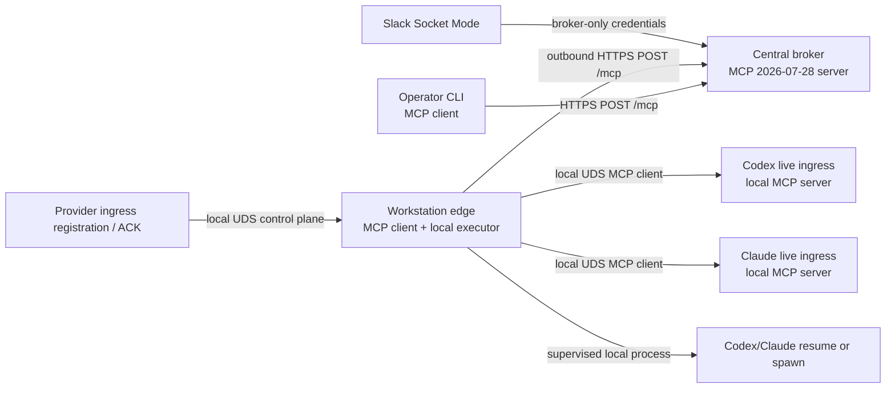

# ADR-0002: Stateless MCP capability plane for Hive v0.4

- Status: Accepted
- Decision: D-HIVE-MCP v1
- Ratified: 2026-08-01 under [KRA-897](https://linear.app/krates-ehf/issue/KRA-897)
- Parent overhaul: [KRA-896](https://linear.app/krates-ehf/issue/KRA-896)
- Supersedes: the v0.3 broker/edge wire contract; the live-provider adapter/local-ingress details
  that mandate loopback callbacks or `claude/channel`; and the narrowly defined no-effect requeue
  transition in ADR-0001. All other ADR-0001 invariants remain authoritative
- Does not authorize: production cutover or removal of `/v1`; that remains an explicit KRA-912 gate

## Context and authority

ADR-0001 remains authoritative for Hive's home, broker-only Slack custody, outward-only workstation
edges, delivery state machine, wake policies, crash honesty, and untrusted-input boundary. Hive v0.4
replaces the bespoke broker/edge API with the stable MCP `2026-07-28` protocol and makes all durable
application state explicit rather than transport-session state.

The normative protocol references are the final
[MCP 2026-07-28 specification](https://modelcontextprotocol.io/specification/2026-07-28), its
[Streamable HTTP binding](https://modelcontextprotocol.io/specification/2026-07-28/basic/transports/streamable-http),
and [server discovery](https://modelcontextprotocol.io/specification/2026-07-28/server/discover).
The [Tasks extension](https://modelcontextprotocol.io/extensions/tasks/overview) is separately
opt-in and experimental. Hive's exact source pin is the project-hosted
`modelcontextprotocol/ext-tasks` proposal, whose pinned revision explicitly disclaims being an
official extension. Hive therefore treats core conformance and this experimental Tasks profile as
two independently pinned and tested claims.

This ADR records all D1-D20 rulings from KRA-896. Its use of MUST, MUST NOT, SHOULD, and MAY is
normative for Hive. Protocol conformance does not weaken an application invariant.

## Preserved invariants

1. Slack Socket Mode and Slack credentials exist only at the broker.
2. Workstation edges make outbound off-box connections and expose no inbound network port.
3. Delivery is at-least-once with one fenced owner; Hive never claims exactly-once processing.
4. A crash after a provider side effect becomes possible is `ambiguous` unless evidence or proven
   provider idempotency establishes a stronger result.
5. `resume` never escalates to `spawn`.
6. Slack bodies and replays are untrusted data. `WAKE` permits routing and dispatch only; it cannot
   grant repository, shell, provider, or operator authority.
7. The broker may assemble an exact Slack thread replay but may not summarize, interpret, redact,
   or prioritize it.
8. Handles identify state. Capabilities authorize operations. A handle is never authority.

## Final topology



The broker is the only off-box MCP server. The edge is the client that claims work. MCP
`subscriptions/listen` MAY wake an edge with a change notification, but it is only a doorbell: the
edge still invokes the mutating claim tool. The protocol has no reverse-invocation channel and Hive
does not invent one. Headless provider execution remains edge application logic. A live provider
ingress is a separate, machine-local MCP server reached by the edge over a Unix-domain socket.

### Dispatch sequence

```mermaid
sequenceDiagram
  participant S as Slack
  participant B as Broker MCP server
  participant E as Edge MCP client
  participant P as Local provider

  S->>B: durable event envelope
  B-->>S: ACK only after transaction commit
  E->>B: hive.delivery.claim(commandId)
  B-->>E: delivery + generation + providerAttempt + scoped capability
  E->>B: resources/read fresh replay (private, ttlMs=0)
  E->>B: hive.delivery.begin_dispatch(commandId)
  B-->>E: durable MCP Task + sealed capability response headers
  E->>E: hive.binding.prepare_ack; commit verifier before exposing secret
  E->>B: hive.delivery.authorize_live_injection(current fence, local command digest)
  B-->>E: provider-start intent + sealed live-injection grant
  E->>P: local dispatch after Task + ACK-verifier + launch-grant durability
  P-->>E: durable local acceptance / provider-start evidence
  opt provider ACK races ahead of broker transition
    P->>E: hive.binding.ack
    E-->>P: ACK evidence durably quarantined
  end
  E->>B: hive.delivery.mark_dispatched(commandId, evidenceRef)
  B-->>E: dispatched + Task working + adapter-specific deadline
  E->>E: activate lifecycle consumption of any quarantined ACK
  E->>B: phase/evidence append commands
  alt explicit provider acknowledgement
    E->>B: hive.delivery.finish(processed, receiptRef)
    B-->>E: terminal delivery + Task + Slack-outbox intent atomically
  else deterministic pre-provider failure
    E->>B: hive.delivery.finish(undeliverable, typedReason)
  else provider effect possible but unproved
    E->>B: hive.delivery.finish(ambiguous, side_effect_uncertain)
  end
```

The durable command record is created before each mutating response. A lost response is retried
with the same command identity and returns the same stored result or Task handle.

Slack ACK requires the normalized event and delivery transaction to commit; an ingest-time full
thread snapshot is not required. The edge MUST obtain a just-in-time full replay immediately before
provider action. Any earlier snapshot is optional audit evidence and never substitutes for that
fresh replay.

## Transport matrix

| Hop | Client -> server | Binding | Authentication | Inbound exposure |
| --- | --- | --- | --- | --- |
| Slack ingress | Slack -> broker | Socket Mode | Slack app credentials | Broker only |
| Delivery/control | Edge -> broker | MCP 2026-07-28 Streamable HTTP at `/mcp` | Edge machine bearer; dispatch capability on scoped calls | Broker only |
| Operator | CLI -> broker | MCP 2026-07-28 Streamable HTTP at `/mcp` | Independent operator/admin bearer scopes | Broker only |
| Local provider diagnostics | Operator CLI -> edge control | MCP 2026-07-28 Streamable HTTP over owner-only UDS | Independent local `provider:probe` operator credential | Local filesystem socket only |
| Live dispatch | Edge -> provider ingress | MCP 2026-07-28 Streamable HTTP over owner-only UDS | Edge-held dispatch credential + dispatch-binding capability + broker-fenced live-injection capability; per-attempt ACK capability when delivery can ACK | Local filesystem socket only |
| Bootstrap registration | Provider bridge -> edge control | MCP 2026-07-28 Streamable HTTP over owner-only UDS | Verified local peer identity + single-use audience-bound registration nonce | Local filesystem socket only |
| Binding renewal | Provider bridge -> edge control | MCP 2026-07-28 Streamable HTTP over owner-only UDS | Provider-held control credential + control-binding capability | Local filesystem socket only |
| Binding confirmation | Provider bridge -> edge control | MCP 2026-07-28 Streamable HTTP over owner-only UDS | Pending-next control credential + capability and exact current/next revision fence | Local filesystem socket only |
| Live ACK | Provider bridge -> edge control | MCP 2026-07-28 Streamable HTTP over owner-only UDS | Provider-held control credential + control-binding capability + distinct per-attempt ACK capability | Local filesystem socket only |
| Headless provider | Edge -> provider process | Supervised process adapter, not an MCP hop | Permission profile + environment allowlist | None |

The broker endpoint accepts one JSON-RPC message per POST and returns JSON or request-scoped SSE.
It validates `Origin`, `Accept`, `MCP-Protocol-Version`, `Mcp-Method`, `Mcp-Name`, and all mirrored
header/body values. It rejects GET and DELETE, mints no `Mcp-Session-Id`, ignores no missing modern
metadata, and implements no `Last-Event-ID` resume. Every request carries protocol version, client
identity, and capabilities in `_meta`; `server/discover` is implemented. Closing a request stream is
transport cancellation, not proof that application work stopped.

Local MCP uses HTTP/1.1 Streamable HTTP request/response framing over a Unix-domain socket, including
real request and response headers; it is not newline-delimited stdio or a custom JSON framing. The
listener never binds TCP. UDS endpoints live in an owner-only runtime directory, are created mode
`0600`, reject symlinks and unexpected owners, verify local peer identity, and use explicit binding
revisions. They preserve the same one-request-per-POST MCP JSON-RPC, modern metadata, header/body
equality, cancellation, and no-session model as the broker endpoint. This gives capability headers a
real authentication-metadata channel without storing any callback URL or network endpoint as
execution authority.

## Identity and authority model

### Machine and operator identities

- An edge credential is a random 256-bit bearer secret minted by the local enrollment plane. The
  broker stores only its SHA-256 digest, edge ID, key ID, validity interval, status, and rotation
  lineage; fixed-length digests are compared in constant time.
- Edge credentials authenticate claim, discovery, health, and explicitly allowed administrative
  calls. They do not authorize a specific delivery.
- Operator read, planning, mutation, reconciliation, and credential-management scopes are distinct.
- Local provider registration and dispatch credentials are independent of broker, edge, Slack, and
  operator credentials. Child processes receive none of those secrets.
- Authentication failures are constant-shape and secret-free. Rotation overlaps are bounded and a
  revoked credential is never restored by an older process.
- Rotation admits active and next keys from one credential lineage for at most ten minutes, then
  requires explicit confirmation and revokes the old key. A still-live delivery capability binds
  that stable lineage, not one key version, so the confirmed next key can continue authorized work;
  crossing an edge or credential lineage revokes the capability. Recovery uses a local, single-use,
  short-lived enrollment secret.
- The edge authenticates the broker through HTTPS certificate validation against one canonical URI;
  the deployment MAY additionally pin the broker certificate's SPKI.
- Hive uses this deliberately narrow machine-to-machine authorization profile. It does not claim
  adoption of the MCP OAuth authorization chapter.

### Delivery-scoped capability

Claim mints an opaque random capability whose broker-side digest is bound to:

```text
edgeId, machineCredentialLineageId, issuedMachineKeyId (audit only), deliveryId,
leaseGeneration, providerAttempt, actor, provider, workspaceHandle,
permissionProfileId/version/digest, allowedOperations, audience, issuedAt, expiresAt
```

The currently active machine bearer authenticates the edge and MUST belong to the bound credential
lineage; `issuedMachineKeyId` never participates in authorization. The delivery capability
authorizes only the bound delivery operations. Both are required. The latter travels in a redacted
`Hive-Dispatch-Capability` header. Capabilities travel only in authentication metadata, never
in a URI, query string, resource body, Task result, diagnostic, trace, error, or provider prompt.
Expiry cannot extend the lease. A stale generation, attempt, edge, audience, or operation fails
closed even if the secret itself is valid. A successful serialized actor-lease renewal atomically
extends every still-active **delivery-lifecycle** capability under that actor/generation, never
beyond the renewed lease; it does not expose a new secret. This rule excludes the evidence-upload
and local ACK-evidence capabilities, which authorize no lifecycle mutation and use their separate
bounded evidence-window expiries. Exact command replay observes the same renewal result. Loss or
unresolved renewal never extends lifecycle capability life.

### Attempt evidence-upload capability

`hive.delivery.begin_dispatch` also mints a separate opaque evidence-upload capability in the same
transaction as the Task. Its digest record binds the original edge and machine-credential lineage,
delivery, lease generation, provider attempt, evidence-stream ID, append-only operation, sequence
floor, audience, size/count limits, and an initial expiry at the validated absolute
attempt-retention ceiling. Measured from Task creation, that ceiling covers the selected adapter's
provider accept/start budget followed by its maximum live-ACK window or supervised-process hard
deadline, plus reconciliation retention. The immutable upload path therefore remains usable
when a provider durably accepts work but actor authority is lost before `mark_dispatched` can run;
no lifecycle command or post-lease extension is needed to keep evidence drain alive.

`mark_dispatched` atomically records the actual adapter-specific attempt deadline and evidence
retention horizon but never has to lengthen the already sufficient upload authority. The narrower
recorded horizon may drive garbage collection only after every bound evidence/outbox obligation is
durably discharged; it cannot revoke an upload capability whose absolute ceiling has not expired.

Before creating the Task, `begin_dispatch` validates that the configured absolute ceiling covers
the selected adapter's provider accept/start budget, maximum live-ACK or supervised-process budget,
and reconciliation retention from Task creation. An invalid configuration fails deterministically
before Task creation or provider effect; the ceiling can never truncate the promised evidence
window. The accept/start deadline is only an operation budget and never the expiry boundary for
immutable evidence upload.

This capability deliberately survives actor-lease loss and revocation of lifecycle authority so a
restarted original edge can drain provider acknowledgement or crash evidence already committed to
its local outbox. It requires a current machine bearer from the original edge/credential lineage and
authorizes only idempotent immutable append for the bound attempt. It cannot claim, renew, dispatch,
cancel, terminalize a Task/delivery, enqueue Slack output, create a new attempt, change an existing
evidence byte, or extend any authority. Sequence/digest conflicts and limit violations fail closed.
Evidence arrival alone never changes delivery truth; an authorized lifecycle command or explicit
reconciliation must consume it. Revoking the edge credential lineage revokes this capability.

### Live-injection capability

Immediately before a live provider call, the edge invokes
`hive.delivery.authorize_live_injection` with its current machine bearer and delivery capability.
The broker validates the exact delivery, lease generation, provider attempt, current actor lease,
local-deliver command ID and canonical request digest, and accept/start budget. From authoritative
delivery, owner, plan, and Task state it derives `edgeId`, actor, provider, required live
surface/version, and permission-profile ID/version/digest; none is caller-selectable. It also binds
the caller-declared local binding ID/revision as non-authoritative coordinates; only provider ingress
can validate them against its confirmed local binding. One compare-and-set transaction commits the
unique `(deliveryId, leaseGeneration, providerAttempt, provider-start intent)` row and returns a
broker-signed, key-ID-versioned `Hive-Live-Injection-Capability` header bound to all authoritative
and declared values, the provider-ingress audience, issuance time, and expiry. Expiry is no later
than both the current lease and the immutable accept/start deadline. The signed grant is independent
of the longer-lived ACK-evidence capability:
neither reusable local binding authority nor ACK authority can substitute for it.

Exactly one launch authorization can exist for an attempt. Reissuing the same command ID and
secret-negative request digest returns the stored byte-identical grant; every other command ID or
digest for that attempt conflicts and mints nothing. The canonical local-deliver digest covers the
MCP method and params, exact replay digest, and non-secret attempt/binding fences. It explicitly
excludes every authentication and capability header, including the live-injection and ACK headers,
which are verified as separate authentication metadata and cannot make the digest circular.

Provider ingress verifies the broker issuer and a launch-signing key chained to a broker trust root
provisioned independently of the reusable edge-dispatch channel; the confirmed binding pins the
allowed key ID but cannot replace that root. It then verifies audience, exact attempt and binding
fence, broker-derived edge/actor/provider and required surface/version against the confirmed binding,
the permission-profile coordinate against the provider's local allowlist, local command ID and
digest, and expiry before first acceptance.

Normal signing-key rotation retains every launch key verify-only until every grant it signed has
expired and every associated non-acceptance, evidence, and local-command replay hold is discharged
or reaches its configured absolute retention ceiling, whichever is later. The root-authorized key
set and binding state record that reference-counted retention; rotation cannot shorten it. Explicit
emergency root revocation fails closed, leaves side effect possible, and creates a reconciliation
obligation rather than manufacturing no-effect proof. An unknown, revoked, or out-of-window key
otherwise fails closed. One local fsync-backed transaction
consumes the grant and stores durable acceptance plus the exact command result before injection.
Fresh use after expiry is rejected. Exact `hive.live.deliver` replay may return the stored acceptance
after expiry but cannot consume the grant or inject again.

Committing launch authorization makes provider effect possible. While its grant is outstanding, no
new attempt may become eligible. Expiry plus durable, exact local evidence
that provider ingress never accepted the grant restores side effect `impossible` and permits the
same atomic authority-loss requeue used before launch intent. Missing, conflicting, or uncertain
evidence produces `ambiguous`; expiry alone is never proof. A crash after `prepare_ack` alone remains
safely pre-effect because the ACK capability cannot cross this launch gate.

KRA-904 owns broker issuance and the provider-start-intent transaction; KRA-900 owns the broker
signing root and root-authorized launch-key set; KRA-908 owns independent trust-root provisioning,
key pinning, confirmed-binding comparison, and provider-ingress verification.

### Recoverable capability response envelopes

Every remotely minted bearer that must survive a lost response has two broker records: a fixed-length
digest used only for verification and a replay envelope used only to reproduce the original response.
For claim, `begin_dispatch`, and `authorize_live_injection`, the broker generates the random 256-bit
secret or signed grant, then seals it with
AES-256-GCM under a broker-local capability-wrapping key. A random 96-bit IV is stored; AAD binds the
capability kind, machine-credential lineage, delivery/generation/attempt coordinates, command ID,
canonical request digest, binding fence where applicable, and wrapping-key ID. The command
transaction stores only
ciphertext/IV/tag, verifier digest, and key ID—never plaintext.

The response carries dispatch authority only in `Hive-Dispatch-Capability`, evidence authority only
in `Hive-Evidence-Upload-Capability`, and the single-attempt launch grant only in
`Hive-Live-Injection-Capability`. These response headers are stripped before any MCP result,
Task, model-visible `_meta`, log, trace, diagnostic, or provider prompt is constructed. The edge
adapter persists them directly into its owner-only secret store before committing its local command
receipt. An exact authorized command replay decrypts the stored envelope and reproduces the
byte-identical header; it does not mint or extend authority. Wrapping-key rotation transactionally
rewraps live envelopes and retains the prior key decrypt-only until every command tombstone it
protects expires. Missing keys or failed authentication fail closed. Ciphertext is not a bearer and
never participates in capability verification.

### Durable command identity

Every mutating call carries a client-generated `commandId` and selects exactly one canonical
idempotency family:

```text
delivery attempt:
  (deliveryId, leaseGeneration, providerAttempt, operation, ordinal,
   commandId, canonicalRequestDigest, resultOrTaskRef)
actor lease:
  (actor, leaseGeneration, operation, ordinal,
   commandId, canonicalRequestDigest, result)
claim:
  (edgeId, claimCommandId, canonicalRequestDigest, storedClaimResult)
administrative target:
  (principalId, targetKind, canonicalTargetKey, expectedTargetRevision,
   operation, commandId, canonicalRequestDigest, result)
reconciliation/outbox:
  (subjectKind, subjectId, expectedStateVersion, evidenceSetDigest,
   operation, commandId, canonicalRequestDigest, result)
local live operation:
  (edgeBootEpoch, bindingId, bindingRevision, deliveryId, leaseGeneration,
   providerAttempt, operation, commandId, canonicalRequestDigest, storedResult)
local binding operation:
  (providerPrincipalId, edgeBootEpoch, registrationNonceOrBindingId,
   expectedBindingRevision, operation, commandId, canonicalRequestDigest, storedResult)
local diagnostic operation:
  (operatorPrincipalId, edgeBootEpoch, provider, probeKind,
   commandId, canonicalRequestDigest, storedResult)
```

`operation` includes the logical phase; repeatable actions such as actor-lease renewal also include
a monotonic ordinal. `hive.edge.report` and subscription mutations use the administrative-target
family; delivery and Slack-outbox reconciliation use the reconciliation/outbox family;
`hive.delivery.authorize_live_injection` uses the delivery-attempt family. Replaying the
exact tuple and
request returns the stored response. Reusing a command identity with different bytes is
`command_conflict`. The MCP request ID and Task ID are not idempotency keys. Before claiming, the
edge durably persists `claimCommandId` because claim mutates ownership before a delivery capability
exists. Local `prepare_ack`/deliver/cancel use the local-live family. For `prepare_ack`, the tuple
selects the exact boot epoch, binding revision, delivery/generation/attempt,
`prepare_ack` operation, command ID, request digest, and stored sealed-header result.
Provider-bridge register/renew/confirm/ACK use the local-binding family; provider probes use the
local-diagnostic family. Registration's single-use nonce is consumed
in the same transaction that stores the exact minted response, so a lost reply can recover the same
binding and secret rather than register twice.

Fresh mutation and exact committed-command replay have distinct authorization decisions. A current
authenticated principal in the original credential lineage may present the complete immutable tuple
and byte-identical request digest to retrieve only an already committed stored response even after
the object capability or lease expired. For broker delivery commands this means the original edge
and machine-credential lineage. Local registration replay is the bootstrap exception: the same
verified OS peer identity, nonce, command tuple/digest, and original bootstrap-credential digest may
retrieve the stored registration response even though that credential is consumed for every fresh
mutation. Other local replay requires the original peer identity and local credential lineage. The
replay path cannot execute application logic, extend authority, or mint a new secret; any returned
expired capability remains expired. A missing/incomplete record, principal
or lineage mismatch, changed digest, or request for fresh execution fails with the ordinary hidden,
conflict, or stale-authority shape. Command tombstones outlive the maximum retry and Task-retention
window.

## Handle grammar and capability catalog

All Hive handles are canonical ASCII URIs. Path segments are percent-encoded once; encoded `/`,
dot-segments, empty identifiers, fragments, user-info, query-carried credentials, and non-canonical
round trips are rejected.

```text
hive://{brokerUuid}/v1/events/{eventId}
hive://{brokerUuid}/v1/deliveries/{deliveryId}
hive://{brokerUuid}/v1/deliveries/{deliveryId}/transitions
hive://{brokerUuid}/v1/deliveries/{deliveryId}/replay
hive://{brokerUuid}/v1/deliveries/{deliveryId}/evidence
hive://{brokerUuid}/v1/dispatches/{deliveryId}/{generation}/{providerAttempt}
hive://{brokerUuid}/v1/reconciliation/pending
hive://{brokerUuid}/v1/outbox{?cursor}
hive://{brokerUuid}/v1/outbox/{outboxId}
hive://{brokerUuid}/v1/subscriptions/{actor}
hive://{brokerUuid}/v1/edges/{edgeId}
hive://{brokerUuid}/v1/edges/{edgeId}/pending
hive://{brokerUuid}/v1/providers/{edgeId}/{provider}
hive://{brokerUuid}/v1/workspaces/{workspaceId}
hive://{brokerUuid}/v1/reason-codes
hive://edge/v1/bindings/{bindingId}?epoch={edgeBootEpoch}&revision={bindingRevision}
hive://edge/v1/providers/{provider}/{providerSessionRef}
```

The broker authority is a stable lowercase UUID from broker metadata. Positive integers use
canonical decimal without leading zeroes. The binding epoch and revision are non-secret ABA fences,
not authority. The optional outbox `cursor` and `outboxId` are opaque non-authority values; a cursor
is bound to the caller's authorization and filters, and a page returns an optional canonical `next`
resource URI. `providerSessionRef` is an edge-minted opaque reference and never the provider's raw
session ID. Task IDs and evidence IDs are opaque. Their results include related Hive handles as data.

### Resource and template catalog

Every row is a resource template advertised only when implemented and authorized. All private reads
repeat authentication and object authorization. `Owner` is the single serving-contract acceptance
owner; a prerequisite supplies a store, probe, or transport seam but does not co-own that surface.

| Template | MCP method(s) | Authorized caller | Content | Cache | Owner | Prerequisite |
| --- | --- | --- | --- | --- | --- | --- |
| `events/{eventId}` | `resources/read` | scoped operator or reconciler | Allowlisted normalized event metadata; no raw Slack body | private, 0 | KRA-903 | KRA-898 adapter |
| `deliveries/{deliveryId}` | `resources/read` | current owning edge capability, scoped operator, or reconciler | Current domain state, typed reasons, and related handles | private, 0 | KRA-903 | KRA-898 adapter |
| `deliveries/{deliveryId}/transitions` | `resources/read` | same delivery authority | Ordered safe transition projection and evidence handles | private, 0 | KRA-903 | KRA-905 evidence |
| `deliveries/{deliveryId}/replay` | `resources/read` | current owning edge with `replay:read`, or separately audited raw-replay operator scope | Fresh exact thread replay for that delivery only | private, 0 | KRA-903 | KRA-898 adapter |
| `deliveries/{deliveryId}/evidence` | `resources/read` | owning edge metadata scope, evidence operator, or reconciler | Bounded evidence metadata and separately authorized chunks | private, 0 | KRA-903 | KRA-905 evidence |
| `dispatches/{deliveryId}/{generation}/{providerAttempt}` | `resources/read` | matching owning edge, scoped operator, or reconciler | Attempt phase, immutable Task reference, and safe result projection | private, 0 | KRA-903 | KRA-905 Task/evidence store |
| `reconciliation/pending` | `resources/read` | evidence operator or reconciler | Open obligation count, oldest age, delivery/attempt handles, safe reason/evidence-completeness fields; no raw bodies | private, 0 | KRA-903 | KRA-905 obligation store |
| `outbox{?cursor}` | `resources/read` | operator or reconciler holding `outbox:read` | Bounded cursor page of authorized outbox handles, event/delivery handles, lane/outcome sequence, outcome kind, state/version, attempt count/times, evidence completeness, and remediation; optional `next` URI; no message body | private, 0 | KRA-911 | KRA-905 outbox store; KRA-903 common resource adapter |
| `outbox/{outboxId}` | `resources/read` | operator or reconciler holding `outbox:read` and subject visibility | Exact safe subject, state and `expectedStateVersion`, lane position, send-attempt verdict/times, `evidenceSetDigest` and authorized evidence handles, uncertainty, and allowed typed reconciliation verdicts; no message body, token, credential, or raw Slack response | private, 0 | KRA-911 | KRA-905 outbox store; KRA-903 common resource adapter |
| `subscriptions/{actor}` | `resources/read` | subscription admin, scoped operator, or edge currently leasing that actor | Versioned subscription projection with no credential | private, 0 | KRA-903 | KRA-898 adapter |
| `edges/{edgeId}` | `resources/read` | that edge or scoped operator | Safe identity, compatibility, and health projection | private, 0 | KRA-903 | KRA-898 first resource |
| `edges/{edgeId}/pending` | `resources/read`; optional `subscriptions/listen` resource-update doorbell | that edge only | Queue revision and `hasWork`; never delivery content | private, 0 | KRA-903 | KRA-899 doorbell/claim transport |
| `providers/{edgeId}/{provider}` | `resources/read` | that edge or scoped operator | Safe capability/version/availability observations; no raw session ID | private, 0 | KRA-903 | KRA-910 probe projection |
| `workspaces/{workspaceId}` | `resources/read` | mapped edge or scoped operator | Safe mapping/readiness projection | private, 0 | KRA-903 | KRA-898 adapter |
| `reason-codes` | `resources/read` | any authenticated Hive client | Caller-independent typed reason documentation | public, 3600000 | KRA-903 | KRA-901 typed outcomes |
| `bindings/{bindingId}` (edge-local) | `resources/read` | edge executor or matching local binding principal | Actor/provider/surface/epoch/revision/expiry; endpoint and secrets excluded | private, 0 | KRA-908 | KRA-898/KRA-900 schemas and local authority |
| `providers/{provider}/{providerSessionRef}` (provider-local) | `resources/read` | edge with matching binding capability | Supported live surface and opaque session reference | private, 0 | KRA-908 | KRA-898/KRA-900 schemas and local authority |

KRA-903 alone owns and accepts the broker replay resource, including fresh assembly, authorization,
and zero-TTL serving. KRA-904 is its consumer: it owns the requirement to perform that read
immediately before provider action and pass the exact returned bytes onward. Consumption timing does
not make KRA-904 a co-owner or prerequisite of the resource surface.

`outbox:read` and `outbox:reconcile` are separate scopes. An outbox handle, cursor, state version,
or evidence digest never grants mutation authority. Unauthorized and cross-subject reads use
`hive_not_found_or_hidden`; reconciliation repeats authorization and the reconciliation-family
state/evidence compare-and-set.

### Broker tool catalog

| Tool | Caller | Effect |
| --- | --- | --- |
| `hive.delivery.claim` | edge | Fairly select and atomically claim the next eligible delivery |
| `hive.delivery.accept` | owning edge | Record durable local acceptance |
| `hive.delivery.renew_lease` | owning edge | Renew the actor-generation lease through one serialized ordinal |
| `hive.delivery.begin_dispatch` | owning edge | Validate plan and create the durable dispatch Task before provider start |
| `hive.delivery.authorize_live_injection` | owning edge | Validate current lifecycle authority, bind the declared local binding/command coordinates, atomically record the unique provider-start intent, and return its replayable exact-attempt live-injection grant |
| `hive.delivery.record_phase` | owning edge | Append a fenced phase/evidence reference |
| `hive.delivery.mark_dispatched` | owning edge | Atomically record provider acceptance/start evidence, transition `dispatching -> dispatched`, and start the adapter-specific attempt deadline |
| `hive.delivery.reserve_spawn` | owning edge | Acquire the single fenced spawn reservation |
| `hive.delivery.finish` | owning edge | Atomically record a typed terminal result, terminalize the Task, and insert the versioned terminal Slack-outbox intent |
| `hive.delivery.cancel` | owning edge with matching delivery capability, or separately scoped operator | Request cooperative cancellation under separate authority |
| `hive.delivery.append_evidence` | owning edge, or original edge lineage with the attempt evidence-upload capability after lease loss | Idempotently append bounded immutable attempt evidence without lifecycle authority |
| `hive.reply.enqueue` | owning edge | Durably enqueue explicitly nonterminal progress output; terminal outcomes are forbidden here |
| `hive.edge.report` | edge | Report safe last-seen, workspace, and provider observations |
| `hive.subscription.upsert` | subscription admin | Validate and write one subscription |
| `hive.subscription.validate` | subscription admin | Validate without mutation |
| `hive.dispatch.plan` | operator | Compute a read-only dispatch plan without claim/probe mutation |
| `hive.delivery.reconcile` | reconciler | Atomically append the safe verdict, apply the delivery/Task result, close its obligation, insert the outcome-revision Slack-outbox intent, and store the replayable result |
| `hive.outbox.reconcile` | reconciler holding `outbox:reconcile` | CAS `expectedStateVersion` and `evidenceSetDigest`, then append and replay the separate idempotent Slack-outbox verdict; never rewrite the delivery verdict |

The claim tool replaces the current mutating `GET /v1/deliveries`. Lifecycle routes are not
mistaken for resources merely because the old transport used HTTP verbs. Replay is a fresh private
resource read immediately before action. Provider execution itself is not a broker-to-edge tool.
Claim has no client cursor capable of excluding older eligible work: the broker scans all eligible
pending deliveries fairly. The current `/v1/admin/*` edge-mint, subscription, and reconciliation
surfaces are explicitly owned by the local enrollment, subscription-admin, and reconciliation
planes above rather than disappearing from the replacement inventory.

`hive.delivery.mark_dispatched` is the sole authoritative transition from `dispatching` to
`dispatched`. It requires the current delivery capability and durable local-acceptance or
provider-start evidence for the same attempt, commits the transition and adapter-specific deadline
atomically, and leaves the Task `working`. For a live attempt it starts `liveAckDeadline`; for a
headless attempt it records the already bounded supervised-process deadline and never creates a
human live-ACK clock. Headless completion follows process-exit evidence. Failure before this point
remains a deterministic pre-provider outcome when no effect is proved.

A live provider MUST durably accept the attempt before `mark_dispatched`, but a correctly fenced
provider ACK may race before or after that broker transition. `hive.binding.ack` always appends such
an ACK as immutable local evidence; it never directly mutates broker delivery, Task, or Slack truth.
Before the exact `mark_dispatched` result is durable locally, the edge quarantines that evidence.
Afterward, current lifecycle authority may consume it through `finish`; if authority is lost first,
the edge drains it with the attempt evidence-upload capability for explicit reconciliation. Fast,
synchronous, and post-lease ACK evidence is therefore never rejected merely for timing.

`server/discover` returns only `2026-07-28` and an authentication-filtered catalog. It advertises the
pinned Tasks profile only when implemented and explicitly negotiated by the caller, and advertises
no prompt, subscription, tool, or resource capability that is not actually implemented. Server
identity is display-only and never participates in authorization. The per-edge pending resource
contains only a queue revision and `hasWork`, never delivery content; a resource-update notification
for it is a lossy doorbell.

### Local live-ingress catalog

Initial edge mint and recovery are deliberately absent from the advertised MCP catalog. A local
broker-admin CLI/UDS plane owns mint, rotate, revoke, and one-time enrollment so a generic MCP client
cannot discover bootstrap authority.

The two local directions have separate catalogs and credentials:

| Server / tool | Caller | Required input and durable result |
| --- | --- | --- |
| provider ingress / `hive.live.describe` | edge executor | Binding ID/revision and boot epoch; returns supported surface/version and opaque `providerSessionRef` |
| provider ingress / `hive.live.deliver` | edge executor | Delivery/generation/attempt, broker-derived edge/actor/provider/surface/profile coordinates, binding fence, exact replay, broker-fenced live-injection capability, per-attempt live-ACK capability in its dedicated authentication header, and command ID; compares semantic coordinates to the confirmed binding/local profile allowlist, then atomically consumes the grant and stores durable local acceptance before provider injection can be repeated |
| provider ingress / `hive.live.cancel` | edge executor | Delivery/generation/attempt, binding fence, reason, and command ID; stores and returns cooperative cancellation acknowledgement |
| edge control / `hive.binding.register` | provider bridge | Actor, provider, surface/version, allowed operations, boot epoch, one-time registration nonce, command ID, and root-authorized broker launch-key IDs; atomically stores a pending binding and recoverable provider-facing directional envelope without replacing the provider's trust root |
| edge control / `hive.binding.renew` | matching provider bridge | Binding ID, current revision, boot epoch, command ID, and any root-authorized launch-key-set update; exact CAS stages a next revision while current remains active and returns one stored encrypted renew envelope |
| edge control / `hive.binding.confirm` | matching provider bridge | Current/next revision fence, originating register/renew command ID, and new command ID authenticated by pending-next control authority; atomically promotes next and returns stored confirmation |
| edge control / `hive.binding.prepare_ack` | edge executor with current delivery authority | Binding fence, delivery/generation/attempt, broker-authenticated `begin_dispatch` result reference, and command ID; derives the bounded ACK expiry, durably stores the verifier and sealed header replay, then emits the secret only in the dedicated authentication response header |
| edge control / `hive.binding.ack` | matching provider bridge | Binding fence, delivery/generation/attempt, ACK kind, bounded receipt reference, and command ID; appends one fenced immutable local-journal result without lifecycle effect, quarantined until `mark_dispatched` is durable |
| edge control / `hive.provider.probe` | local operator with `provider:probe` | Provider, probe kind, hard deadline, and command ID; returns one immediate supervised typed result and creates no delivery Task |

Before `hive.live.deliver` can carry a live-ACK secret to provider ingress, the edge executor calls
`hive.binding.prepare_ack`. Its request names the exact broker-authenticated `begin_dispatch` result
already committed in the edge journal; callers never supply an expiry. Edge control verifies the
delivery/generation/attempt and result digest, then derives `ackEvidenceExpiresAt` from the immutable
broker-bound attempt-retention ceiling. It rejects any missing/mismatched result and can neither
extend that ceiling nor select a later time.

One fsync-backed local transaction stores the verifier digest, exact attempt and binding-revision
fence, derived expiry, command identity, sealed header replay, and the attempt-scoped verification
hold on the bound control bundle. Only after commit may edge control emit plaintext in the dedicated
`Hive-Live-Ack-Capability` authentication response header. The edge transport persists that header
in its owner-only secret store and strips it before any DTO/application/logging layer sees the
response; it passes the secret to `hive.live.deliver` only as the matching authentication request
header. The deliver call fails closed if the prepared verifier is not durable. Provider ingress
persists the header in its owner-only secret store with durable local acceptance and strips it before
provider injection; if either write fails, injection MUST NOT begin.

A crash after ACK preparation but before broker live-injection authorization leaves an unused
bounded ACK capability and cannot create provider effect. A synchronous ACK can therefore be
verified and journaled rather than racing verifier creation. Plaintext never enters a command row,
replay body, Task, DTO,
provider prompt, log, trace, or diagnostic. Exact preparation replay opens the stored ciphertext
only through the owner-only edge-local wrapping key and re-emits the same header bytes over the
authenticated UDS; the body remains secret-negative and the durable command row contains only
ciphertext/IV/tag and fixed-length digests.

Preparation is evidence setup, not launch authority. After it succeeds, the edge calls
`hive.delivery.authorize_live_injection` and persists and strips that response header through the
same owner-only transport seam. Provider ingress requires both separate headers, verifies the
broker-signed launch grant as specified above, and atomically consumes it with acceptance. Exact
`prepare_ack` replay may recover the byte-identical ACK header after lifecycle expiry, but it cannot
satisfy, mint, refresh, or bypass the live-injection gate.

Registration authenticates both the local peer identity and a single-use, audience-bound bootstrap
credential delivered outside Slack and outside the discoverable catalog. In the same durable
transaction that consumes the nonce and stores the replay result, the edge mints two independent
256-bit directional bundles:

- a dispatch credential plus dispatch-binding capability for edge -> provider-ingress calls; and
- a control credential plus control-binding capability for provider -> edge-control renew/ACK calls.

The provider bridge's broker trust root is provisioned outside both bundles. Registration or renewal
may carry only launch-signing key IDs and key sets that validate under that root; confirmation pins
the accepted set to the binding revision. No edge-supplied value can replace the root or authorize an
unrooted launch key.

Each bundle has its own credential/capability lineage, audience, allowed operations, and expiry. The
sender stores secret material in its owner-only local secret store; the receiving verifier stores
only fixed-length digests. Concretely, the edge retains dispatch sender secrets and control verifier
digests; the provider receives dispatch verifier digests and its control sender secrets.

The provider-facing envelope has an explicit wrapping key. Both peers derive it with HKDF-SHA-256
from the 256-bit bootstrap secret, registration nonce, and the fixed info string
`hive-binding-bootstrap/v1`; AES-256-GCM uses a random stored 96-bit IV and authenticates peer
identity, edge boot epoch, command ID, and canonical request digest as AAD. The edge stores only the
ciphertext/IV/tag and bootstrap-secret digest, then discards the wrapping key and provider-held
plaintext. Exact registration replay re-verifies the same bootstrap secret and tuple and returns the
same ciphertext without decrypting it; the provider derives the key and opens it. Logs, resources,
Tasks, evidence, and ordinary command rows contain only non-secret IDs, digests, and ciphertext.

Renewal uses a separate recoverable envelope and preserves both factors of control authority. Both
peers run HKDF-Extract-SHA-256 with the current control-binding capability as salt and the current
control credential as input keying material, then HKDF-Expand-SHA-256 over the canonical
binding/current/next revision tuple and fixed info string `hive-binding-renew/v1`. AES-256-GCM again
uses a random stored 96-bit IV and authenticates peer identity, edge boot epoch,
binding/current/next revisions, renew command ID, and canonical request digest as AAD. The edge
stores only ciphertext/IV/tag plus separate fixed-length digests of the current credential and
capability, then discards the wrapping key and next provider-held plaintext. Exact renew replay
requires the same verified peer plus both now-current or bounded-previous secret values solely to
retrieve the byte-identical stored ciphertext; either factor alone cannot decrypt or authorize it,
and neither may authorize another renewal or any fresh operation. The provider derives the same key
from both factors and opens the next control secrets/dispatch verifiers.

Registration and renewal use explicit pending/current states:

1. Register stages the initial bundle as `pending`; renew authenticates with `current`, stages exactly
   one `next` revision, and leaves current sender/verifier pairs active.
2. The provider installs the next dispatch verifier in accept-next state and its next control sender
   secret, then invokes `hive.binding.confirm` using that next control authority.
3. Confirm atomically promotes both directional bundles. A lost renew response replays through the
   still-current bundle; a lost confirm response replays through the now-current next bundle. The
   provider accepts current and next dispatch verifiers during staging, so neither loss strands the
   edge.
4. Binding an attempt atomically creates an attempt-scoped `ack-verification-only` hold for the
   exact control credential/capability digests through that attempt's ACK-evidence expiry. Nominal
   expiry or promotion of a bundle cannot remove such a hold, whether the bundle is still `current`
   or has become `previous`. A held bundle is narrowed to `hive.binding.ack` and exact
   stored-response replay for its already-bound tuples; it cannot renew, confirm, bind, deliver, or
   accept new work. New work uses a non-expired current bundle. The verifier is removed only after
   its last hold expires or is durably discharged. Explicit binding or control-lineage revocation
   overrides retention and fails closed.

Before initial confirmation the binding cannot dispatch. ACK requires the control bundle that was
bound to the attempt—active current authority or its attempt-scoped verification hold—plus the
distinct per-attempt live-ACK capability. The pair authenticates only immutable evidence for that
exact attempt, remains verifiable through the bounded attempt-plus-reconciliation window despite
bundle promotion, nominal expiry, or actor-lease loss, and cannot authorize lifecycle completion.
Edge control durably journals a valid early ACK and quarantines it until the broker's
`hive.delivery.mark_dispatched` result is local; after lease loss it remains evidence for
upload/reconciliation only. The edge derives and validates socket identity from the owner-only
runtime directory; the caller never supplies an arbitrary URL or broker/admin target.
Registration binds actor, provider, edge, opaque provider-session reference, binding ID and revision,
edge boot
epoch, surface/version, allowed operations, expiry, and both credential lineages. Redirects, TCP
targets, cross-actor use, expired registrations, and stale revisions fail closed.

`hive.provider.probe` is deliberately local: the broker cannot invoke an outward-only edge. The
operator CLI must run on the selected workstation and call its owner-only edge-control UDS with a
separate `provider:probe` credential, or fail `hive_local_edge_required`. KRA-910 supplies the supervised
version/capability probe with an environment allowlist and hard deadline. The result is immediate and
creates no delivery Task. Persisting a new broker observation is a separate explicit, idempotent
`hive.edge.report` mutation; a read/plan command never triggers a probe implicitly.

The current Claude SDK-v1 experimental notification is a migration input, not a valid v0.4
capability. KRA-908 owns its replacement and the Codex/Claude live conformance seam.

## MCP Task projection

Core protocol conformance and `io.modelcontextprotocol/tasks` extension conformance are negotiated
and tested separately. Hive advertises Tasks only when the exact extension schema is supported by
both peers. The initial source pin is `modelcontextprotocol/ext-tasks` commit
`2c1425d9a288b9b1f489430fe1e00bb392b47e48`; its private `0.1.0` package is not treated as a
published dependency. KRA-898 records generated schema provenance and may advance the pin only in a
reviewed conformance change. No floating draft is trusted at runtime.

The pinned Tasks text still contains the pre-final `-32003` value for missing client capability,
while stable core `2026-07-28` assigns `MissingRequiredClientCapability` to `-32021`. The stable core
code wins in Hive's profile. KRA-898 records this upstream extension delta as a raw-wire fixture;
Hive never allocates either value to a custom error.

`hive.delivery.begin_dispatch` durably creates one immutable Task and the separate evidence-upload
capability per provider attempt before returning the Task handle. The secret travels only in the
sealed `Hive-Evidence-Upload-Capability` response header and is reproduced byte-identically from the
stored envelope on exact replay. It never asks the
client to perform the provider side effect through `tasks/update`; edge phase/evidence tools remain
the application protocol. `tasks/update` carries only responses to outstanding `inputRequests`.
`tasks/cancel` is cooperative. Polling via `tasks/get` is the baseline; task notifications over
`subscriptions/listen` are an optional optimization and never required for correctness. Hive v0.4
defines no non-delivery Task kind: provider/version probes are bounded immediate operations.

| Operation | Initial result | Terminal Task projection |
| --- | --- | --- |
| Discovery, lists, reads, validation, plan | Immediate | None |
| Claim, accept, renew, live-injection authorization, mark-dispatched, spawn reservation | Immediate durable result | None |
| Dispatch begin | Immediate durable Task handle; evidence authority only in a sealed response header | See delivery projection below |
| Local live-deliver injection | Immediate local acceptance | Broker Task remains `working` for explicit `hive_ack` |
| Headless resume/spawn | Broker Task `working` | `completed` domain result or `cancelled` with no-effect proof |
| Provider/version probe | Immediate bounded result or typed timeout | None |
| Reconciliation after validated preconditions | Immediate durable result | Creates no Task; may terminalize the existing `working` attempt Task, never rewrites a terminal Task |

| Hive truth | Task truth |
| --- | --- |
| Provider effect not begun; cancellation and delivery disposition durably proved | `cancelled` |
| `processed` with provider evidence | `completed` with `CallToolResult.isError=false` and receipt/evidence handles |
| Deterministic `undeliverable` | `completed` with `CallToolResult.isError=true` and side effect `impossible` |
| `ambiguous` | `completed` with `CallToolResult.isError=true`, side effect `possible`, and reconciliation handle |
| `dead_letter` | `completed` with `CallToolResult.isError=true` and terminal reason set |
| JSON-RPC execution failed without a Hive domain outcome | `failed` |

The first transition of an attempt to `ambiguous` atomically inserts one durable reconciliation
obligation keyed by delivery, provider attempt, and outcome revision. The completed Task result
contains the obligation handle, and the authorized `reconciliation/pending` resource lists it until
an explicit safe verdict appends a closure. Creating another attempt for that delivery is forbidden
while the obligation is open. Hive v0.4 performs no automatic reconciliation and never treats Task
completion as discharge of the obligation; unrelated deliveries may continue.

An explicit reconciliation verdict is one idempotent serializable command transaction. It verifies
the still-open obligation, expected outcome revision, and evidence-set digest; appends the immutable
operator verdict; applies the resulting delivery transition; terminalizes the same attempt's Task
only if it is still `working` (`completed` for a domain terminal or `cancelled` for an
evidence-proved no-effect requeue); closes exactly that obligation; inserts exactly one
sender-outcome Slack-outbox revision; and stores the command result atomically. A historical
terminal Task is never rewritten. No new attempt can observe the obligation as closed or become
claimable before the verdict and outbox revision are durable, and a crash cannot leave a recorded
verdict with an open obligation or a closed obligation without its verdict. Exact replay returns
the stored transaction result; any conflict rolls back the entire transaction.

The baseline ambiguity budget is zero open obligations: the first open item makes reconciliation
health degraded and emits one bounded operator alert, but does not make the broker unavailable.
KRA-906 exposes only aggregate open-count and oldest-age signals; KRA-911 owns the actionable queue
and verdict. Cutover progression and legacy removal in KRA-912 require zero open obligations. Every
transition/restart/sweep path uses the same idempotent obligation insert, so repeated recovery cannot
inflate the backlog.

Four clocks remain independent:

1. The lease controls delivery authority.
2. The live-ACK deadline controls how long an unacknowledged live attempt may remain `dispatched`
   before becoming `ambiguous`; it does not exist for headless attempts.
3. Task `ttlMs` controls Task retrieval retention only.
4. Task `pollIntervalMs` is client pacing only.

Active Tasks use `ttlMs=null`. At terminalization, Hive sets a TTL that retains the Task beyond the
maximum live-ACK deadline and evidence reconciliation window, measured from Task creation as the
extension requires. Task expiry or a missed poll never changes delivery state. Dedup tombstones
outlive Task payload retention. A live-ACK deadline or lease loss after provider start may create
ambiguity; a Task clock cannot. Requeue creates a new provider attempt and a new immutable Task; a
later reconciliation never rewrites a historical terminal Task.

Provider accept/start and supervised-process hard deadlines are bounded adapter-operation budgets
owned by KRA-910, not additional Task clocks. They never choose a disposition without durable phase
and side-effect evidence. From Task creation, the evidence-upload authority covers the selected
adapter's entire maximum accept/start plus live-ACK or supervised-process window, followed by
reconciliation retention, even when `mark_dispatched` never commits. `mark_dispatched` records the
actual attempt deadline but neither creates nor shortens that upload window. `begin_dispatch`
rejects configuration whose absolute attempt-retention ceiling cannot cover the full selected
window.

A Task cannot terminalize independently of delivery truth. When operator cancellation is proven
before any provider effect, the broker atomically records delivery `undeliverable` with
`operator_cancelled` and Task `cancelled`. When actor-lease authority is lost before launch intent,
or after the unique live launch grant expires and exact durable non-acceptance
evidence restores side effect `impossible`, or after headless process creation is durably proved
absent, the broker atomically closes that attempt's Task as `cancelled` and requeues the delivery to
`pending`; the next claim receives a higher lease generation and provider attempt. While a launch
grant is live, or whenever acceptance/process evidence is missing or uncertain, requeue is forbidden
and the attempt becomes `ambiguous`. Once provider effect remains possible, cancellation cannot
produce Task `cancelled`: evidence instead yields the appropriate
`processed`, `undeliverable`, or `ambiguous` domain terminal. No terminal Task may leave its delivery
stranded in `dispatching` or `dispatched`.

## Error, disposition, and retry contract

Stable JSON-RPC and MCP errors retain their exact codes and HTTP behavior: parse/invalid
request/method/params, `HeaderMismatch` (`-32020`), `MissingRequiredClientCapability` (`-32021`),
and `UnsupportedProtocolVersion` (`-32022`). Authentication uses safe HTTP 401. Endpoint- or
method-scope denial is decided before any object lookup and uses safe HTTP 403. After a principal is
admitted to that method, an unknown, unauthorized, or cross-actor object handle always uses one
indistinguishable `Invalid params` (`-32602`) / `hive_not_found_or_hidden` shape. Hive allocates no
custom JSON-RPC numeric range.

Completed tool/domain outcomes use `CallToolResult.isError` and stable symbolic names in structured
content rather than misusing JSON-RPC failure. The catalog includes:

| Stable name | Retry rule |
| --- | --- |
| `hive_capability_invalid` | No; reclaim under current authority |
| `hive_replay_rejected` | Exact command replay returns stored result; other replay fails |
| `hive_fence_stale` | No; stale owner must stop |
| `hive_command_conflict` | No; investigate client bug |
| `hive_invalid_transition` | No without a fresh resource read |
| `hive_provider_unavailable` | Only if evidence proves provider never started |
| `hive_provider_incompatible` | No until version/capability changes |
| `hive_workspace_unmapped` | No until mapping changes |
| `hive_rate_limited` | Exact bounded retry before provider start only |
| `hive_deadline_exceeded` | Phase-dependent; never infer provider non-execution |
| `hive_cancel_conflict` | Read current Task/delivery state |
| `hive_side_effect_uncertain` | Never automatic; reconcile |
| `hive_evidence_incomplete` | Repair evidence before reconciliation |
| `hive_legacy_disabled` | Select MCP explicitly; never auto-fallback |
| `hive_binding_stale` | Re-register and obtain current revision |
| `hive_local_edge_required` | No on this host; run the command on the target workstation |
| `hive_reconcile_unsafe` | No; supplied evidence cannot exclude duplication |
| `hive_internal_failed_closed` | Retry only with the same command identity |

Every failure has a versioned machine shape containing
`name`, `retryable`, `phase`, `sideEffect` (`impossible`, `possible`, or `confirmed`), safe
`reasonCodes`, and optional `retryAfterMs`/resource handle. Public messages never include tokens,
headers, request bodies, raw output, environment, cwd, SQLite text, or exception strings.

Deterministic failures such as an absent workspace mapping, absent provider adapter, or a rate cap
before provider start are `undeliverable`, not `ambiguous`. An automatic retry is permitted only
when evidence proves the provider side effect was impossible or the exact provider operation has a
deployed idempotency proof.

## Cancellation and authority loss

| Observed phase | Cancellation / lease loss result |
| --- | --- |
| Before validation completes | Stop; operator cancellation records `undeliverable/operator_cancelled`; lease loss releases for fenced reclaim |
| Claimed/accepted, before durable dispatch Task | Lease loss requeues `pending` for a higher generation; operator cancellation records `undeliverable/operator_cancelled` |
| Task durable, before provider-start intent | With no-effect proof, atomically cancel Task and record operator `undeliverable` or authority-loss requeue |
| Start intent recorded; live grant expired with durable non-acceptance proof, or headless process creation durably proved absent | Operator cancellation records deterministic `undeliverable/operator_cancelled`; authority loss atomically cancels the Task and requeues under a higher generation/attempt |
| Provider starting/running or start outcome unknown | Attempt cleanup; `ambiguous` unless provider proves no effect |
| Provider completed, result not durably recorded | `ambiguous` unless durable provider evidence proves result |
| Result durably recorded | Return stored terminal result; cancellation cannot rewrite history |

`tasks/cancel` acknowledges intent with an empty result. It may leave a Task `working`, and a race
may produce a terminal result other than `cancelled`. Cancelling an already terminal Task never
changes Hive state. Transport-stream closure after command commit does not imply Task cancellation.

Exactly one serialized, reference-counted renewer exists per `(actor, leaseGeneration)`; every active
delivery attempt under that lease attaches to it rather than starting a delivery-local loop. It
remains active until every associated attempt is terminal or no longer provider-effect-possible,
including the human-latency live-ACK window. The first loss or uncertain renewal is sticky, revokes
every associated delivery capability, and later success cannot clear it. Authority loss attempts
provider cancellation/process-group cleanup, but cleanup success is not evidence that earlier side
effects did not occur. A revived stale edge cannot dispatch, turn acknowledgement evidence into a
result, reply, or record lifecycle truth. Its only post-lease broker mutation is immutable,
attempt-bound outbox drain through the separate evidence-upload capability; that append cannot alter
lifecycle truth. The edge-control server may still journal a correctly fenced provider ACK as local
immutable evidence during its bounded evidence window.

## Resource privacy and cache matrix

`cacheScope=public` means safe to share across authorization contexts; it does not mean unauthenticated
network access. Every complete Hive discovery, list, and resource-read response MUST carry valid
`cacheScope` and `ttlMs`; omission or malformed values are a Hive-server conformance failure. A
private/zero defensive fallback exists only when consuming an explicitly allowlisted nonconforming
compatibility peer and never makes Hive's own response conformant.

| Resource/result | Scope | `ttlMs` | Content rule |
| --- | --- | ---: | --- |
| `server/discover`, `tools/list`, `resources/list` | private | 5000 | Filtered by current request authority |
| Caller-independent schema/resource templates | public | 300000 | Static contract material only |
| Typed reason documentation | public | 3600000 | No delivery identifiers or operator detail |
| Delivery, history, Task, cancellation state | private | 0 | Owning edge or authorized operator only |
| Normalized Slack event metadata | private | 0 | Field-allowlisted IDs/timestamps/routing only; no raw body |
| Exact Slack replay | private | 0 | One authorized delivery/thread; exact raw untrusted bytes |
| Subscription, edge, provider, workspace health | private | 0 | Scope-filtered operational state |
| Evidence and reconciliation preconditions | private | 0 | Explicit evidence/reconciler authority |
| Slack-outbox inspection and reconciliation preconditions | private | 0 | Explicit `outbox:read`; safe metadata and authorized evidence handles only |
| Human/JSON CLI views | private | 0 | Same resource authorization as underlying data |

Every `tasks/get`, `tasks/update`, and `tasks/cancel` repeats authentication and authorization; Task
IDs are not bearer authority. No resource returns a credential, secret-store reference, unrelated
transcript, provider prompt, full child environment, cwd, or arbitrary process output. An
unauthorized or cross-actor lookup uses the same `hive_not_found_or_hidden` shape as absence.

Raw replay authorization is field- and caller-specific:

| Caller | Normalized metadata | Exact replay |
| --- | --- | --- |
| Current owning edge | Allowlisted fields for its delivery | Allowed only with the matching delivery capability and `replay:read` operation immediately before action |
| Provider-local principal | No direct broker read | No direct broker read; receives only the exact current-thread replay inside a matching fenced `hive.live.deliver`; Hive attaches no authentication material or messages from other threads |
| Ordinary operator read scope | Allowlisted fields for authorized objects | Denied |
| Operator with separate `slack_replay:read` scope | Allowlisted fields | Exact named-delivery replay, audited on every read |
| Reconciler | Evidence and normalized fields needed by the verdict | Denied unless the same principal separately holds audited `slack_replay:read` |

An exact replay is assembled fresh and is neither summarized nor selectively redacted. If a caller
cannot receive every raw message in that delivery thread, the exact-replay read is denied rather
than silently transformed. The normalized event resource is a separate allowlisted projection, not
a redacted replay. Credential-shaped text originally posted in Slack remains exact untrusted Slack
data; the guarantee is that Hive never injects its own transport or authentication credentials into
the replay body.

## Evidence and persistence

KRA-905 introduces the target append-only evidence plane. This ADR does not pretend the current
broker already has a Slack outbox or provider-evidence store. The target stores are:

- broker event/delivery/lease/command/Task/transition/outbox/reconciliation-obligation evidence;
- edge local dispatch journal, provider probe/process/phase/output-reference evidence;
- idempotent evidence transfer keyed by evidence ID and canonical digest;
- bounded chunks with size, count, retention, and total-delivery limits;
- append-only operator verdicts rather than overwritten history.

Broker and edge each assign a durable per-ledger sequence. Cross-ledger causality uses evidence,
command, Task, and correlation links; wall clocks are diagnostic and never manufacture a total
order. The edge retains an idempotent evidence outbox until the broker acknowledges its sequence.
Lease loss does not discard it: the original edge may drain only its immutable bound records through
the attempt evidence-upload capability, and reconciliation/lifecycle authority remains separate.
Command dedup, Task creation, and the `dispatching` transition commit in one broker transaction.
For live dispatch, broker provider-start intent commits before local acceptance or injection, and
provider ingress durably consumes that grant before injection. For headless dispatch, provider
launch intent commits locally before spawn. Provider acknowledgement evidence commits before broker
terminalization.

Every transaction that first commits or appends a sender-visible outcome revision atomically inserts
one idempotent Slack-outbox intent keyed by event/delivery plus outcome revision. This includes
ingress rejection or `unroutable`, operator cancellation, `finish`, live-deadline/lease sweeps,
`dead_letter`, and reconciliation—not only ordinary edge commands. A terminal transition also
terminalizes a still-`working` Task in that transaction. If reconciliation follows an already
terminal historical Task such as `ambiguous`, it appends the delivery verdict and outbox revision
without changing that immutable Task.

The outbox worker may deliver at least once and records provider evidence separately, but a crash or
authority loss cannot erase the sender-visible outcome intent. `hive.reply.enqueue` is reserved for
explicitly nonterminal progress. Every progress intent carries the same per-event/delivery outcome
sequence, and one durable fenced send lane serializes Slack delivery for each event/delivery key.
The worker may claim only the lowest unresolved sequence in that lane; at most one Slack request for
the key may be in flight.

When a terminal revision commits, all lower unclaimed progress rows are atomically marked
superseded before the terminal row becomes send-eligible. A lower progress row already claimed or in
flight is a terminal barrier: it must reach a durable `delivered`, proved-not-sent/permanently-failed,
or explicitly reconciled uncertain verdict before the terminal Slack request may start. Thus a
delayed progress send can finish only before terminal output, never after it. Once a terminal
revision exists, every later or replayed progress enqueue is rejected/suppressed; once its Slack
send begins, no progress row for that lane can be claimed. Lane lease loss preserves sequence
ownership in the durable outbox; `hive.outbox.reconcile` resolves uncertain Slack delivery without
rewriting the delivery verdict.

Each event records schema version, delivery, generation, provider attempt, command, actor/edge,
binding revision where relevant, monotonic phase, wall time, and safe structured detail. Output is
stored by bounded reference and digest, not copied into errors or traces. The evidence model must
prove provider effect `impossible`, `possible`, or `confirmed`; lack of evidence is never proof of
absence. KRA-905 also introduces the Slack reply outbox before KRA-911 can inspect or reconcile it.

## Observability

W3C `traceparent`, `tracestate`, and allowlisted `baggage` propagate under their exact MCP `_meta`
keys and across authorized local hops. Arbitrary client baggage is dropped. Stable span fields may
include event ID, delivery ID, generation, provider attempt, edge ID, actor, provider, provider
session reference (never the raw session ID), command ID, Task ID, binding revision, phase, reason
code, and evidence ID. High-cardinality
values are bounded and raw bodies are never span attributes.

Required spans cover discovery, header validation, authentication, authorization, claim, replay,
dispatch begin, Task get/update/cancel, provider probe/start/result, lease renewal, transition,
outbox reply, and reconciliation. Health distinguishes liveness, broker readiness, provider
availability, subscription eligibility, workspace mapping, authority, protocol compatibility, and
aggregate reconciliation backlog health.
Credential-shaped and prompt-shaped negative fixtures must prove absence from logs, spans, metrics,
errors, evidence metadata, and CLI output.

Hive uses short operation spans linked by durable Task/evidence context; it does not keep one span
open across a human ACK or restart. Error, authority-loss, ambiguity, and reconciliation traces are
retained; successful polling and lease renewals are sampled or aggregated. Identifiers never become
metric labels.

## Compatibility, shadow, and cutover

Hive v0.4 implements exactly MCP `2026-07-28`. It never silently negotiates an older MCP revision.
The existing `/v1` surface is a separate, explicitly configured compatibility adapter, not an MCP
downgrade. Transport selection is pinned per edge and per provider attempt before mutation. Once a
provider-affecting command begins, no fallback path may execute that operation.

The compatibility window starts only after the MCP path passes its acceptance matrix and lasts at
most seven calendar days. Its manifest records exact `compatibilityStartedAt` and `legacySunsetAt`;
an extension requires a fresh explicit Hákon ruling. `/v1` may be re-enabled during that window only by the named rollback owner and
only for a new provider attempt whose evidence proves no duplicate side effect. KRA-912 prepares the
cutover, but production selection and `/v1` removal require explicit Hákon approval.

Zero open reconciliation obligations is necessary but not sufficient for legacy removal. Before the
removal gate, the broker commits a durable `legacyDraining` manifest revision. Every `/v1` entrypoint
registers an in-flight request against the manifest revision and broker boot epoch it observed
before route logic,
including claim, delivery transitions, edge mint/rotation, subscription writes, reconciliation, and
stored-response or secret-bearing reads. After `legacyDraining` commits, legacy admission becomes a
closed, subject-bound drain allowlist. The broker rejects new claims; `accept`, `begin_dispatch`, and
`reserve_spawn`; creation of any new Task, provider attempt, or provider-start intent; progress
enqueue; adapter or authority retargeting; credential, enrollment, subscription, and unrelated
administrative mutations; and reconciliation not tied either to an obligation already durable
before the draining revision or to one atomically descended under that same drain revision from an
admitted pre-drain pinned subject.

The broker admits only: exact bounded tombstone/stored-result/replay reads; atomic cancellation or
evidence-proved no-effect requeue of any exact pre-drain pinned attempt with no provider-start
intent, explicitly including a durable Task in `dispatching`; lease renewal, monotonic completion
phase/evidence append, `mark_dispatched`, and terminal result for the exact `legacyV1` attempt
already pinned before the draining revision and whose provider acceptance/start durably predates it;
attempt-bound evidence upload through its separate evidence capability after lease loss; and delivery/outbox reconciliation
or Slack delivery for an obligation or outbox intent already recorded before draining or atomically
descended under the same drain revision from an admitted completion, cancellation, or send for that
pre-drain subject. Renewal cannot extend the attempt's absolute deadline. No admitted phase may
create a post-drain provider-start intent. A reconciliation-produced requeue may remain pending for
the modern adapter after cutover, but cannot be claimed or create another legacy attempt while
draining. Operator cancellation of a proved pre-effect attempt atomically records
`undeliverable/operator_cancelled` and cancels any durable Task. An authority-loss requeue likewise
cancels that attempt's Task and may target only the modern adapter after cutover; it never begins
provider work under quiescence.

Every admitted call remains counted in flight and revalidates the same manifest revision, broker
boot epoch, closed operation allowlist, and class-specific subject fence in its final transaction.
Attempt lifecycle requires the `legacyV1` adapter pin, exact delivery/generation/provider-attempt,
and current lifecycle capability plus lease/ordinal authority. Evidence-only append requires the
exact attempt/evidence-stream fence and evidence-upload capability and cannot alter lifecycle truth.
Slack-outbox send or reconciliation requires the outbox ID, lane/outcome sequence, expected state
version, and its send or `outbox:reconcile` authority; reconciliation additionally compares the
evidence-set digest. Delivery reconciliation requires its obligation subject, separate scope,
`expectedStateVersion`, and `evidenceSetDigest`. Operator cancellation requires its separate scope
and exact subject/version compare-and-set. Stored-result/replay requires the original principal or
credential lineage plus immutable command tuple and request digest and can execute no application
logic. The final `legacyDisabled` compare-and-set conflicts with every such completion. A handler
registered under the pre-drain revision either commits wholly before that revision changes or rolls
back on the revision conflict; it never continues across revisions in place. If its logical
operation is drain-allowlisted, the caller retries with the same command identity and a fresh
in-flight registration under the draining revision. That retry returns an already committed stored
result or re-runs the closed allowlist and class-specific fence before any new write or external
effect. No unenumerated credential, subscription, reconciliation, or delivery mutation can
serialize after the zero check. The in-flight registration is released only after a read response
completes or a mutation aborts or commits its result and replay obligation into legacy drain
accounting.

The in-flight registry is crash-recoverable rather than an immortal row or a wall-clock guess. On
startup, before serving traffic, one transaction advances the broker boot epoch and thereby fences
all handlers from the prior epoch; every legacy mutation's final transaction compares both its
registered epoch and manifest revision. Recovery then resolves each prior-epoch registration from
authoritative records: a committed command/domain result and replay obligation is marked completed
and remains in drain accounting; absence of that atomic result proves the mutation did not commit
and marks the registration aborted; any uncertain provider/Slack effect remains an explicit attempt,
outbox, or reconciliation obligation and is not cleared as a request. Only after this reconciliation
may the old registration be released. A registration never expires merely because time passed while
its boot epoch could still commit.

The broker then drains or explicitly reconciles every legacy-pinned claim, provider attempt, Task,
evidence upload, Slack-outbox item, and stored-response replay obligation. Legacy command tombstones
and exact replay remain served until their bounded window expires unless the gate proves none remain.
Restart recovery plus all due lease/deadline sweeps run while admission remains quiesced. One
serializable compare-and-set transaction then verifies the same manifest revision, zero registered
in-flight legacy requests, zero active or uncertain legacy-pinned work, zero open reconciliation
obligations, zero unacknowledged legacy evidence/outbox records, zero unexpired legacy command
tombstones or stored-response replay windows, and zero legacy secret-bearing replay envelopes before
committing `legacyDisabled` with a removal epoch. A completed HTTP response is not a durable client receipt and
cannot discharge that replay window. Any new or changed record conflicts and restarts the gate.
Admission registration and this final CAS contend on the same manifest fence: a request commits
wholly before draining and enters drain accounting, commits as an explicitly allowed drain under the
same revision, or fails `hive_legacy_disabled`. Physical `/v1` code removal follows a successful
disabled-state restart/rollback rehearsal; it never races an in-flight request or attempt that could
create a lost response or become ambiguous after the zero check.

Cutover conformance MUST prove that a pre-drain dispatched or ACK-waiting attempt can renew and
finish without manufactured ambiguity; post-drain claim, begin-dispatch, provider-start, progress,
and administrative calls fail; a stale lease, wrong attempt, wrong adapter, or unrelated obligation
fails; evidence upload after lease loss cannot change lifecycle truth; and every allowed completion
racing the zero check conflicts with and restarts the final compare-and-set. It also races that gate
with both an in-flight exact replay and an unexpired but idle command tombstone; neither permits
legacy disablement.

| Edge selection | Broker surface | Result |
| --- | --- | --- |
| `mcp2026` | modern | MCP `2026-07-28` |
| explicitly allowlisted `legacyV1` before sunset | dual adapter | `/v1` |
| `mcp2026` | legacy-only | typed incompatible-version failure |
| `legacyV1` | modern-only or after sunset | typed legacy-disabled failure |
| either | auth/capability/transport failure | fail; never fall back |

The selected adapter is persisted at claim. Rollback can redirect only pending/unclaimed work;
claimed, dispatched, or uncertain work remains on its original adapter or becomes honestly
`ambiguous`.

Shadow proof never injects a real provider twice. Legacy and MCP adapters run against a deterministic
recording `BrokerService`/provider seam and compare ordered transitions, typed reasons, Task/evidence
projection, and terminal truth. The allowed relation is equal or safer:

- positive legacy fixtures MUST preserve admission, provider intent/effect phase, terminal domain
  result, and sender outcome; a valid `processed` path cannot become a rejection;
- only a negative fixture or an input made newly invalid by a named v0.4 rule may reject earlier or
  more narrowly, and the comparison records that rule;
- old `ambiguous` may become `undeliverable` only with proof that provider start was impossible;
- `ambiguous` may never be normalized to `processed` without provider evidence;
- no new path may retry a possibly effected operation.

The comparison vector is `(admission, authority verdict, command identity, provider-effect phase,
disposition, retry permission, sender outcome, privacy projection, evidence completeness)`. Adapter
and Task bookkeeping may differ, but the projected domain trace must satisfy the safety relation.

The deployed fleet is small, so contract tests, hostile-provider fixtures, and a controlled staged
rollout carry the proof burden. Exactly one edge assignment changes at a time; its broker adapter and
selected edge move as one coordinated step before the next edge is considered. There is no
ceremonial dual-run that adds a second real dispatch path.

## Operator CLI contract

The current CLI implements only `broker`, `edge`, `create-edge`, and `put-subscription`; v0.4 does
not claim to preserve commands that do not exist. KRA-907 introduces the MCP-backed operator plane:

```text
hive status                               hive doctor
hive deliveries list|inspect|reconcile    hive edges list|inspect
hive providers probe                      hive subscriptions list|inspect|validate|put
hive dispatch plan                        hive config validate
hive edge-credentials mint|rotate|revoke  hive outbox inspect|reconcile
```

Read, plan, mutation, reconciliation, and credential administration use separate authority scopes.
Human and `--json` outputs share typed schemas. Exit codes are stable: `0` success, `2` usage/schema,
`3` authentication, `4` authorization, `5` not-found/routing, `6` unhealthy diagnostic result, `7`
conflict/stale state, `8` transient transport, `9` ambiguity/operator action, and `10` internal
failed-closed. No routine workflow requires SQLite or handcrafted HTTP.

`hive providers probe` is an explicit local diagnostic action, not a broker-routed read. It requires
the target edge's owner-only UDS and `provider:probe` scope. Remote use returns
`hive_local_edge_required` with `retryable=false`, `sideEffect=impossible`, and CLI exit `5`
(not-found/routing); the operator must rerun it on the target workstation. It returns the immediate
KRA-910 probe result. Persisting that observation requires an explicit separate report action.

`create-edge` and `put-subscription` remain compatibility aliases only during the bounded legacy
window. Read commands are mechanically side-effect-free: `dispatch plan` cannot claim, reserve,
spawn a probe, or mutate.

## KRA-894 behavioral rulings

1. **Actor addressing:** the first nonblank line contains exactly one `WAKE: <actor> — ...`,
   `WAKE: <actor> | ...`, `NEXT <actor> — ...`, or `NEXT <actor> | ...` envelope. Actor grammar is
   lowercase ASCII `[a-z][a-z0-9_-]{0,63}` and must resolve exactly in the registry. No fuzzy match,
   broadcast, later-line envelope, first-token guess, or prose-derived recipient is permitted.
   Unknown, duplicate, or ambiguous actors produce a durable loud outcome.
2. **Branch/task attachment:** Slack text may reference only a pre-registered structured task and
   repository/worktree binding. Hive never checks out, creates, updates, or attaches a branch merely
   because untrusted Slack prose names one. Missing or mismatched bindings fail loudly.
3. **Authority:** a valid `WAKE` authorizes Hive to route untrusted material to the registered actor.
   It grants no downstream mutation or permission. Those actions require the actor's already
   attached user/task authority and permission profile.
4. **Sender outcome envelope:** every stable-identity Slack envelope admitted for evaluation obtains
   a versioned durable outcome, including routing/admission refusal:
   `queued`, `dispatched`, `assessed_only`, `unroutable`, `undeliverable`, `processed`, `ambiguous`,
   or `dead_letter`, with
   event/delivery IDs and a safe reason code. The first transaction for each sender-visible revision
   also inserts its outcome-revision-keyed Slack-outbox intent. Transport receipt is distinct from task completion.
   An unbound event defaults to `assessed_only`; a pre-existing task binding may authorize more, but
   message text itself never does.
5. **Home:** KRA-894 implementation is folded into the v0.4 children named below. The KRA-717
   tracker remains historical/closed-deferred while ADR-0001 remains accepted. This ADR supersedes
   exactly ADR-0001's v0.3 broker/edge wire, the live-provider adapter/local-ingress details that
   mandate loopback callbacks or `claude/channel`, and the narrowly defined evidence-proved
   no-effect requeue transition; every other ADR-0001 invariant remains authoritative.

## D1-D20 decision register

Each entry records candidates, invariant/uncertainty, smallest falsifier, ruling, rejection, and
implementation owner.

### D1 — broker/edge role direction

- **Candidates:** broker calls inbound edge; edge pulls from broker; edge-initiated dual-role tunnel.
- **Invariant/uncertainty:** no inbound workstation port; MCP has no reverse invocation channel.
- **Smallest falsifier:** protocol trace showing a server request on `subscriptions/listen`.
- **Ruling:** edge client pulls from broker server; listen is an optional doorbell only.
- **Rejected:** inbound edge violates topology; tunnel adds a custom reverse transport without need.
- **Owner/acceptance:** KRA-899; prove zero inbound off-box/network/TCP edge listener and a mutating
  fair claim tool. The separately authorized owner-only local UDS control server remains permitted.

### D2 — concrete transport

- **Candidates:** Streamable HTTP over TCP/TLS or UDS, stdio, UDS custom framing, WebSocket/custom tunnel.
- **Invariant/uncertainty:** final-standard semantics on every hop with the least exposed surface.
- **Smallest falsifier:** official transport conformance plus restart/cancellation/Origin tests.
- **Ruling:** HTTPS Streamable HTTP off-box; HTTP/1.1 Streamable HTTP over owner-only UDS locally,
  retaining real headers without a TCP listener.
- **Rejected:** WebSocket/tunnel has no benefit; local TCP preserves avoidable endpoint risk.
- **Owner/acceptance:** KRA-899 and KRA-908; pass final header, metadata, framing, and negative tests.

### D3 — SDK and extension packages

- **Candidates:** unified SDK v1; split TypeScript v2; handwritten protocol; floating Tasks draft.
- **Invariant/uncertainty:** exact final-core behavior while Tasks remains separately experimental.
- **Smallest falsifier:** compile and conformance probe against exact package/schema revisions.
- **Ruling:** exact `@modelcontextprotocol/{client,server,node}@2.0.0` and the Node adapter's exact
  `hono@4.11.4` peer; adapter boundary; exact upstream Tasks schema provenance. The current unified
  SDK manifest range `^1.25.3` lock-resolves to `1.29.0`; KRA-898 MUST make that manifest pin exact
  before protocol work, and KRA-908 later removes it.
- **Rejected:** caret/floating dependencies, leaked SDK types, or claiming Tasks as stable core.
- **Owner/acceptance:** KRA-898; lockfile, schema provenance, discovery, and conformance are reachable.

### D4 — machine identity and authentication

- **Candidates:** shared token; per-edge bearer; OAuth; mTLS.
- **Invariant/uncertainty:** rotation/revocation and independent privilege domains for a small fleet.
- **Smallest falsifier:** forged/revoked/cross-edge/replay matrix and child-environment inspection.
- **Ruling:** per-edge random bearer digests plus separate operator/local credentials; no OAuth claim.
- **Rejected:** shared token collapses domains; OAuth/mTLS adds machinery without current benefit.
- **Owner/acceptance:** KRA-900; constant-shape auth, rotation lineage, and secret-negative tests.

### D5 — delivery authority and replay protection

- **Candidates:** machine token alone; signed self-contained token; server-stored opaque capability.
- **Invariant/uncertainty:** stateless transport must not mean ambient or replayable application power.
- **Smallest falsifier:** cross-generation/attempt/audience/operation replay with lost responses.
- **Ruling:** server-stored opaque lifecycle capability plus durable command identity including
  providerAttempt. The final local injection additionally requires one short-lived broker-signed
  grant backed by an atomically committed provider-start intent and bound to the exact local command.
- **Rejected:** handles or Task IDs as authority; token-only or request-ID-only deduplication; a
  self-contained launch token with no broker-side intent/fence.
- **Owner/acceptance:** KRA-900, KRA-901, KRA-904, KRA-908, KRA-909; exact retry returns stored
  result, conflict fails, and stale launch authority never reaches provider injection.

### D6 — Hive handle grammar

- **Candidates:** bare integers; ad-hoc strings; versioned canonical Hive URIs.
- **Invariant/uncertainty:** handles must be explicit, parseable references and never secrets.
- **Smallest falsifier:** canonicalization/property tests for encoding, alias, traversal, and leakage.
- **Ruling:** the broker-UUID `hive://.../v1` and edge-local grammar in this ADR.
- **Rejected:** bare IDs lack realm/version; URLs invite endpoint/authority confusion.
- **Owner/acceptance:** KRA-898; generated schema, round-trip, and hostile-handle fixtures.

### D7 — capability partition and names

- **Candidates:** mirror every `/v1` route; resources for all reads and tools for all effects;
  provider execution as broker invocation.
- **Invariant/uncertainty:** semantic capability boundaries, including mutating claim and admin routes.
- **Smallest falsifier:** route/store inventory mapped to one catalog owner and authority rule.
- **Ruling:** the resource/template and tool catalogs above; reads are resources, mutations tools,
  execution remains edge-local, and both directions of local registration/delivery have named tools.
- **Rejected:** HTTP-verb mirroring, missing admin surface, and reverse provider invocation.
- **Owner/acceptance:** KRA-898/903/904/907/908/910/911; every current and target operation has one owner.

### D8 — immediate result versus Task

- **Candidates:** hold request open; Task every call; Task only durable long-running coordination.
- **Invariant/uncertainty:** response loss must not duplicate provider work; live ACK may take hours.
- **Smallest falsifier:** disconnect after commit, then exact reissue, across every provider phase.
- **Ruling:** immediate deterministic controls; begin_dispatch creates a durable Task before start.
- **Rejected:** SSE-resume assumptions, Task ID as dedup key, and `tasks/update` as evidence input.
- **Owner/acceptance:** KRA-901/904/905; four-clock tests and same-Task retry proof.

### D9 — faithful `ambiguous` projection

- **Candidates:** Task completed, generic failed, or typed failed with reconciliation reference.
- **Invariant/uncertainty:** uncertainty must remain visible and must never invite automatic retry.
- **Smallest falsifier:** crash after each provider-start boundary with no receipt.
- **Ruling:** delivery `ambiguous`; Task `completed` with `isError=true`, side effect possible, and
  retry forbidden; the same transaction creates a durable reconciliation obligation. The zero-open
  baseline budget degrades health and alerts without blocking unrelated work. Task `failed` is
  reserved for JSON-RPC execution failure without a domain result.
- **Rejected:** successful completion fictionalizes success; cancelled/timeout fictionalizes
  non-execution; generic failed invites unsafe retry.
- **Owner/acceptance:** KRA-901/905/909/911; projection and reconciliation fixtures.

### D10 — cancellation and authority loss

- **Candidates:** transport abort implies stop; cooperative cleanup; always ambiguous.
- **Invariant/uncertainty:** cancellation cannot undo or disprove a provider side effect.
- **Smallest falsifier:** cancel/lease loss at every explicit dispatch phase.
- **Ruling:** phase table above; cleanup is attempted, truth follows evidence, first loss is sticky.
- **Rejected:** unconditional retry/cancelled and unconditional ambiguity before provider start.
- **Owner/acceptance:** KRA-901/909/910; process-group and stale-owner hostile tests.

### D11 — live ingress and local transport

- **Candidates:** arbitrary callback URL; loopback HTTP; stdio; owner-only UDS MCP.
- **Invariant/uncertainty:** no arbitrary network authority, shared credential, or ABA registration.
- **Smallest falsifier:** forged/stale/cross-target/redirect/socket-owner matrix for both providers.
- **Ruling:** fenced capability handles resolved only by the edge to owner-only UDS MCP servers
  using Streamable HTTP request/response framing and its real authentication headers. Live delivery
  requires both the reusable binding authority and the exact broker-fenced injection grant.
- **Rejected:** callback URLs and shared `HIVE_EDGE_LOCAL_TOKEN`; stdio alone is not reconnectable.
- **Owner/acceptance:** KRA-908; Codex and Claude replacement with explicit ACK and current revision.

### D12 — typed errors, disposition, and retry

- **Candidates:** thrown strings; transport codes only; versioned Hive error envelope.
- **Invariant/uncertainty:** retry must be machine-decidable without leaking internals.
- **Smallest falsifier:** classifier matrix including deterministic, stale, uncertain, and secret input.
- **Ruling:** standard numeric protocol errors plus typed symbolic Hive outcomes, phase, side-effect
  evidence, and retryability; deterministic is not ambiguous.
- **Rejected:** message matching and generic internal errors.
- **Owner/acceptance:** KRA-901 and KRA-902; exhaustive public/private projection tests.

### D13 — resource privacy and caching

- **Candidates:** cache everything; private zero-TTL everything; explicit per-resource policy.
- **Invariant/uncertainty:** no cross-actor data while retaining safe static cache value.
- **Smallest falsifier:** cache-key/cross-authority and credential/transcript negative fixtures.
- **Ruling:** explicit matrix above; dynamic operational and body-bearing reads are private/zero-TTL.
- **Rejected:** implicit defaults and public dynamic identity/body caches.
- **Owner/acceptance:** KRA-903; every resource declares schema, authority, ttlMs, and cacheScope.

### D14 — evidence and Task persistence

- **Candidates:** overwrite current row; raw process buffers; append-only bounded evidence.
- **Invariant/uncertainty:** restart investigations must reconstruct crash truth without secret sprawl.
- **Smallest falsifier:** kill after every phase and rebuild timeline from broker plus edge stores.
- **Ruling:** append-only versioned evidence, durable command/Task stores, and a new Slack outbox.
- **Rejected:** claiming nonexistent stores, transcript copying, or reconciliation by mutation.
- **Owner/acceptance:** KRA-905 then KRA-911; evidence proves impossible/possible/confirmed.

### D15 — observability

- **Candidates:** console strings; unbounded full-context spans; safe typed OTel.
- **Invariant/uncertainty:** end-to-end diagnosis without bodies, secrets, or cardinality explosion.
- **Smallest falsifier:** credential/prompt canaries across logs, spans, metrics, evidence, and CLI.
- **Ruling:** W3C context plus typed allowlisted fields and bounded health dimensions.
- **Rejected:** raw exception/output/body capture and secret-bearing baggage.
- **Owner/acceptance:** KRA-906; restart/reconciliation trace and negative-leak proof.

### D16 — legacy compatibility and downgrade

- **Candidates:** automatic MCP downgrade; permanent dual stack; bounded explicit `/v1` adapter.
- **Invariant/uncertainty:** compatibility cannot weaken authority or duplicate a side effect.
- **Smallest falsifier:** version mismatch and rollback at every mutation boundary.
- **Ruling:** modern-only MCP; explicit per-attempt legacy selection for at most seven days.
- **Rejected:** automatic downgrade/fallback and permanent mixed behavior.
- **Owner/acceptance:** KRA-899 and KRA-912; no fallback after mutation and explicit removal gate.

### D17 — shadow and cutover

- **Candidates:** real dual dispatch; deterministic adapter comparison; direct flag day.
- **Invariant/uncertainty:** prove semantic equality or safety without duplicate provider execution.
- **Smallest falsifier:** one recording service and hostile provider matrix through both adapters.
- **Ruling:** deterministic semantic preorder plus a controlled staged rollout, one explicit edge
  assignment at a time. Legacy removal additionally requires admission quiescence, full legacy-work
  drain/reconciliation, and a serializable zero-active/zero-obligation `legacyDisabled` fence before
  physical code deletion.
- **Rejected:** real dual execution and ceremony unsupported by fleet size.
- **Owner/acceptance:** KRA-902/KRA-912; Hákon is cutover owner and explicit approval is mandatory.

### D18 — operator CLI

- **Candidates:** raw HTTP/SQLite; preserve fictional commands; one typed MCP-backed CLI.
- **Invariant/uncertainty:** routine diagnosis/recovery needs stable auth, JSON, and remediation.
- **Smallest falsifier:** operator journeys from fault to safe action without direct storage access.
- **Ruling:** introduce the command and exit-code contract above; read/mutation scopes stay separate.
- **Rejected:** bespoke CLI backends and claims that status/reconciliation already exist.
- **Owner/acceptance:** KRA-903/907/911; shared schemas and no raw HTTP/SQLite journey.

### D19 — KRA-894 behavioral forks

- **Candidates:** fuzzy first-token actor; strict registered address; Slack-driven branch/task mutation.
- **Invariant/uncertainty:** untrusted Slack can route but never manufacture authority or targets.
- **Smallest falsifier:** hostile actor/branch prose and sender-visible lost/misrouted outcomes.
- **Ruling:** exact delimited actor, pre-registered task/ref binding, versioned durable outcome envelope.
- **Rejected:** fuzzy/broadcast parsing, silent assess-only, and Slack-directed checkout/update.
- **Owner/acceptance:** KRA-904/907/911 plus KRA-894 closure; fail loudly with receipts.

### D20 — ADR and conformance authority

- **Candidates:** Linear prose only; SDK behavior as authority; versioned ADR/schema/fixtures.
- **Invariant/uncertainty:** shipped behavior must be reproducible and drift-detecting.
- **Smallest falsifier:** fresh checkout runs the exact root gates and official conformance fixtures.
- **Ruling:** this ADR, generated schemas/fixtures, exact pins, and official spec are the contract set.
- **Rejected:** floating docs/dependencies and hand-edited generated artifacts.
- **Owner/acceptance:** KRA-898/KRA-902/KRA-912; `pnpm check` and `pnpm build` reach conformance.

## Contract authority and conformance gate

Conflict order is:

1. MCP `2026-07-28` specification and schema for standard wire primitives.
2. This founder-ratified ADR for Hive topology, authority, state, Tasks profile, and compatibility.
3. Versioned canonical Hive JSON Schemas with immutable `$id` values.
4. Generated validators, TypeScript types, and capability catalog; generated artifacts are never
   hand-edited.
5. Deterministic conformance fixtures and canonical semantic traces.
6. Operations prose and examples.

Linear is the decision and status ledger, not runtime contract authority. A change to a locked
invariant, authority boundary, compatibility policy, or cutover gate requires a new ADR and explicit
Hákon ratification. Compatible additive schema changes follow the versioned contract policy.

`pnpm check` must reach compilation, unit tests, schema generation/drift, the pinned official MCP
core fixtures, the separately pinned Tasks fixtures, KRA-902 semantic scenarios, and secret-negative
tests. A reachability test fails if a required suite disappears from the root gate. `pnpm build`
remains an independently runnable compile/artifact smoke gate. A fresh adapter instance must serve
each stateless request without connection memory.

## Implementation ownership and corrected DAG

One issue owns each acceptance box:

| Contract | Owning issue |
| --- | --- |
| SDK adapter, schema provenance, discovery, handle grammar | KRA-898 |
| Off-box transport, client pull, compatibility selector | KRA-899 |
| Machine and delivery authority, credential separation | KRA-900 |
| Error contract, disposition rules, Task projection | KRA-901 |
| Hostile provider and semantic comparison harness | KRA-902 |
| Authorized resource/cache plane | KRA-903 |
| Broker lifecycle tools and mandatory pre-action replay consumption | KRA-904 |
| Append-only evidence, command/Task store, Slack outbox | KRA-905 |
| OTel, safe health, leak-negative diagnostics | KRA-906 |
| Operator CLI framework and safe read/plan rendering | KRA-907 |
| Local live bindings and Claude v1 replacement | KRA-908 |
| Serialized lease, fencing, phases, spawn reservation | KRA-909 |
| Provider supervision, env, deadlines, bounded output | KRA-910 |
| Delivery/outbox reconciliation | KRA-911 |
| Compatibility proof, explicit cutover, `/v1` removal | KRA-912 |

The required partial DAG, mirrored in Linear, is:

```text
KRA-913 -> KRA-898, KRA-912
KRA-897 -> KRA-894, KRA-898, KRA-899, KRA-900, KRA-901, KRA-902
KRA-901 -> KRA-905
KRA-900 + KRA-901 -> KRA-909
KRA-898 + KRA-905 -> KRA-910
KRA-898 + KRA-899 + KRA-900 + KRA-901 -> KRA-906
KRA-898 + KRA-899 + KRA-900 + KRA-901 + KRA-905 + KRA-910 -> KRA-903
KRA-894 + KRA-898 + KRA-899 + KRA-900 + KRA-901 + KRA-909 + KRA-910 -> KRA-904
KRA-903 + KRA-906 -> KRA-907
KRA-899 + KRA-900 + KRA-904 -> KRA-908
KRA-894 + KRA-901 + KRA-903 + KRA-905 + KRA-907 -> KRA-911
KRA-894 + KRA-898..KRA-911 + KRA-913 -> KRA-912 preparation
KRA-912 preparation -> explicit Hákon cutover approval
```

Independent ready nodes may run in parallel; arrows are prerequisites, not a ceremonial total
order. KRA-909 and KRA-910 semantics must exist before KRA-904 may claim provider-affecting
acceptance. KRA-898 and KRA-905 precede the MCP-backed supervised probe in KRA-910; KRA-905 also
precedes evidence-consuming resources and reconciliation.
KRA-906 can lay instrumentation in parallel with the other post-A foundations. KRA-907 need not wait
for KRA-904 or KRA-908. KRA-911 alone owns reconciliation and its CLI. KRA-902 develops from the
start and remains the final hostile/conformance gate into KRA-912.

## Consequences

Hive obtains ordinary stateless HTTP routing without pretending the application itself is
stateless. Durable deliveries, commands, Tasks, capabilities, evidence, and outbox records remain
explicit broker or edge state. The edge can disconnect and retry without relying on an MCP session
or resumable SSE stream, and a lost response cannot authorize a second provider effect.

The cost is a larger explicit contract: two authentication layers, durable command deduplication,
separate core/Tasks conformance, and evidence-first operations. That cost buys a simpler failure
story: deterministic failure stays deterministic, uncertainty stays `ambiguous`, and no transport
optimization is allowed to rewrite delivery truth.
