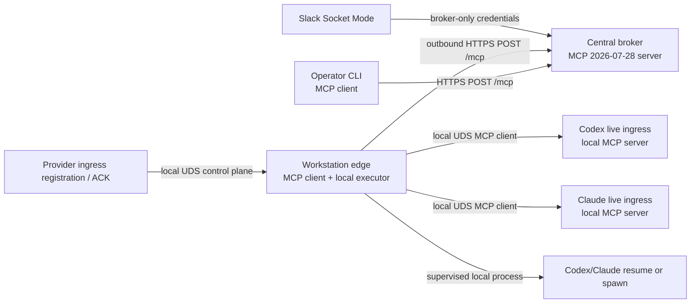
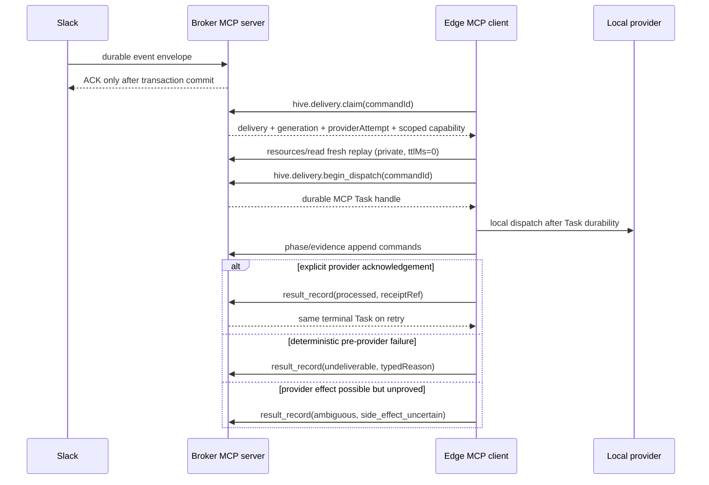

# ADR-0002: Stateless MCP capability plane for Hive v0.4

- Status: Accepted
- Decision: D-HIVE-MCP v1
- Ratified: 2026-08-01 under [KRA-897](https://linear.app/krates-ehf/issue/KRA-897)
- Parent overhaul: [KRA-896](https://linear.app/krates-ehf/issue/KRA-896)
- Supersedes: only the v0.3 broker/edge wire contract in ADR-0001
- Does not authorize: production cutover or removal of `/v1`; that remains an explicit KRA-912 gate

## Context and authority

ADR-0001 remains authoritative for Hive's home, broker-only Slack custody, outward-only workstation
edges, delivery state machine, wake policies, crash honesty, and untrusted-input boundary. Hive v0.4
replaces the bespoke broker/edge API with the stable MCP `2026-07-28` protocol and makes all durable
application state explicit rather than transport-session state.

The normative protocol references are the final
[MCP 2026-07-28 specification](https://modelcontextprotocol.io/specification/2026-07-28), its
[Streamable HTTP binding](https://modelcontextprotocol.io/specification/2026-07-28/basic/transports/streamable-http),
and [server discovery](https://modelcontextprotocol.io/specification/2026-07-28/server/discover).
The [Tasks extension](https://modelcontextprotocol.io/extensions/tasks/overview) is official but
separately opt-in and experimental. Hive therefore treats core conformance and Tasks-extension
conformance as two independently pinned and tested claims.

This ADR records all D1-D20 rulings from KRA-896. Its use of MUST, MUST NOT, SHOULD, and MAY is
normative for Hive. Protocol conformance does not weaken an application invariant.

## Preserved invariants

1. Slack Socket Mode and Slack credentials exist only at the broker.
2. Workstation edges make outbound off-box connections and expose no inbound network port.
3. Delivery is at-least-once with one fenced owner; Hive never claims exactly-once processing.
4. A crash after a provider side effect becomes possible is `ambiguous` unless evidence or proven
   provider idempotency establishes a stronger result.
5. `resume` never escalates to `spawn`.
6. Slack bodies and replays are untrusted data. `WAKE` permits routing and dispatch only; it cannot
   grant repository, shell, provider, or operator authority.
7. The broker may assemble an exact Slack thread replay but may not summarize, interpret, redact,
   or prioritize it.
8. Handles identify state. Capabilities authorize operations. A handle is never authority.

## Final topology



The broker is the only off-box MCP server. The edge is the client that claims work. MCP
`subscriptions/listen` MAY wake an edge with a change notification, but it is only a doorbell: the
edge still invokes the mutating claim tool. The protocol has no reverse-invocation channel and Hive
does not invent one. Headless provider execution remains edge application logic. A live provider
ingress is a separate, machine-local MCP server reached by the edge over a Unix-domain socket.

### Dispatch sequence



The durable command record is created before each mutating response. A lost response is retried
with the same command identity and returns the same stored result or Task handle.

Slack ACK requires the normalized event and delivery transaction to commit; an ingest-time full
thread snapshot is not required. The edge MUST obtain a just-in-time full replay immediately before
provider action. Any earlier snapshot is optional audit evidence and never substitutes for that
fresh replay.

## Transport matrix

| Hop | Client -> server | Binding | Authentication | Inbound exposure |
| --- | --- | --- | --- | --- |
| Slack ingress | Slack -> broker | Socket Mode | Slack app credentials | Broker only |
| Delivery/control | Edge -> broker | MCP 2026-07-28 Streamable HTTP at `/mcp` | Edge machine bearer; dispatch capability on scoped calls | Broker only |
| Operator | CLI -> broker | MCP 2026-07-28 Streamable HTTP at `/mcp` | Independent operator/admin bearer scopes | Broker only |
| Live dispatch | Edge -> provider ingress | MCP 2026-07-28 over UDS with newline-delimited stdio framing | Independent binding credential + capability | Local filesystem socket only |
| Registration/ACK | Provider ingress -> edge control | MCP 2026-07-28 over UDS with newline-delimited stdio framing | Independent local credential + fenced capability | Local filesystem socket only |
| Headless provider | Edge -> provider process | Supervised process adapter, not an MCP hop | Permission profile + environment allowlist | None |

The broker endpoint accepts one JSON-RPC message per POST and returns JSON or request-scoped SSE.
It validates `Origin`, `Accept`, `MCP-Protocol-Version`, `Mcp-Method`, `Mcp-Name`, and all mirrored
header/body values. It rejects GET and DELETE, mints no `Mcp-Session-Id`, ignores no missing modern
metadata, and implements no `Last-Event-ID` resume. Every request carries protocol version, client
identity, and capabilities in `_meta`; `server/discover` is implemented. Closing a request stream is
transport cancellation, not proof that application work stopped.

UDS endpoints live in an owner-only runtime directory, are created mode `0600`, reject symlinks and
unexpected owners, and use explicit binding revisions. They preserve the MCP JSON-RPC and
per-request metadata model. No callback URL or TCP port is stored as execution authority.

## Identity and authority model

### Machine and operator identities

- An edge credential is a random 256-bit bearer secret minted by the local enrollment plane. The
  broker stores only its SHA-256 digest, edge ID, key ID, validity interval, status, and rotation
  lineage; fixed-length digests are compared in constant time.
- Edge credentials authenticate claim, discovery, health, and explicitly allowed administrative
  calls. They do not authorize a specific delivery.
- Operator read, planning, mutation, reconciliation, and credential-management scopes are distinct.
- Local provider registration and dispatch credentials are independent of broker, edge, Slack, and
  operator credentials. Child processes receive none of those secrets.
- Authentication failures are constant-shape and secret-free. Rotation overlaps are bounded and a
  revoked credential is never restored by an older process.
- Rotation admits active and next keys for at most ten minutes, then requires explicit confirmation
  and revokes the old key. Recovery uses a local, single-use, short-lived enrollment secret.
- The edge authenticates the broker through HTTPS certificate validation against one canonical URI;
  the deployment MAY additionally pin the broker certificate's SPKI.
- Hive uses this deliberately narrow machine-to-machine authorization profile. It does not claim
  adoption of the MCP OAuth authorization chapter.

### Delivery-scoped capability

Claim mints an opaque random capability whose broker-side digest is bound to:

```text
edgeId, machineKeyId, deliveryId, leaseGeneration, providerAttempt, actor, provider,
workspaceHandle, permissionProfileId/version/digest, allowedOperations, audience, issuedAt,
expiresAt
```

The machine bearer authenticates the edge; the delivery capability authorizes only the bound
delivery operations. Both are required. The latter travels in a redacted
`Hive-Dispatch-Capability` header. Capabilities travel only in authentication metadata, never
in a URI, query string, resource body, Task result, diagnostic, trace, error, or provider prompt.
Expiry cannot extend the lease. A stale generation, attempt, edge, audience, or operation fails
closed even if the secret itself is valid.

### Durable command identity

Every mutating call carries a client-generated `commandId` and the broker stores:

```text
(deliveryId, leaseGeneration, providerAttempt, operation, ordinal,
 commandId, canonicalRequestDigest, resultOrTaskRef)
```

`operation` includes the logical phase; repeatable actions such as lease renewal also include a
monotonic ordinal. Replaying the exact tuple and request returns the stored response. Reusing a
command identity with different bytes is `command_conflict`. The MCP request ID and Task ID are not
idempotency keys. Before claiming, the edge durably persists a `claimCommandId`; claim deduplicates
on `(edgeId, claimCommandId)` because it mutates ownership before a delivery capability exists.

## Handle grammar and capability catalog

All Hive handles are canonical ASCII URIs. Path segments are percent-encoded once; encoded `/`,
dot-segments, empty identifiers, fragments, user-info, query-carried credentials, and non-canonical
round trips are rejected.

```text
hive://{brokerUuid}/v1/events/{eventId}
hive://{brokerUuid}/v1/deliveries/{deliveryId}
hive://{brokerUuid}/v1/deliveries/{deliveryId}/transitions
hive://{brokerUuid}/v1/deliveries/{deliveryId}/replay
hive://{brokerUuid}/v1/deliveries/{deliveryId}/evidence
hive://{brokerUuid}/v1/dispatches/{deliveryId}/{generation}/{providerAttempt}
hive://{brokerUuid}/v1/subscriptions/{actor}
hive://{brokerUuid}/v1/edges/{edgeId}
hive://{brokerUuid}/v1/edges/{edgeId}/pending
hive://{brokerUuid}/v1/providers/{edgeId}/{provider}
hive://{brokerUuid}/v1/workspaces/{workspaceId}
hive://{brokerUuid}/v1/reason-codes
hive://edge/v1/bindings/{bindingId}?epoch={edgeBootEpoch}&revision={bindingRevision}
hive://edge/v1/providers/{provider}/{providerSessionId}
```

The broker authority is a stable lowercase UUID from broker metadata. Positive integers use
canonical decimal without leading zeroes. The binding epoch and revision are non-secret ABA fences,
not authority. Task IDs and evidence IDs are opaque. Their results include related Hive handles as
data.

### Broker tool catalog

| Tool | Caller | Effect |
| --- | --- | --- |
| `hive.delivery.claim` | edge | Fairly select and atomically claim the next eligible delivery |
| `hive.delivery.accept` | owning edge | Record durable local acceptance |
| `hive.delivery.renew_lease` | owning edge | Renew one serialized lease ordinal |
| `hive.delivery.begin_dispatch` | owning edge | Validate plan and create the durable dispatch Task before provider start |
| `hive.delivery.record_phase` | owning edge | Append a fenced phase/evidence reference |
| `hive.delivery.reserve_spawn` | owning edge | Acquire the single fenced spawn reservation |
| `hive.delivery.finish` | owning edge | Record a typed terminal result and terminalize the Task |
| `hive.delivery.cancel` | edge/operator | Request cooperative cancellation under separate authority |
| `hive.delivery.append_evidence` | owning edge | Idempotently append bounded evidence metadata/chunks |
| `hive.reply.enqueue` | owning edge | Durably enqueue sender-visible Slack output |
| `hive.edge.report` | edge | Report safe last-seen, workspace, and provider observations |
| `hive.subscription.upsert` | subscription admin | Validate and write one subscription |
| `hive.subscription.validate` | subscription admin | Validate without mutation |
| `hive.dispatch.plan` | operator | Compute a read-only dispatch plan without claim/probe mutation |
| `hive.delivery.reconcile` | reconciler | Append a safe explicit delivery verdict |
| `hive.outbox.reconcile` | reconciler | Append a separate Slack-outbox verdict |

The claim tool replaces the current mutating `GET /v1/deliveries`. Lifecycle routes are not
mistaken for resources merely because the old transport used HTTP verbs. Replay is a fresh private
resource read immediately before action. Provider execution itself is not a broker-to-edge tool.
Claim has no client cursor capable of excluding older eligible work: the broker scans all eligible
pending deliveries fairly. The current `/v1/admin/*` edge-mint, subscription, and reconciliation
surfaces are explicitly owned by the local enrollment, subscription-admin, and reconciliation
planes above rather than disappearing from the replacement inventory.

`server/discover` returns only `2026-07-28` and an authentication-filtered catalog. It never
advertises Tasks, prompts, subscriptions, or any tool/resource not actually implemented. Server
identity is display-only and never participates in authorization. The per-edge pending resource
contains only a queue revision and `hasWork`, never delivery content; a resource-update notification
for it is a lossy doorbell.

### Local live-ingress catalog

Initial edge mint and recovery are deliberately absent from the advertised MCP catalog. A local
broker-admin CLI/UDS plane owns mint, rotate, revoke, and one-time enrollment so a generic MCP client
cannot discover bootstrap authority.

`hive.live.describe`, `hive.live.deliver`, and `hive.live.cancel` exist only on fenced local
bindings. Registration binds actor, provider, edge, provider session, binding ID and revision,
edge boot epoch, surface/version, allowed operations, expiry, and an independent credential.
Redirects, TCP targets,
broker/admin targets, cross-actor use, expired registrations, and stale revisions fail closed.

The current Claude SDK-v1 experimental notification is a migration input, not a valid v0.4
capability. KRA-908 owns its replacement and the Codex/Claude live conformance seam.

## MCP Task projection

Core protocol conformance and `io.modelcontextprotocol/tasks` extension conformance are negotiated
and tested separately. Hive advertises Tasks only when the exact extension schema is supported by
both peers. The initial source pin is `modelcontextprotocol/ext-tasks` commit
`2c1425d9a288b9b1f489430fe1e00bb392b47e48`; its private `0.1.0` package is not treated as a
published dependency. KRA-898 records generated schema provenance and may advance the pin only in a
reviewed conformance change. No floating draft is trusted at runtime.

The pinned Tasks text still contains the pre-final `-32003` value for missing client capability,
while stable core `2026-07-28` assigns `MissingRequiredClientCapability` to `-32021`. The stable core
code wins in Hive's profile. KRA-898 records this upstream extension delta as a raw-wire fixture;
Hive never allocates either value to a custom error.

`hive.delivery.begin_dispatch` durably creates one immutable Task per provider attempt before
returning its handle. It never asks the
client to perform the provider side effect through `tasks/update`; edge phase/evidence tools remain
the application protocol. `tasks/update` carries only responses to outstanding `inputRequests`.
`tasks/cancel` is cooperative. Polling via `tasks/get` is the baseline; task notifications over
`subscriptions/listen` are an optional optimization and never required for correctness.

| Operation | Initial result | Terminal Task projection |
| --- | --- | --- |
| Discovery, lists, reads, validation, plan | Immediate | None |
| Claim, accept, renew, spawn reservation | Immediate durable result | None |
| Dispatch begin | Immediate durable Task handle | See delivery projection below |
| Local live-deliver injection | Immediate local acceptance | Broker Task remains `working` for explicit `hive_ack` |
| Headless resume/spawn | Broker Task `working` | `completed` domain result or `cancelled` with no-effect proof |
| Provider/version probe when slow | Task | `completed` with success or typed `isError` domain result |
| Reconciliation after validated preconditions | Immediate durable result | None |

| Hive truth | Task truth |
| --- | --- |
| Provider effect not begun; cancellation proved | `cancelled` |
| `processed` with provider evidence | `completed` with `CallToolResult.isError=false` and receipt/evidence handles |
| Deterministic `undeliverable` | `completed` with `CallToolResult.isError=true` and side effect `impossible` |
| `ambiguous` | `completed` with `CallToolResult.isError=true`, side effect `possible`, and reconciliation handle |
| `dead_letter` | `completed` with `CallToolResult.isError=true` and terminal reason set |
| JSON-RPC execution failed without a Hive domain outcome | `failed` |

Four clocks remain independent:

1. The lease controls delivery authority.
2. The live-ACK deadline controls how long unacknowledged possible provider work may remain
   `dispatched` before becoming `ambiguous`.
3. Task `ttlMs` controls Task retrieval retention only.
4. Task `pollIntervalMs` is client pacing only.

Active Tasks use `ttlMs=null`. At terminalization, Hive sets a TTL that retains the Task beyond the
maximum live-ACK deadline and evidence reconciliation window, measured from Task creation as the
extension requires. Task expiry or a missed poll never changes delivery state. Dedup tombstones
outlive Task payload retention. A live-ACK deadline or lease loss after provider start may create
ambiguity; a Task clock cannot. Requeue creates a new provider attempt and a new immutable Task; a
later reconciliation never rewrites a historical terminal Task.

## Error, disposition, and retry contract

Stable JSON-RPC and MCP errors retain their exact codes and HTTP behavior: parse/invalid
request/method/params, `HeaderMismatch` (`-32020`), `MissingRequiredClientCapability` (`-32021`),
and `UnsupportedProtocolVersion` (`-32022`). Unknown or unauthorized resource handles use the same
`Invalid params` (`-32602`) shape after authentication. Authentication uses safe HTTP 401; a known
principal lacking request authority uses safe HTTP 403. Hive allocates no custom JSON-RPC numeric
range.

Completed tool/domain outcomes use `CallToolResult.isError` and stable symbolic names in structured
content rather than misusing JSON-RPC failure. The catalog includes:

| Stable name | Retry rule |
| --- | --- |
| `hive_capability_invalid` | No; reclaim under current authority |
| `hive_replay_rejected` | Exact command replay returns stored result; other replay fails |
| `hive_fence_stale` | No; stale owner must stop |
| `hive_command_conflict` | No; investigate client bug |
| `hive_invalid_transition` | No without a fresh resource read |
| `hive_provider_unavailable` | Only if evidence proves provider never started |
| `hive_provider_incompatible` | No until version/capability changes |
| `hive_workspace_unmapped` | No until mapping changes |
| `hive_rate_limited` | Exact bounded retry before provider start only |
| `hive_deadline_exceeded` | Phase-dependent; never infer provider non-execution |
| `hive_cancel_conflict` | Read current Task/delivery state |
| `hive_side_effect_uncertain` | Never automatic; reconcile |
| `hive_evidence_incomplete` | Repair evidence before reconciliation |
| `hive_legacy_disabled` | Select MCP explicitly; never auto-fallback |
| `hive_binding_stale` | Re-register and obtain current revision |
| `hive_reconcile_unsafe` | No; supplied evidence cannot exclude duplication |
| `hive_internal_failed_closed` | Retry only with the same command identity |

Every failure has a versioned machine shape containing
`name`, `retryable`, `phase`, `sideEffect` (`impossible`, `possible`, or `confirmed`), safe
`reasonCodes`, and optional `retryAfterMs`/resource handle. Public messages never include tokens,
headers, request bodies, raw output, environment, cwd, SQLite text, or exception strings.

Deterministic failures such as an absent workspace mapping, absent provider adapter, or a rate cap
before provider start are `undeliverable`, not `ambiguous`. An automatic retry is permitted only
when evidence proves the provider side effect was impossible or the exact provider operation has a
deployed idempotency proof.

## Cancellation and authority loss

| Observed phase | Cancellation / lease loss result |
| --- | --- |
| Before validation completes | Stop; no mutation, or deterministic operator-cancel outcome |
| Claimed/accepted, before durable dispatch Task | Lease loss releases for fenced reclaim; operator cancellation is deterministic |
| Task durable, before provider-start intent | Append cancellation; Task may become `cancelled` |
| Start intent recorded, process not created and absence proved | Stop; deterministic terminal result |
| Provider starting/running or start outcome unknown | Attempt cleanup; `ambiguous` unless provider proves no effect |
| Provider completed, result not durably recorded | `ambiguous` unless durable provider evidence proves result |
| Result durably recorded | Return stored terminal result; cancellation cannot rewrite history |

`tasks/cancel` acknowledges intent with an empty result. It may leave a Task `working`, and a race
may produce a terminal result other than `cancelled`. Cancelling an already terminal Task never
changes Hive state. Transport-stream closure after command commit does not imply Task cancellation.

Only one lease renewal may be in flight per delivery. The first loss or uncertain renewal is sticky;
later success cannot clear it. Authority loss attempts provider cancellation/process-group cleanup,
but cleanup success is not evidence that earlier side effects did not occur. A revived stale edge
cannot dispatch, acknowledge, reply, append evidence, or record a result.

## Resource privacy and cache matrix

`cacheScope=public` means safe to share across authorization contexts; it does not mean unauthenticated
network access. Omitted or malformed cache hints are treated as `private` and `ttlMs=0`.

| Resource/result | Scope | `ttlMs` | Content rule |
| --- | --- | ---: | --- |
| `server/discover`, `tools/list`, `resources/list` | private | 5000 | Filtered by current request authority |
| Caller-independent schema/resource templates | public | 300000 | Static contract material only |
| Typed reason documentation | public | 3600000 | No delivery identifiers or operator detail |
| Delivery, history, Task, cancellation state | private | 0 | Owning edge or authorized operator only |
| Slack event metadata and exact replay | private | 0 | Actor/channel/thread scoped; raw untrusted bytes |
| Subscription, edge, provider, workspace health | private | 0 | Scope-filtered operational state |
| Evidence and reconciliation preconditions | private | 0 | Explicit evidence/reconciler authority |
| Human/JSON CLI views | private | 0 | Same resource authorization as underlying data |

Every `tasks/get`, `tasks/update`, and `tasks/cancel` repeats authentication and authorization; Task
IDs are not bearer authority. No resource returns a credential, secret-store reference, unrelated
transcript, provider prompt, full child environment, cwd, or arbitrary process output. An
unauthorized or cross-actor lookup uses the same `hive_not_found_or_hidden` shape as absence.

## Evidence and persistence

KRA-905 introduces the target append-only evidence plane. This ADR does not pretend the current
broker already has a Slack outbox or provider-evidence store. The target stores are:

- broker event/delivery/lease/command/Task/transition/outbox/reconciliation evidence;
- edge local dispatch journal, provider probe/process/phase/output-reference evidence;
- idempotent evidence transfer keyed by evidence ID and canonical digest;
- bounded chunks with size, count, retention, and total-delivery limits;
- append-only operator verdicts rather than overwritten history.

Broker and edge each assign a durable per-ledger sequence. Cross-ledger causality uses evidence,
command, Task, and correlation links; wall clocks are diagnostic and never manufacture a total
order. The edge retains an idempotent evidence outbox until the broker acknowledges its sequence.
Command dedup, Task creation, and the `dispatching` transition commit in one broker transaction.
Provider launch intent commits locally before spawn/injection; provider acknowledgement evidence
commits before broker terminalization.

Each event records schema version, delivery, generation, provider attempt, command, actor/edge,
binding revision where relevant, monotonic phase, wall time, and safe structured detail. Output is
stored by bounded reference and digest, not copied into errors or traces. The evidence model must
prove provider effect `impossible`, `possible`, or `confirmed`; lack of evidence is never proof of
absence. KRA-905 also introduces the Slack reply outbox before KRA-911 can inspect or reconcile it.

## Observability

W3C `traceparent`, `tracestate`, and allowlisted `baggage` propagate under their exact MCP `_meta`
keys and across authorized local hops. Arbitrary client baggage is dropped. Stable span fields may
include event ID, delivery ID, generation, provider attempt, edge ID, actor, provider, provider
session reference (never the raw session ID), command ID, Task ID, binding revision, phase, reason
code, and evidence ID. High-cardinality
values are bounded and raw bodies are never span attributes.

Required spans cover discovery, header validation, authentication, authorization, claim, replay,
dispatch begin, Task get/update/cancel, provider probe/start/result, lease renewal, transition,
outbox reply, and reconciliation. Health distinguishes liveness, broker readiness, provider
availability, subscription eligibility, workspace mapping, authority, and protocol compatibility.
Credential-shaped and prompt-shaped negative fixtures must prove absence from logs, spans, metrics,
errors, evidence metadata, and CLI output.

Hive uses short operation spans linked by durable Task/evidence context; it does not keep one span
open across a human ACK or restart. Error, authority-loss, ambiguity, and reconciliation traces are
retained; successful polling and lease renewals are sampled or aggregated. Identifiers never become
metric labels.

## Compatibility, shadow, and cutover

Hive v0.4 implements exactly MCP `2026-07-28`. It never silently negotiates an older MCP revision.
The existing `/v1` surface is a separate, explicitly configured compatibility adapter, not an MCP
downgrade. Transport selection is pinned per edge and per provider attempt before mutation. Once a
provider-affecting command begins, no fallback path may execute that operation.

The compatibility window starts only after the MCP path passes its acceptance matrix and lasts at
most seven calendar days. Its manifest records exact `compatibilityStartedAt` and `legacySunsetAt`;
an extension requires a fresh explicit Hákon ruling. `/v1` may be re-enabled during that window only by the named rollback owner and
only for a new provider attempt whose evidence proves no duplicate side effect. KRA-912 prepares the
cutover, but production selection and `/v1` removal require explicit Hákon approval.

| Edge selection | Broker surface | Result |
| --- | --- | --- |
| `mcp2026` | modern | MCP `2026-07-28` |
| explicitly allowlisted `legacyV1` before sunset | dual adapter | `/v1` |
| `mcp2026` | legacy-only | typed incompatible-version failure |
| `legacyV1` | modern-only or after sunset | typed legacy-disabled failure |
| either | auth/capability/transport failure | fail; never fall back |

The selected adapter is persisted at claim. Rollback can redirect only pending/unclaimed work;
claimed, dispatched, or uncertain work remains on its original adapter or becomes honestly
`ambiguous`.

Shadow proof never injects a real provider twice. Legacy and MCP adapters run against a deterministic
recording `BrokerService`/provider seam and compare ordered transitions, typed reasons, Task/evidence
projection, and terminal truth. The allowed relation is equal or safer:

- a deterministic old result may become a stricter deterministic failure;
- old `ambiguous` may become `undeliverable` only with proof that provider start was impossible;
- `ambiguous` may never be normalized to `processed` without provider evidence;
- no new path may retry a possibly effected operation.

The comparison vector is `(admission, authority verdict, command identity, provider-effect phase,
disposition, retry permission, sender outcome, privacy projection, evidence completeness)`. Adapter
and Task bookkeeping may differ, but the projected domain trace must satisfy the safety relation.

The deployed fleet is small, so contract tests, hostile-provider fixtures, and one controlled
lockstep rollout carry the proof burden. There is no ceremonial dual-run that adds a second real
dispatch path.

## Operator CLI contract

The current CLI implements only `broker`, `edge`, `create-edge`, and `put-subscription`; v0.4 does
not claim to preserve commands that do not exist. KRA-907 introduces the MCP-backed operator plane:

```text
hive status                               hive doctor
hive deliveries list|inspect|reconcile    hive edges list|inspect
hive providers probe                      hive subscriptions list|inspect|validate|put
hive dispatch plan                        hive config validate
hive edge-credentials mint|rotate|revoke  hive outbox inspect|reconcile
```

Read, plan, mutation, reconciliation, and credential administration use separate authority scopes.
Human and `--json` outputs share typed schemas. Exit codes are stable: `0` success, `2` usage/schema,
`3` authentication, `4` authorization, `5` not-found/routing, `6` unhealthy diagnostic result, `7`
conflict/stale state, `8` transient transport, `9` ambiguity/operator action, and `10` internal
failed-closed. No routine workflow requires SQLite or handcrafted HTTP.

`create-edge` and `put-subscription` remain compatibility aliases only during the bounded legacy
window. Read commands are mechanically side-effect-free: `dispatch plan` cannot claim, reserve,
spawn a probe, or mutate.

## KRA-894 behavioral rulings

1. **Actor addressing:** the first nonblank line contains exactly one `WAKE: <actor> — ...`,
   `WAKE: <actor> | ...`, `NEXT <actor> — ...`, or `NEXT <actor> | ...` envelope. Actor grammar is
   lowercase ASCII `[a-z][a-z0-9_-]{0,63}` and must resolve exactly in the registry. No fuzzy match,
   broadcast, later-line envelope, first-token guess, or prose-derived recipient is permitted.
   Unknown, duplicate, or ambiguous actors produce a durable loud outcome.
2. **Branch/task attachment:** Slack text may reference only a pre-registered structured task and
   repository/worktree binding. Hive never checks out, creates, updates, or attaches a branch merely
   because untrusted Slack prose names one. Missing or mismatched bindings fail loudly.
3. **Authority:** a valid `WAKE` authorizes Hive to route untrusted material to the registered actor.
   It grants no downstream mutation or permission. Those actions require the actor's already
   attached user/task authority and permission profile.
4. **Sender outcome envelope:** every accepted Slack envelope obtains a versioned durable outcome:
   `queued`, `dispatched`, `assessed_only`, `unroutable`, `undeliverable`, `processed`, `ambiguous`,
   or `dead_letter`, with
   event/delivery IDs and a safe reason code. Transport receipt is distinct from task completion.
   An unbound event defaults to `assessed_only`; a pre-existing task binding may authorize more, but
   message text itself never does.
5. **Home:** KRA-894 implementation is folded into the v0.4 children named below. The KRA-717
   tracker remains historical/closed-deferred while ADR-0001 remains accepted; this ADR supersedes
   only ADR-0001's v0.3 wire section.

## D1-D20 decision register

Each entry records candidates, invariant/uncertainty, smallest falsifier, ruling, rejection, and
implementation owner.

### D1 — broker/edge role direction

- **Candidates:** broker calls inbound edge; edge pulls from broker; edge-initiated dual-role tunnel.
- **Invariant/uncertainty:** no inbound workstation port; MCP has no reverse invocation channel.
- **Smallest falsifier:** protocol trace showing a server request on `subscriptions/listen`.
- **Ruling:** edge client pulls from broker server; listen is an optional doorbell only.
- **Rejected:** inbound edge violates topology; tunnel adds a custom reverse transport without need.
- **Owner/acceptance:** KRA-899; prove zero inbound edge listener and a mutating fair claim tool.

### D2 — concrete transport

- **Candidates:** Streamable HTTP, stdio, UDS custom framing, WebSocket/custom tunnel.
- **Invariant/uncertainty:** final-standard semantics on every hop with the least exposed surface.
- **Smallest falsifier:** official transport conformance plus restart/cancellation/Origin tests.
- **Ruling:** HTTPS Streamable HTTP off-box; newline-delimited MCP over owner-only UDS locally.
- **Rejected:** WebSocket/tunnel has no benefit; local TCP preserves avoidable endpoint risk.
- **Owner/acceptance:** KRA-899 and KRA-908; pass final header, metadata, framing, and negative tests.

### D3 — SDK and extension packages

- **Candidates:** unified SDK v1; split TypeScript v2; handwritten protocol; floating Tasks draft.
- **Invariant/uncertainty:** exact final-core behavior while Tasks remains separately experimental.
- **Smallest falsifier:** compile and conformance probe against exact package/schema revisions.
- **Ruling:** exact `@modelcontextprotocol/{client,server,node}@2.0.0` and the Node adapter's exact
  `hono@4.11.4` peer; adapter boundary; exact upstream Tasks schema provenance. Existing unified
  `@modelcontextprotocol/sdk@1.29.0` is pinned only until KRA-908 removes it.
- **Rejected:** caret/floating dependencies, leaked SDK types, or claiming Tasks as stable core.
- **Owner/acceptance:** KRA-898; lockfile, schema provenance, discovery, and conformance are reachable.

### D4 — machine identity and authentication

- **Candidates:** shared token; per-edge bearer; OAuth; mTLS.
- **Invariant/uncertainty:** rotation/revocation and independent privilege domains for a small fleet.
- **Smallest falsifier:** forged/revoked/cross-edge/replay matrix and child-environment inspection.
- **Ruling:** per-edge random bearer digests plus separate operator/local credentials; no OAuth claim.
- **Rejected:** shared token collapses domains; OAuth/mTLS adds machinery without current benefit.
- **Owner/acceptance:** KRA-900; constant-shape auth, rotation lineage, and secret-negative tests.

### D5 — delivery authority and replay protection

- **Candidates:** machine token alone; signed self-contained token; server-stored opaque capability.
- **Invariant/uncertainty:** stateless transport must not mean ambient or replayable application power.
- **Smallest falsifier:** cross-generation/attempt/audience/operation replay with lost responses.
- **Ruling:** server-stored opaque capability plus durable command identity including providerAttempt.
- **Rejected:** handles or Task IDs as authority; token-only or request-ID-only deduplication.
- **Owner/acceptance:** KRA-900, KRA-901, KRA-909; exact retry returns stored result, conflict fails.

### D6 — Hive handle grammar

- **Candidates:** bare integers; ad-hoc strings; versioned canonical Hive URIs.
- **Invariant/uncertainty:** handles must be explicit, parseable references and never secrets.
- **Smallest falsifier:** canonicalization/property tests for encoding, alias, traversal, and leakage.
- **Ruling:** the broker-UUID `hive://.../v1` and edge-local grammar in this ADR.
- **Rejected:** bare IDs lack realm/version; URLs invite endpoint/authority confusion.
- **Owner/acceptance:** KRA-898; generated schema, round-trip, and hostile-handle fixtures.

### D7 — capability partition and names

- **Candidates:** mirror every `/v1` route; resources for all reads and tools for all effects;
  provider execution as broker invocation.
- **Invariant/uncertainty:** semantic capability boundaries, including mutating claim and admin routes.
- **Smallest falsifier:** route/store inventory mapped to one catalog owner and authority rule.
- **Ruling:** catalog above; reads are resources, mutations tools, execution remains edge-local.
- **Rejected:** HTTP-verb mirroring, missing admin surface, and reverse provider invocation.
- **Owner/acceptance:** KRA-898/903/904/907; every current and target operation has one owner.

### D8 — immediate result versus Task

- **Candidates:** hold request open; Task every call; Task only durable long-running coordination.
- **Invariant/uncertainty:** response loss must not duplicate provider work; live ACK may take hours.
- **Smallest falsifier:** disconnect after commit, then exact reissue, across every provider phase.
- **Ruling:** immediate deterministic controls; begin_dispatch creates a durable Task before start.
- **Rejected:** SSE-resume assumptions, Task ID as dedup key, and `tasks/update` as evidence input.
- **Owner/acceptance:** KRA-901/904/905; four-clock tests and same-Task retry proof.

### D9 — faithful `ambiguous` projection

- **Candidates:** Task completed, generic failed, or typed failed with reconciliation reference.
- **Invariant/uncertainty:** uncertainty must remain visible and must never invite automatic retry.
- **Smallest falsifier:** crash after each provider-start boundary with no receipt.
- **Ruling:** delivery `ambiguous`; Task `completed` with `isError=true`, side effect possible, and
  retry forbidden. Task `failed` is reserved for JSON-RPC execution failure without a domain result.
- **Rejected:** successful completion fictionalizes success; cancelled/timeout fictionalizes
  non-execution; generic failed invites unsafe retry.
- **Owner/acceptance:** KRA-901/905/909/911; projection and reconciliation fixtures.

### D10 — cancellation and authority loss

- **Candidates:** transport abort implies stop; cooperative cleanup; always ambiguous.
- **Invariant/uncertainty:** cancellation cannot undo or disprove a provider side effect.
- **Smallest falsifier:** cancel/lease loss at every explicit dispatch phase.
- **Ruling:** phase table above; cleanup is attempted, truth follows evidence, first loss is sticky.
- **Rejected:** unconditional retry/cancelled and unconditional ambiguity before provider start.
- **Owner/acceptance:** KRA-901/909/910; process-group and stale-owner hostile tests.

### D11 — live ingress and local transport

- **Candidates:** arbitrary callback URL; loopback HTTP; stdio; owner-only UDS MCP.
- **Invariant/uncertainty:** no arbitrary network authority, shared credential, or ABA registration.
- **Smallest falsifier:** forged/stale/cross-target/redirect/socket-owner matrix for both providers.
- **Ruling:** fenced capability handles resolved only by the edge to owner-only UDS MCP servers.
- **Rejected:** callback URLs and shared `HIVE_EDGE_LOCAL_TOKEN`; stdio alone is not reconnectable.
- **Owner/acceptance:** KRA-908; Codex and Claude replacement with explicit ACK and current revision.

### D12 — typed errors, disposition, and retry

- **Candidates:** thrown strings; transport codes only; versioned Hive error envelope.
- **Invariant/uncertainty:** retry must be machine-decidable without leaking internals.
- **Smallest falsifier:** classifier matrix including deterministic, stale, uncertain, and secret input.
- **Ruling:** standard numeric protocol errors plus typed symbolic Hive outcomes, phase, side-effect
  evidence, and retryability; deterministic is not ambiguous.
- **Rejected:** message matching and generic internal errors.
- **Owner/acceptance:** KRA-901 and KRA-902; exhaustive public/private projection tests.

### D13 — resource privacy and caching

- **Candidates:** cache everything; private zero-TTL everything; explicit per-resource policy.
- **Invariant/uncertainty:** no cross-actor data while retaining safe static cache value.
- **Smallest falsifier:** cache-key/cross-authority and credential/transcript negative fixtures.
- **Ruling:** explicit matrix above; dynamic operational and body-bearing reads are private/zero-TTL.
- **Rejected:** implicit defaults and public dynamic identity/body caches.
- **Owner/acceptance:** KRA-903; every resource declares schema, authority, ttlMs, and cacheScope.

### D14 — evidence and Task persistence

- **Candidates:** overwrite current row; raw process buffers; append-only bounded evidence.
- **Invariant/uncertainty:** restart investigations must reconstruct crash truth without secret sprawl.
- **Smallest falsifier:** kill after every phase and rebuild timeline from broker plus edge stores.
- **Ruling:** append-only versioned evidence, durable command/Task stores, and a new Slack outbox.
- **Rejected:** claiming nonexistent stores, transcript copying, or reconciliation by mutation.
- **Owner/acceptance:** KRA-905 then KRA-911; evidence proves impossible/possible/confirmed.

### D15 — observability

- **Candidates:** console strings; unbounded full-context spans; safe typed OTel.
- **Invariant/uncertainty:** end-to-end diagnosis without bodies, secrets, or cardinality explosion.
- **Smallest falsifier:** credential/prompt canaries across logs, spans, metrics, evidence, and CLI.
- **Ruling:** W3C context plus typed allowlisted fields and bounded health dimensions.
- **Rejected:** raw exception/output/body capture and secret-bearing baggage.
- **Owner/acceptance:** KRA-906; restart/reconciliation trace and negative-leak proof.

### D16 — legacy compatibility and downgrade

- **Candidates:** automatic MCP downgrade; permanent dual stack; bounded explicit `/v1` adapter.
- **Invariant/uncertainty:** compatibility cannot weaken authority or duplicate a side effect.
- **Smallest falsifier:** version mismatch and rollback at every mutation boundary.
- **Ruling:** modern-only MCP; explicit per-attempt legacy selection for at most seven days.
- **Rejected:** automatic downgrade/fallback and permanent mixed behavior.
- **Owner/acceptance:** KRA-899 and KRA-912; no fallback after mutation and explicit removal gate.

### D17 — shadow and cutover

- **Candidates:** real dual dispatch; deterministic adapter comparison; direct flag day.
- **Invariant/uncertainty:** prove semantic equality or safety without duplicate provider execution.
- **Smallest falsifier:** one recording service and hostile provider matrix through both adapters.
- **Ruling:** deterministic semantic preorder plus one controlled lockstep fleet rollout.
- **Rejected:** real dual execution and ceremony unsupported by fleet size.
- **Owner/acceptance:** KRA-902/KRA-912; Hákon is cutover owner and explicit approval is mandatory.

### D18 — operator CLI

- **Candidates:** raw HTTP/SQLite; preserve fictional commands; one typed MCP-backed CLI.
- **Invariant/uncertainty:** routine diagnosis/recovery needs stable auth, JSON, and remediation.
- **Smallest falsifier:** operator journeys from fault to safe action without direct storage access.
- **Ruling:** introduce the command and exit-code contract above; read/mutation scopes stay separate.
- **Rejected:** bespoke CLI backends and claims that status/reconciliation already exist.
- **Owner/acceptance:** KRA-903/907/911; shared schemas and no raw HTTP/SQLite journey.

### D19 — KRA-894 behavioral forks

- **Candidates:** fuzzy first-token actor; strict registered address; Slack-driven branch/task mutation.
- **Invariant/uncertainty:** untrusted Slack can route but never manufacture authority or targets.
- **Smallest falsifier:** hostile actor/branch prose and sender-visible lost/misrouted outcomes.
- **Ruling:** exact delimited actor, pre-registered task/ref binding, versioned durable outcome envelope.
- **Rejected:** fuzzy/broadcast parsing, silent assess-only, and Slack-directed checkout/update.
- **Owner/acceptance:** KRA-904/907/911 plus KRA-894 closure; fail loudly with receipts.

### D20 — ADR and conformance authority

- **Candidates:** Linear prose only; SDK behavior as authority; versioned ADR/schema/fixtures.
- **Invariant/uncertainty:** shipped behavior must be reproducible and drift-detecting.
- **Smallest falsifier:** fresh checkout runs the exact root gates and official conformance fixtures.
- **Ruling:** this ADR, generated schemas/fixtures, exact pins, and official spec are the contract set.
- **Rejected:** floating docs/dependencies and hand-edited generated artifacts.
- **Owner/acceptance:** KRA-898/KRA-902/KRA-912; `pnpm check` and `pnpm build` reach conformance.

## Contract authority and conformance gate

Conflict order is:

1. MCP `2026-07-28` specification and schema for standard wire primitives.
2. This founder-ratified ADR for Hive topology, authority, state, Tasks profile, and compatibility.
3. Versioned canonical Hive JSON Schemas with immutable `$id` values.
4. Generated validators, TypeScript types, and capability catalog; generated artifacts are never
   hand-edited.
5. Deterministic conformance fixtures and canonical semantic traces.
6. Operations prose and examples.

Linear is the decision and status ledger, not runtime contract authority. A change to a locked
invariant, authority boundary, compatibility policy, or cutover gate requires a new ADR and explicit
Hákon ratification. Compatible additive schema changes follow the versioned contract policy.

`pnpm check` must reach compilation, unit tests, schema generation/drift, the pinned official MCP
core fixtures, the separately pinned Tasks fixtures, KRA-902 semantic scenarios, and secret-negative
tests. A reachability test fails if a required suite disappears from the root gate. `pnpm build`
remains an independently runnable compile/artifact smoke gate. A fresh adapter instance must serve
each stateless request without connection memory.

## Implementation ownership and corrected DAG

One issue owns each acceptance box:

| Contract | Owning issue |
| --- | --- |
| SDK adapter, schema provenance, discovery, handle grammar | KRA-898 |
| Off-box transport, client pull, compatibility selector | KRA-899 |
| Machine and delivery authority, credential separation | KRA-900 |
| Error contract, disposition rules, Task projection | KRA-901 |
| Hostile provider and semantic comparison harness | KRA-902 |
| Authorized resource/cache plane | KRA-903 |
| Broker lifecycle tools and fresh replay | KRA-904 |
| Append-only evidence, command/Task store, Slack outbox | KRA-905 |
| OTel, safe health, leak-negative diagnostics | KRA-906 |
| Operator CLI framework and safe read/plan rendering | KRA-907 |
| Local live bindings and Claude v1 replacement | KRA-908 |
| Serialized lease, fencing, phases, spawn reservation | KRA-909 |
| Provider supervision, env, deadlines, bounded output | KRA-910 |
| Delivery/outbox reconciliation | KRA-911 |
| Compatibility proof, explicit cutover, `/v1` removal | KRA-912 |

The required order is:

```text
KRA-897
  -> KRA-898, KRA-899, KRA-900, KRA-901, KRA-902 scaffold
  -> KRA-905 evidence and KRA-906 instrumentation foundation (parallel)
  -> KRA-909 phase/fencing and KRA-910 supervision (parallel where independent)
  -> KRA-903 evidence/probe-complete resource plane
  -> KRA-904 and KRA-908 end-to-end dispatch/live acceptance
  -> KRA-907 read/doctor/plan CLI
  -> KRA-911 delivery/outbox reconciliation CLI
  -> KRA-902 complete matrix and KRA-912 preparation
  -> explicit Hákon cutover approval
```

KRA-909 and KRA-910 semantics must exist before KRA-904 may claim provider-affecting acceptance.
KRA-905 precedes evidence-consuming resources, supervision, and reconciliation; KRA-906 can lay its
instrumentation foundation in parallel, while its end-to-end proof waits for all producers. KRA-911
alone owns reconciliation and its CLI. KRA-902 develops early and remains the final
hostile/conformance gate.

## Consequences

Hive obtains ordinary stateless HTTP routing without pretending the application itself is
stateless. Durable deliveries, commands, Tasks, capabilities, evidence, and outbox records remain
explicit broker or edge state. The edge can disconnect and retry without relying on an MCP session
or resumable SSE stream, and a lost response cannot authorize a second provider effect.

The cost is a larger explicit contract: two authentication layers, durable command deduplication,
separate core/Tasks conformance, and evidence-first operations. That cost buys a simpler failure
story: deterministic failure stays deterministic, uncertainty stays `ambiguous`, and no transport
optimization is allowed to rewrite delivery truth.
